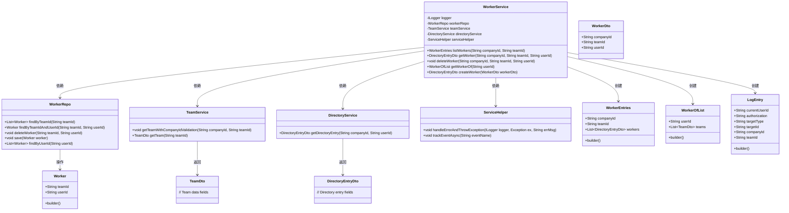

# 基础信息

|      |      |
|------|------|
| 名称 | WorkerService |
| 编码语言 | .java |
| 代码路径 | staffjoy/company-svc/src/main/java/xyz/staffjoy/company/service/WorkerService.java |
| 包名 | xyz.staffjoy.company.service |
| 依赖项 | ['com.github.structlog4j.ILogger', 'com.github.structlog4j.SLoggerFactory', 'org.springframework.beans.factory.annotation.Autowired', 'org.springframework.stereotype.Service', 'xyz.staffjoy.common.api.ResultCode', 'xyz.staffjoy.common.auditlog.LogEntry', 'xyz.staffjoy.common.auth.AuthContext', 'xyz.staffjoy.common.error.ServiceException', 'xyz.staffjoy.company.dto', 'xyz.staffjoy.company.model.Worker', 'xyz.staffjoy.company.repo.WorkerRepo', 'xyz.staffjoy.company.service.helper.ServiceHelper', 'java.util.List'] |
| 概述说明 | WorkerService提供员工管理功能，包括查询、创建、删除员工及获取所属团队列表。 |

# 说明

WorkerService是一个服务类，提供与员工相关的操作。它依赖WorkerRepo、TeamService、DirectoryService和ServiceHelper。主要功能包括：列出指定团队的所有员工信息，获取单个员工信息，删除员工关系，获取员工所属团队列表，以及创建新员工关系。每个操作都会验证团队是否存在，并处理数据库异常。创建和删除操作会记录审计日志和跟踪事件。

# 类列表 Class Summary

| 名称   | 类型  | 说明 |
|-------|------|-------------|
| WorkerService | class | WorkerService类提供员工管理功能，包括查询、创建、删除及关联团队操作。 |

## 类 WorkerService

|      |      |
|------|------|
| 访问范围 | @Service;public |
| 类型 | class |
| 名称 | WorkerService |
| 说明 | WorkerService类提供员工管理功能，包括查询、创建、删除及关联团队操作。 |

### UML类图

这段类图展示了WorkerService的核心结构和依赖关系。WorkerService作为主要服务类，依赖WorkerRepo进行数据持久化操作，依赖TeamService和DirectoryService获取团队和目录信息，使用ServiceHelper处理错误和跟踪事件。它操作多种DTO对象如WorkerEntries、WorkerOfList、DirectoryEntryDto等，并创建Worker实体和LogEntry日志记录。整个设计体现了清晰的职责划分和分层架构，各组件通过接口协作完成工人管理功能。

### 内部方法调用关系图

```mermaid
graph TD
    A["类WorkerService"]
    B["属性: WorkerRepo workerRepo"]
    C["属性: TeamService teamService"]
    D["属性: DirectoryService directoryService"]
    E["属性: ServiceHelper serviceHelper"]
    F["方法: WorkerEntries listWorkers(companyId, teamId)"]
    G["方法: DirectoryEntryDto getWorker(companyId, teamId, userId)"]
    H["方法: void deleteWorker(companyId, teamId, userId)"]
    I["方法: WorkerOfList getWorkerOf(userId)"]
    J["方法: DirectoryEntryDto createWorker(workerDto)"]

    A --> B
    A --> C
    A --> D
    A --> E
    A --> F
    A --> G
    A --> H
    A --> I
    A --> J

    F --> G1["调用: teamService.getTeamWithCompanyIdValidation"]
    F --> G2["调用: workerRepo.findByTeamId"]
    F --> G3["循环调用: directoryService.getDirectoryEntry"]

    G --> H1["调用: teamService.getTeamWithCompanyIdValidation"]
    G --> H2["调用: workerRepo.findByTeamIdAndUserId"]
    G --> H3["调用: directoryService.getDirectoryEntry"]

    H --> I1["调用: this.getWorker"]
    H --> I2["调用: workerRepo.deleteWorker"]
    H --> I3["调用: serviceHelper.handleErrorAndThrowException"]
    H --> I4["调用: logger.info"]
    H --> I5["调用: serviceHelper.trackEventAsync"]

    I --> J1["调用: workerRepo.findByUserId"]
    I --> J2["循环调用: teamService.getTeam"]

    J --> K1["调用: teamService.getTeamWithCompanyIdValidation"]
    J --> K2["调用: directoryService.getDirectoryEntry"]
    J --> K3["调用: workerRepo.findByTeamIdAndUserId"]
    J --> K4["调用: workerRepo.save"]
    J --> K5["调用: serviceHelper.handleErrorAndThrowException"]
    J --> K6["调用: logger.info"]
    J --> K7["调用: serviceHelper.trackEventAsync"]
```

这段代码是WorkerService类的实现，主要处理与Worker相关的业务逻辑。它包含五个主要方法：listWorkers用于列出团队成员，getWorker获取单个成员信息，deleteWorker删除成员，getWorkerOf查询成员所属团队，createWorker创建新成员。每个方法都涉及团队验证、数据库操作、目录服务调用和异常处理，并通过日志记录和事件跟踪实现审计功能。类通过依赖注入使用WorkerRepo、TeamService等服务，体现了清晰的职责划分和分层架构设计。

### 字段列表 Field List

| 名称  | 类型  | 说明 |
|-------|-------|------|
| serviceHelper | ServiceHelper | 自动注入ServiceHelper实例 |
| workerRepo | WorkerRepo | 自动注入WorkerRepo实例 |
| teamService | TeamService | 自动注入TeamService实例 |
| directoryService | DirectoryService | 自动注入DirectoryService服务 |
| logger = SLoggerFactory.getLogger(WorkerService.class) | ILogger | 静态日志记录器初始化，用于WorkerService类。 |

### 方法列表 Method List

| 名称  | 类型  | 说明 |
|-------|-------|------|
| getWorkerOf | WorkerOfList | 根据用户ID获取所属团队列表，返回包含团队信息的WorkerOfList对象。 |
| getWorker | DirectoryEntryDto | 获取员工信息：验证公司和团队存在后，查询员工并返回目录条目，无则报错。 |
| listWorkers | WorkerEntries | 方法根据公司ID和团队ID获取团队成员列表，验证后返回包含成员信息的WorkerEntries对象。 |
| deleteWorker | void | 删除员工方法：验证后删除数据库记录，失败抛异常，记录审计日志和事件。 |
| createWorker | DirectoryEntryDto | 创建员工并验证团队和用户，避免重复添加，记录日志后返回用户信息。 |

