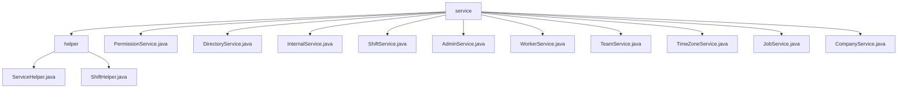

# 基础信息

|      |      |
|------|------|
| 名称 | service |
| 编码语言 | .java |
| 代码路径 | staffjoy/company-svc/src/main/java/xyz/staffjoy/company/service |
| 包名 | staffjoy.docs.company-svc.src.main.java.xyz.staffjoy.company.service |
| 概述说明 | Spring框架员工管理和班次调度模块，含ServiceHelper和ShiftHelper组件，支持跨系统协作和异常监控。 |

# 说明

## 概述

该代码模块是一个基于Spring框架的企业级员工管理系统，提供完整的公司组织架构管理解决方案。核心功能围绕公司-团队-员工三级结构展开，包含权限控制、班次调度、目录管理等业务领域。模块采用分层架构设计，包含10个核心服务类：

1. **基础服务组件**：
   - ServiceHelper：提供统一的异常处理、审计日志和异步事件跟踪
   - PermissionService：实现细粒度的权限验证体系

2. **组织架构服务**：
   - CompanyService：公司基础信息管理
   - TeamService：团队创建与维护（含时区管理）
   - WorkerService：员工关系管理
   - AdminService：管理员权限管理

3. **业务功能服务**：
   - ShiftService：班次全生命周期管理
   - JobService：职位/岗位管理
   - DirectoryService：企业目录服务
   - InternalService：数据报表服务

模块集成Sentry错误监控系统，采用ModelMapper进行DTO转换，并通过AccountClient等远程客户端实现跨系统协作。

## 主要业务场景

1. **组织架构管理**
   - 公司/团队/员工的CRUD操作
   - 多级权限验证（公司管理员/团队成员/目录成员）
   - 时区与工作日历配置
   - 管理员权限分配与审计

2. **人力资源运营**
   - 员工入职流程（onboardWorker）
   - 企业目录维护与账户同步
   - 职位(Job)创建与管理
   - 员工-团队关联关系维护

3. **班次调度管理**
   - 班次创建/发布/更新/删除
   - 团队排班计划查询
   - 班次变更通知推送
   - 在岗人数统计（GrowthGraph）

4. **系统安全与可靠性**
   - 统一的权限校验流程
   - 操作审计日志记录
   - 异常处理与Sentry监控集成
   - 环境配置检查与验证

5. **数据服务**
   - 分页查询支持
   - DTO模型转换
   - 时区信息获取
   - 管理报表生成

### 包内部结构视图

该流程图展示了company-svc项目中service模块的层级结构。根节点service包含helper子目录和多个服务类文件，其中helper目录下又包含ServiceHelper和ShiftHelper两个辅助类。服务类文件涵盖了权限、目录、内部、班次、管理、员工、团队、时区、职位和公司等多种业务功能服务。

# 文件列表 File List

| 名称   | 类型  | 说明 |
|-------|------|-------------|
| [TimeZoneService.java](TimeZoneService.md) | file | Java服务类TimeZoneService提供获取所有时区ID列表的方法。 |
| [TeamService.java](TeamService.md) | file | TeamService类处理团队创建、查询、更新及员工团队信息获取，包含日志和异常处理。 |
| [WorkerService.java](WorkerService.md) | file | WorkerService提供员工管理功能，包括查询、创建、删除员工及获取所属团队列表。 |
| [ShiftService.java](ShiftService.md) | file | ShiftService类提供班次管理功能，包括创建、查询、更新、删除及批量发布班次，支持团队、职位和用户验证，记录审计日志并发送通知。 |
| [InternalService.java](InternalService.md) | file | 内部服务类，获取当前值班人数和每周排班数，返回增长图数据。 |
| [PermissionService.java](PermissionService.md) | file | 权限服务类，检查用户是否为公司管理员、团队成员或目录成员。 |
| [CompanyService.java](CompanyService.md) | file | 公司服务类，包含创建、查询、更新公司信息功能，处理异常并记录日志。 |
| [JobService.java](JobService.md) | file | JobService类提供作业管理功能，包括创建、查询、更新作业，并记录审计日志和事件跟踪。 |
| [AdminService.java](AdminService.md) | file | AdminService类提供管理员管理功能，包括查询、创建、删除及获取所属公司列表。依赖多个服务完成操作，并记录日志和事件。 |
| [DirectoryService.java](DirectoryService.md) | file | 目录服务类，包含创建、查询、更新目录及关联账户功能，处理公司内用户信息管理。 |
| [helper](helper/_module.md) | package | ServiceHelper提供异步事件跟踪和通知功能，ShiftHelper管理班次数据并处理验证和转换。 |

