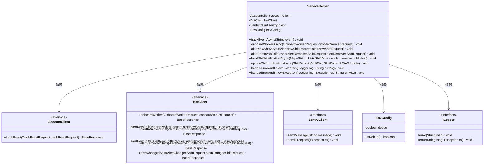
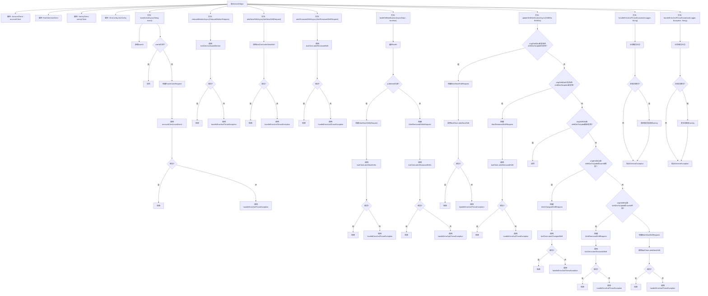

# 基础信息

|      |      |
|------|------|
| 名称 | ServiceHelper |
| 编码语言 | .java |
| 代码路径 | staffjoy/company-svc/src/main/java/xyz/staffjoy/company/service/helper/ServiceHelper.java |
| 包名 | xyz.staffjoy.company.service.helper |
| 依赖项 | ['com.github.structlog4j.ILogger', 'com.github.structlog4j.SLoggerFactory', 'io.sentry.SentryClient', 'org.springframework.beans.factory.annotation.Autowired', 'org.springframework.scheduling.annotation.Async', 'org.springframework.stereotype.Component', 'org.springframework.util.StringUtils', 'xyz.staffjoy.account.client.AccountClient', 'xyz.staffjoy.account.dto.TrackEventRequest', 'xyz.staffjoy.bot.client.BotClient', 'xyz.staffjoy.bot.dto', 'xyz.staffjoy.common.api.BaseResponse', 'xyz.staffjoy.common.auth.AuthContext', 'xyz.staffjoy.common.env.EnvConfig', 'xyz.staffjoy.common.error.ServiceException', 'xyz.staffjoy.company.config.AppConfig', 'xyz.staffjoy.company.dto.ShiftDto', 'java.time.Instant', 'java.util.List', 'java.util.Map'] |
| 概述说明 | 服务助手类，提供异步事件跟踪、员工入职、班次通知等功能，处理错误并记录日志。 |

# 说明

ServiceHelper是一个Spring组件类，提供异步事件跟踪和通知功能。它包含多个异步方法，使用AccountClient和BotClient进行远程调用。主要功能包括跟踪用户事件、处理员工入职、发送新班次/取消班次/变更班次的提醒通知。所有方法都通过Async注解异步执行，统一使用handleErrorAndThrowException处理异常和错误响应，并在生产环境下通过SentryClient上报错误。类中还包含环境配置检查和日志记录功能，确保错误信息被妥善处理和记录。

# 类列表 Class Summary

| 名称   | 类型  | 说明 |
|-------|------|-------------|
| ServiceHelper | class | ServiceHelper类提供异步事件跟踪、工人入职和班次通知功能，处理错误并记录日志。 |

## 类 ServiceHelper

|      |      |
|------|------|
| 访问范围 | @SuppressWarnings("Duplicates");@Component;public |
| 类型 | class |
| 名称 | ServiceHelper |
| 说明 | ServiceHelper类提供异步事件跟踪、工人入职和班次通知功能，处理错误并记录日志。 |

### UML类图

这段代码展示了一个名为`ServiceHelper`的服务类，它通过异步方法处理多种业务逻辑，包括事件跟踪、工人入职、班次通知等。该类依赖多个客户端接口（如`AccountClient`、`BotClient`）和配置类（`EnvConfig`），并通过`SentryClient`进行错误上报。所有异步方法都遵循相似的错误处理模式，使用`handleErrorAndThrowException`方法统一处理异常。类图清晰地展示了这些依赖关系和接口定义。

### 内部方法调用关系图

这段代码是一个Spring组件类ServiceHelper，主要功能是异步处理各种事件跟踪和通知任务。它包含多个异步方法，如trackEventAsync、onboardWorkerAsync、alertNewShiftAsync等，这些方法通过调用不同的客户端（如accountClient、botClient）来执行具体操作，并统一处理异常情况。类中还包含两个错误处理方法handleErrorAndThrowException，用于记录日志、发送错误信息到Sentry并抛出异常。整体设计采用异步处理模式，通过@Async注解实现，提高了系统的响应速度和吞吐量。

### 字段列表 Field List

| 名称  | 类型  | 说明 |
|-------|-------|------|
| accountClient | AccountClient | 自动注入AccountClient实例 |
| sentryClient | SentryClient | 自动注入SentryClient实例。 |
| envConfig | EnvConfig | 自动注入EnvConfig配置实例 |
| logger = SLoggerFactory.getLogger(ServiceHelper.class) | ILogger | 静态日志记录器实例，用于ServiceHelper类。 |
| botClient | BotClient | 自动注入BotClient实例。 |

### 方法列表 Method List

| 名称  | 类型  | 说明 |
|-------|-------|------|
| alertRemovedShiftAsync | void | 异步处理移除班次提醒，调用外部接口并处理异常和失败响应。 |
| trackEventAsync | void | 异步方法：验证用户ID后发送事件跟踪请求，失败则报错。 |
| alertNewShiftAsync | void | 异步通知新班次，处理异常和失败响应。 |
| onboardWorkerAsync | void | 异步处理员工入职请求，调用botClient并处理异常和失败响应。 |
| buildShiftNotificationAsync | void | 异步通知用户班次变更，发布或移除时调用不同接口处理异常和响应。 |
| updateShiftNotificationAsync | void | 异步处理班次变更通知，包括新增、删除和修改，失败时抛出异常。 |
| handleErrorAndThrowException | void | 处理错误并抛出异常：记录错误，非调试时发送至Sentry，抛出ServiceException。 |
| handleErrorAndThrowException | void | 处理错误并抛出异常：记录日志，非调试时发送至Sentry，抛出ServiceException。 |

