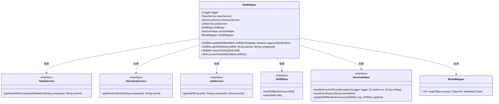
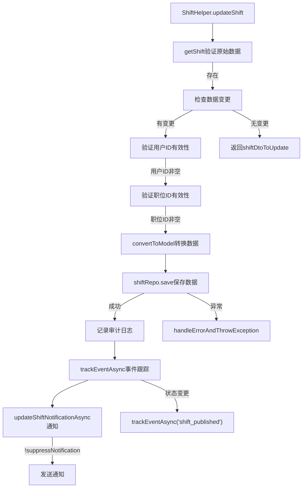
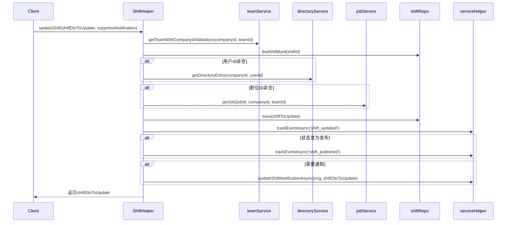

# 基础信息

|      |      |
|------|------|
| 名称 | ShiftHelper |
| 编码语言 | .java |
| 代码路径 | staffjoy/company-svc/src/main/java/xyz/staffjoy/company/service/helper/ShiftHelper.java |
| 包名 | xyz.staffjoy.company.service.helper |
| 依赖项 | ['com.github.structlog4j.ILogger', 'com.github.structlog4j.SLoggerFactory', 'org.modelmapper.ModelMapper', 'org.springframework.beans.factory.annotation.Autowired', 'org.springframework.stereotype.Component', 'org.springframework.util.StringUtils', 'xyz.staffjoy.common.api.ResultCode', 'xyz.staffjoy.common.auditlog.LogEntry', 'xyz.staffjoy.common.auth.AuthContext', 'xyz.staffjoy.common.error.ServiceException', 'xyz.staffjoy.company.dto.ShiftDto', 'xyz.staffjoy.company.model.Shift', 'xyz.staffjoy.company.repo.ShiftRepo', 'xyz.staffjoy.company.service.DirectoryService', 'xyz.staffjoy.company.service.JobService', 'xyz.staffjoy.company.service.TeamService'] |
| 概述说明 | ShiftHelper类用于管理班次数据，包含更新、查询及转换功能，支持异步通知和日志记录。 |

# 说明

ShiftHelper是一个用于管理班次数据的Spring组件类。它通过依赖注入引入了多个服务类，包括TeamService、DirectoryService、JobService等。主要功能包括更新班次信息（updateShift）和获取班次详情（getShift）。更新操作会验证用户和职位是否存在，记录审计日志，并触发相关事件跟踪和通知。获取班次时会验证团队信息并转换数据模型。类中还包含DTO与模型之间的转换方法。所有操作都包含完善的错误处理和日志记录机制。

# 类列表 Class Summary

| 名称   | 类型  | 说明 |
|-------|------|-------------|
| ShiftHelper | class | ShiftHelper类用于管理班次数据，包含更新、查询和转换功能，支持验证和异步通知。 |

## 类 ShiftHelper

|      |      |
|------|------|
| 访问范围 | @Component;public |
| 类型 | class |
| 名称 | ShiftHelper |
| 说明 | ShiftHelper类用于管理班次数据，包含更新、查询和转换功能，支持验证和异步通知。 |

### UML类图

这段代码展示了一个Spring组件ShiftHelper，它负责处理班次(Shift)相关的业务逻辑。该类通过多个服务接口(TeamService、DirectoryService等)进行数据验证和操作，使用ModelMapper进行DTO与模型转换，并通过ServiceHelper处理错误和通知。核心方法updateShift实现了班次更新的完整流程，包括数据验证、持久化、审计日志和事件通知，体现了清晰的职责划分和异常处理机制。类图展示了ShiftHelper与6个依赖组件的关系，其中5个是接口依赖，符合依赖倒置原则。

### 内部方法调用关系图

这段代码实现了一个班次更新服务，主要流程包括：数据验证（团队、用户、职位）、模型转换、持久化存储、审计日志记录和事件通知。通过严格的异常处理和条件判断确保数据一致性，同时支持异步事件跟踪和通知功能。时序图清晰展示了跨服务调用的顺序和条件分支，流程图则突出了核心业务逻辑的处理路径和异常处理机制。

### 字段列表 Field List

| 名称  | 类型  | 说明 |
|-------|-------|------|
| shiftRepo | ShiftRepo | 自动注入ShiftRepo实例。 |
| teamService | TeamService | 自动注入TeamService实例 |
| serviceHelper | ServiceHelper | 自动注入ServiceHelper实例 |
| directoryService | DirectoryService | 自动注入DirectoryService服务 |
| logger = SLoggerFactory.getLogger(ShiftHelper.class) | ILogger | 静态日志记录器初始化，用于ShiftHelper类。 |
| modelMapper | ModelMapper | 自动注入ModelMapper对象。 |
| jobService | JobService | 自动注入JobService实例 |

### 方法列表 Method List

| 名称  | 类型  | 说明 |
|-------|-------|------|
| updateShift | ShiftDto | 更新班次信息，验证数据并记录日志，可选发送通知。 |
| convertToDto | ShiftDto | 将Shift对象转换为ShiftDto对象的方法。 |
| convertToModel | Shift | 将ShiftDto转换为Shift模型的工具方法。 |
| getShift | ShiftDto | 根据公司ID和团队ID验证后，通过班次ID获取班次信息并转换为DTO返回。 |

