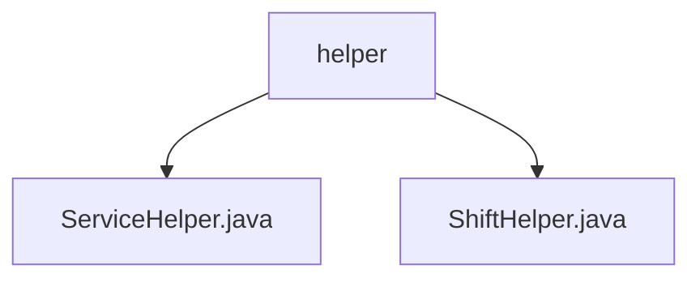

# 基础信息

|      |      |
|------|------|
| 名称 | helper |
| 编码语言 | .java |
| 代码路径 | staffjoy/company-svc/src/main/java/xyz/staffjoy/company/service/helper |
| 包名 | staffjoy.docs.company-svc.src.main.java.xyz.staffjoy.company.service.helper |
| 概述说明 | ServiceHelper提供异步事件跟踪和通知功能，ShiftHelper管理班次数据并处理验证和转换。 |

# 说明

## 概述

该代码模块是一个基于Spring框架的业务服务模块，主要围绕公司内部员工管理和班次调度功能展开。模块包含两个核心组件类：

1. **ServiceHelper** - 提供异步事件跟踪和通知功能的基础服务组件
2. **ShiftHelper** - 专注于班次数据管理的业务逻辑组件

模块通过远程调用Account和Bot服务实现跨系统协作，采用统一的异常处理机制和日志记录策略，并集成了Sentry错误监控系统。

## 主要业务场景

1. **员工事件跟踪与通知**
   - 异步处理员工入职流程
   - 发送各类班次变更通知（新班次创建/取消/变更）
   - 用户事件跟踪记录

2. **班次管理**
   - 班次信息更新（包含用户/职位验证、审计日志记录）
   - 班次详情获取（包含团队信息验证和数据模型转换）
   - 触发相关事件跟踪和通知

3. **系统可靠性保障**
   - 统一的错误处理（handleErrorAndThrowException）
   - 生产环境错误上报（SentryClient）
   - 环境配置检查
   - 完善的日志记录机制

### 包内部结构视图

该流程图展示了company-svc项目中service/helper目录下的结构关系。helper作为父节点，包含两个子节点文件：ServiceHelper.java和ShiftHelper.java。这两个文件是服务辅助类的实现，分别提供不同的功能支持。整个结构简洁明了，体现了模块化的代码组织方式。

# 文件列表 File List

| 名称   | 类型  | 说明 |
|-------|------|-------------|
| [ServiceHelper.java](ServiceHelper.md) | file | 服务助手类，提供异步事件跟踪、员工入职、班次通知等功能，处理错误并记录日志。 |
| [ShiftHelper.java](ShiftHelper.md) | file | ShiftHelper类用于管理班次数据，包含更新、查询及转换功能，支持异步通知和日志记录。 |

