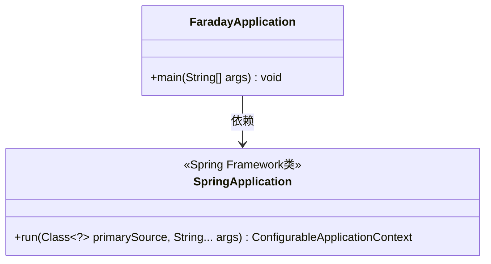
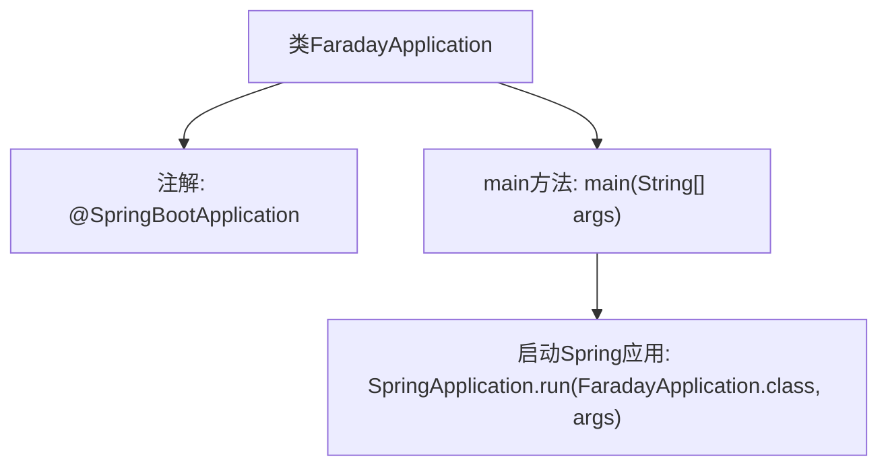

# 基础信息

|      |      |
|------|------|
| 名称 | FaradayApplication |
| 编码语言 | .java |
| 代码路径 | staffjoy/faraday/src/main/java/xyz/staffjoy/faraday/FaradayApplication.java |
| 包名 | xyz.staffjoy.faraday |
| 依赖项 | ['org.springframework.boot.SpringApplication', 'org.springframework.boot.autoconfigure.SpringBootApplication'] |
| 概述说明 | SpringBoot应用启动类，运行主方法启动应用。 |

# 说明

这是一个使用Spring Boot框架的Java应用程序入口类。类名为FaradayApplication，标注了@SpringBootApplication注解，表明这是一个Spring Boot应用的主配置类。main方法作为程序启动入口，通过SpringApplication.run方法启动整个Spring Boot应用，传入的参数是当前类名和命令行参数。这个类遵循了Spring Boot的标准启动模式。

# 类列表 Class Summary

| 名称   | 类型  | 说明 |
|-------|------|-------------|
| FaradayApplication | class | SpringBoot应用启动类，运行主方法启动应用。 |

## 类 FaradayApplication

|      |      |
|------|------|
| 访问范围 | @SpringBootApplication;public |
| 类型 | class |
| 名称 | FaradayApplication |
| 说明 | SpringBoot应用启动类，运行主方法启动应用。 |

### UML类图

这段代码展示了一个典型的Spring Boot应用启动类。FaradayApplication类作为主类，通过main方法启动Spring应用上下文。它依赖于SpringApplication类的run方法来初始化Spring容器，其中@SpringBootApplication注解组合了配置、组件扫描和自动配置功能。类图清晰地展示了启动类与Spring框架核心类之间的简单依赖关系，这是Spring Boot应用的标准启动模式。

### 内部方法调用关系图

这段流程图描述了Spring Boot应用的启动过程。FaradayApplication类通过@SpringBootApplication注解标记为Spring Boot应用入口，main方法调用SpringApplication.run()启动整个应用框架。该流程展示了从类定义到容器初始化的关键步骤，体现了Spring Boot约定优于配置的核心思想。

### 字段列表 Field List

| 名称  | 类型  | 说明 |
|-------|-------|------|

### 方法列表 Method List

| 名称  | 类型  | 说明 |
|-------|-------|------|
| main | void | Java启动Spring应用的main方法。 |

