# 基础信息

|      |      |
|------|------|
| 名称 | faraday |
| 编码语言 | .java |
| 代码路径 | staffjoy/faraday/src/main/java/xyz/staffjoy/faraday |
| 包名 | staffjoy.docs.faraday.src.main.java.xyz.staffjoy.faraday |
| 概述说明 | Spring控制器处理全局错误，生成错误页面并记录异常。模块包含错误页面生成、资源加载和异常处理。反向代理服务支持请求转发、负载均衡和安全控制。 |

# 说明

# Faraday 模块总结

## 概述

Faraday 是一个基于 Spring Boot 的 HTTP 反向代理服务模块，提供完整的请求转发、负载均衡和安全控制功能。该模块采用分层架构设计，包含以下核心组件：

1. **代理核心**：处理 HTTP 请求转发和负载均衡
2. **错误处理系统**：全局异常处理和错误页面生成
3. **配置管理系统**：动态路由映射和属性配置
4. **拦截器框架**：请求预处理和后处理逻辑
5. **监控追踪**：全链路请求监控和性能指标收集
6. **安全控制**：HTTPS 强制、CORS 支持和安全头注入

模块设计注重可配置性和扩展性，支持程序化和静态两种配置方式，适用于微服务架构中的 API 网关场景。

## 主要业务场景

### 1. HTTP 请求代理与转发

- **反向代理功能**：通过 `ReverseProxyFilter` 和 `RequestForwarder` 实现请求拦截、目标地址解析及转发
- **负载均衡**：使用 `RandomLoadBalancer` 在多个目标地址间随机分配请求
- **客户端管理**：`HttpClientProvider` 集中管理不同后端服务的 HTTP 客户端实例
- **数据标准化**：`RequestData`/`ResponseData` 封装传输数据，支持不可变版本和多种数据转换

### 2. 错误处理与页面展示

- **全局异常处理**：`GlobalErrorController` 捕获并处理 `/error` 路径请求，根据异常类型生成相应错误页面
- **错误页面生成**：`ErrorPageFactory` 动态创建特定类型错误页面（超时、禁止访问、服务器错误等）
- **资源管理**：`AssetLoader` 加载并编码图像资源（Logo、favicon）供错误页面使用
- **错误追踪**：非调试模式下将异常信息发送到 Sentry 服务并记录相关 ID

### 3. 配置管理与验证

- **动态配置**：`FaradayProperties` 管理全局代理配置，支持程序化映射开关
- **路由映射**：`MappingProperties` 配置请求路径与目标主机列表，支持超时设置
- **配置验证**：`MappingsValidator` 确保映射配置的有效性，检查重复名称和目标主机格式

### 4. 安全控制与过滤

- **安全防护**：`SecurityFilter` 强制 HTTPS、设置安全头；`NakedDomainFilter` 规范化域名
- **快速响应**：`FaviconFilter` 和 `HealthCheckFilter` 处理静态资源与健康检查请求
- **认证授权**：通过拦截器实现身份验证和权限检查

### 5. 监控与调试

- **全链路追踪**：`TraceInterceptor` 记录请求/响应详细信息（方法、URI、状态码等）
- **性能指标**：`MetricsProperties` 设置指标前缀，收集代理性能数据
- **错误排查**：转发失败时记录错误上下文，便于问题定位

### 6. 自定义异常处理

- **通用异常**：`FaradayException` 表示运行时错误，支持异常链传递
- **权限异常**：`ForbiddenException` 专门处理禁止访问或非法操作场景

该模块作为微服务架构中的核心网关组件，提供了请求路由、安全防护、流量控制和监控等完整功能，同时保持了良好的扩展性和配置灵活性。

### 包内部结构视图

```mermaid
graph TD
    faraday --> FaradayApplication.java
    faraday --> controller
    faraday --> view
    faraday --> exceptions
    faraday --> config
    faraday --> core
    controller --> GlobalErrorController.java
    view --> ErrorPageFactory.java
    view --> AssetLoader.java
    view --> ErrorPage.java
    exceptions --> FaradayException.java
    exceptions --> ForbiddenException.java
    config --> MappingProperties.java
    config --> TracingProperties.java
    config --> FaradayProperties.java
    config --> FaradayConfiguration.java
    config --> MetricsProperties.java
    config --> StaffjoyPropreties.java
    core --> http
    core --> interceptor
    core --> utils
    core --> filter
    core --> trace
    core --> balancer
    core --> mappings
    http --> ReverseProxyFilter.java
    http --> HttpClientProvider.java
    http --> UnmodifiableRequestData.java
    http --> ResponseData.java
    http --> RequestData.java
    http --> RequestForwarder.java
    http --> ForwardDestination.java
    http --> RequestDataExtractor.java
    interceptor --> PreForwardRequestInterceptor.java
    interceptor --> NoOpPreForwardRequestInterceptor.java
    interceptor --> CacheResponseInterceptor.java
    interceptor --> PostForwardResponseInterceptor.java
    interceptor --> AuthRequestInterceptor.java
    interceptor --> NoOpPostForwardResponseInterceptor.java
    utils --> UriCorrector.java
    utils --> BodyConverter.java
    filter --> SecurityFilter.java
    filter --> FaviconFilter.java
    filter --> HealthCheckFilter.java
    filter --> NakedDomainFilter.java
    trace --> IncomingRequest.java
    trace --> LoggingTraceInterceptor.java
    trace --> ForwardRequest.java
    trace --> HttpEntity.java
    trace --> ReceivedResponse.java
    trace --> ProxyingTraceInterceptor.java
    trace --> TraceInterceptor.java
    balancer --> RandomLoadBalancer.java
    balancer --> LoadBalancer.java
    mappings --> MappingsValidator.java
    mappings --> MappingsProvider.java
    mappings --> ProgrammaticMappingsProvider.java
    mappings --> ConfigurationMappingsProvider.java
```

该流程图展示了Staffjoy Faraday项目的完整目录结构，从根目录faraday开始，逐级展开controller、view、exceptions、config和core等主要模块。core模块进一步细分为http、interceptor、utils、filter、trace、balancer和mappings等子模块，每个子模块包含多个具体的Java类文件。整个结构清晰地呈现了项目各组件之间的层级关系，体现了模块化设计的架构特点。

# 文件列表 File List

| 名称   | 类型  | 说明 |
|-------|------|-------------|
| [FaradayApplication.java](FaradayApplication.md) | file | SpringBoot应用启动类，运行主方法启动应用。 |
| [core](core/_module.md) | package | Java反向代理核心组件，含请求转发、客户端管理、拦截器、负载均衡、URI处理、安全过滤和请求追踪功能。 |
| [config](config/_module.md) | package | Faraday配置类集合：MappingProperties定义HTTP映射属性；TracingProperties控制追踪开关；FaradayProperties管理代理设置；FaradayConfiguration注册组件；MetricsProperties配置指标前缀；StaffjoyProperties封装签名密钥。 |
| [exceptions](exceptions/_module.md) | package | FaradayException和ForbiddenException均继承RuntimeException，提供带消息和原因的构造函数，用于处理运行时错误。 |
| [view](view/_module.md) | package | ErrorPageFactory构建错误页，AssetLoader加载图像资源，ErrorPage定义错误页数据结构。 |
| [controller](controller/_module.md) | package | 全局错误控制器，处理异常并生成错误页面，集成Sentry上报。 |

