# 基础信息

|      |      |
|------|------|
| 名称 | FaradayConfiguration |
| 编码语言 | .java |
| 代码路径 | staffjoy/faraday/src/main/java/xyz/staffjoy/faraday/config/FaradayConfiguration.java |
| 包名 | xyz.staffjoy.faraday.config |
| 依赖项 | ['io.micrometer.core.instrument.MeterRegistry', 'org.springframework.boot.autoconfigure.condition.ConditionalOnMissingBean', 'org.springframework.boot.autoconfigure.web.ServerProperties', 'org.springframework.boot.context.properties.EnableConfigurationProperties', 'org.springframework.boot.web.servlet.FilterRegistrationBean', 'org.springframework.context.annotation.Bean', 'org.springframework.context.annotation.Configuration', 'org.springframework.context.annotation.Import', 'org.springframework.core.Ordered', 'xyz.staffjoy.common.config.StaffjoyWebConfig', 'xyz.staffjoy.common.env.EnvConfig', 'xyz.staffjoy.faraday.core.filter.FaviconFilter', 'xyz.staffjoy.faraday.core.filter.HealthCheckFilter', 'xyz.staffjoy.faraday.core.filter.NakedDomainFilter', 'xyz.staffjoy.faraday.core.filter.SecurityFilter', 'xyz.staffjoy.faraday.core.interceptor', 'xyz.staffjoy.faraday.core.balancer.LoadBalancer', 'xyz.staffjoy.faraday.core.balancer.RandomLoadBalancer', 'xyz.staffjoy.faraday.core.http', 'xyz.staffjoy.faraday.core.mappings.ConfigurationMappingsProvider', 'xyz.staffjoy.faraday.core.mappings.MappingsProvider', 'xyz.staffjoy.faraday.core.mappings.MappingsValidator', 'xyz.staffjoy.faraday.core.mappings.ProgrammaticMappingsProvider', 'xyz.staffjoy.faraday.core.trace.LoggingTraceInterceptor', 'xyz.staffjoy.faraday.core.trace.ProxyingTraceInterceptor', 'xyz.staffjoy.faraday.core.trace.TraceInterceptor', 'xyz.staffjoy.faraday.view.AssetLoader', 'java.util'] |
| 概述说明 | Faraday配置类，注册多个过滤器及反向代理相关组件，包含属性注入和条件化Bean创建。 |

# 说明

该配置类是一个Spring配置类，用于设置Faraday反向代理服务的相关组件。它启用了FaradayProperties和StaffjoyProperties的配置属性，并导入了StaffjoyWebConfig。类中注入了多个属性类实例和AssetLoader。主要功能包括注册多个过滤器，如ReverseProxyFilter、NakedDomainFilter、SecurityFilter、FaviconFilter和HealthCheckFilter，并设置它们的执行顺序。此外，它还定义了多个Bean，包括HttpClientProvider、RequestDataExtractor、MappingsProvider（根据配置选择程序化或配置方式）、LoadBalancer、MappingsValidator、RequestForwarder以及各种拦截器（TraceInterceptor、ProxyingTraceInterceptor、PreForwardRequestInterceptor和PostForwardResponseInterceptor）。这些组件共同构成了Faraday反向代理的核心功能。

# 类列表 Class Summary

| 名称   | 类型  | 说明 |
|-------|------|-------------|
| FaradayConfiguration | class | 配置类FaradayConfiguration，启用属性配置，导入Web配置，定义多个过滤器注册Bean和反向代理相关组件。 |

## 类 FaradayConfiguration

|      |      |
|------|------|
| 访问范围 | @Configuration;@EnableConfigurationProperties({FaradayProperties.class, StaffjoyPropreties.class});@Import(value = StaffjoyWebConfig.class);public |
| 类型 | class |
| 名称 | FaradayConfiguration |
| 说明 | 配置类FaradayConfiguration，启用属性配置，导入Web配置，定义多个过滤器注册Bean和反向代理相关组件。 |

### UML类图

```mermaid
classDiagram
    class FaradayConfiguration {
        -FaradayProperties faradayProperties
        -ServerProperties serverProperties
        -StaffjoyPropreties staffjoyPropreties
        -AssetLoader assetLoader
        +FaradayConfiguration(FaradayProperties, ServerProperties, StaffjoyPropreties, AssetLoader)
        +faradayReverseProxyFilterRegistrationBean(ReverseProxyFilter) FilterRegistrationBean~ReverseProxyFilter~
        +nakedDomainFilterRegistrationBean(EnvConfig) FilterRegistrationBean~NakedDomainFilter~
        +securityFilterRegistrationBean(EnvConfig) FilterRegistrationBean~SecurityFilter~
        +faviconFilterRegistrationBean() FilterRegistrationBean~FaviconFilter~
        +healthCheckFilterRegistrationBean() FilterRegistrationBean~HealthCheckFilter~
        +faradayReverseProxyFilter(RequestDataExtractor, MappingsProvider, RequestForwarder, ProxyingTraceInterceptor, PreForwardRequestInterceptor) ReverseProxyFilter
        +faradayHttpClientProvider() HttpClientProvider
        +faradayRequestDataExtractor() RequestDataExtractor
        +faradayConfigurationMappingsProvider(EnvConfig, MappingsValidator, HttpClientProvider) MappingsProvider
        +faradayLoadBalancer() LoadBalancer
        +faradayMappingsValidator() MappingsValidator
        +faradayRequestForwarder(HttpClientProvider, MappingsProvider, LoadBalancer, Optional~MeterRegistry~, ProxyingTraceInterceptor, PostForwardResponseInterceptor) RequestForwarder
        +faradayTraceInterceptor() TraceInterceptor
        +faradayProxyingTraceInterceptor(TraceInterceptor) ProxyingTraceInterceptor
        +faradayPreForwardRequestInterceptor(EnvConfig) PreForwardRequestInterceptor
        +faradayPostForwardResponseInterceptor() PostForwardResponseInterceptor
    }

    class FaradayProperties {
        <<ConfigurationProperties>>
    }

    class StaffjoyPropreties {
        <<ConfigurationProperties>>
    }

    class ServerProperties {
        <<ConfigurationProperties>>
    }

    class AssetLoader {
        +getFaviconFile() File
    }

    class ReverseProxyFilter {
        +ReverseProxyFilter(FaradayProperties, RequestDataExtractor, MappingsProvider, RequestForwarder, ProxyingTraceInterceptor, PreForwardRequestInterceptor)
    }

    class NakedDomainFilter {
        +NakedDomainFilter(EnvConfig)
    }

    class SecurityFilter {
        +SecurityFilter(EnvConfig)
    }

    class FaviconFilter {
        +FaviconFilter(File)
    }

    class HealthCheckFilter {
        +HealthCheckFilter()
    }

    class RequestDataExtractor {
        <<Interface>>
    }

    class MappingsProvider {
        <<Interface>>
    }

    class RequestForwarder {
        <<Interface>>
    }

    class ProxyingTraceInterceptor {
        <<Interface>>
    }

    class PreForwardRequestInterceptor {
        <<Interface>>
    }

    class PostForwardResponseInterceptor {
        <<Interface>>
    }

    class HttpClientProvider {
        <<Interface>>
    }

    class LoadBalancer {
        <<Interface>>
    }

    class MappingsValidator {
        <<Interface>>
    }

    class TraceInterceptor {
        <<Interface>>
    }

    FaradayConfiguration --> FaradayProperties : 依赖
    FaradayConfiguration --> StaffjoyPropreties : 依赖
    FaradayConfiguration --> ServerProperties : 依赖
    FaradayConfiguration --> AssetLoader : 依赖
    FaradayConfiguration --> ReverseProxyFilter : 创建
    FaradayConfiguration --> NakedDomainFilter : 创建
    FaradayConfiguration --> SecurityFilter : 创建
    FaradayConfiguration --> FaviconFilter : 创建
    FaradayConfiguration --> HealthCheckFilter : 创建
    FaradayConfiguration --> RequestDataExtractor : 创建
    FaradayConfiguration --> MappingsProvider : 创建
    FaradayConfiguration --> RequestForwarder : 创建
    FaradayConfiguration --> ProxyingTraceInterceptor : 创建
    FaradayConfiguration --> PreForwardRequestInterceptor : 创建
    FaradayConfiguration --> PostForwardResponseInterceptor : 创建
    FaradayConfiguration --> HttpClientProvider : 创建
    FaradayConfiguration --> LoadBalancer : 创建
    FaradayConfiguration --> MappingsValidator : 创建
    FaradayConfiguration --> TraceInterceptor : 创建
```

这段代码是一个Spring Boot配置类，主要用于配置Faraday反向代理相关的过滤器、拦截器和提供者。FaradayConfiguration类通过依赖注入多个配置属性和组件，创建并注册了多个过滤器（如ReverseProxyFilter、NakedDomainFilter等）和拦截器（如ProxyingTraceInterceptor、AuthRequestInterceptor等）。它还提供了多种接口的实现类，如HttpClientProvider、LoadBalancer等，用于处理HTTP请求、负载均衡和映射验证等任务。整个配置类通过@Bean方法创建和管理这些组件，并通过FilterRegistrationBean设置过滤器的执行顺序。

### 内部方法调用关系图

```mermaid
graph TD
    A["类FaradayConfiguration"]
    B["属性: FaradayProperties faradayProperties"]
    C["属性: ServerProperties serverProperties"]
    D["属性: StaffjoyPropreties staffjoyPropreties"]
    E["属性: AssetLoader assetLoader"]
    F["构造方法: FaradayConfiguration()"]
    G["Bean方法: faradayReverseProxyFilterRegistrationBean()"]
    H["Bean方法: nakedDomainFilterRegistrationBean()"]
    I["Bean方法: securityFilterRegistrationBean()"]
    J["Bean方法: faviconFilterRegistrationBean()"]
    K["Bean方法: healthCheckFilterRegistrationBean()"]
    L["Bean方法: faradayReverseProxyFilter()"]
    M["Bean方法: faradayHttpClientProvider()"]
    N["Bean方法: faradayRequestDataExtractor()"]
    O["Bean方法: faradayConfigurationMappingsProvider()"]
    P["Bean方法: faradayLoadBalancer()"]
    Q["Bean方法: faradayMappingsValidator()"]
    R["Bean方法: faradayRequestForwarder()"]
    S["Bean方法: faradayTraceInterceptor()"]
    T["Bean方法: faradayProxyingTraceInterceptor()"]
    U["Bean方法: faradayPreForwardRequestInterceptor()"]
    V["Bean方法: faradayPostForwardResponseInterceptor()"]

    A --> B
    A --> C
    A --> D
    A --> E
    A --> F
    A --> G
    A --> H
    A --> I
    A --> J
    A --> K
    A --> L
    A --> M
    A --> N
    A --> O
    A --> P
    A --> Q
    A --> R
    A --> S
    A --> T
    A --> U
    A --> V
```

这段代码是Spring Boot配置类FaradayConfiguration的实现，主要用于配置反向代理相关的过滤器(Filter)和Bean。类通过构造函数注入多个配置属性对象，并定义了12个@Bean方法用于创建各种过滤器实例和工具类实例。这些过滤器包括反向代理过滤器、域名过滤器、安全过滤器、favicon过滤器、健康检查过滤器等，每个过滤器都设置了特定的执行顺序。同时配置了HTTP客户端、请求转发器、负载均衡器等基础设施组件，形成了一个完整的反向代理服务配置体系。

### 字段列表 Field List

| 名称  | 类型  | 说明 |
|-------|-------|------|
| staffjoyPropreties | StaffjoyPropreties | 受保护常量Staffjoy属性配置 |
| faradayProperties | FaradayProperties | 受保护的最终FaradayProperties属性faradayProperties。 |
| assetLoader | AssetLoader | 受保护的最终资产加载器实例。 |
| serverProperties | ServerProperties | 受保护的ServerProperties实例。 |

### 方法列表 Method List

| 名称  | 类型  | 说明 |
|-------|-------|------|
| faradayTraceInterceptor | TraceInterceptor | 条件缺失时创建TraceInterceptor实例，默认使用LoggingTraceInterceptor。 |
| faradayRequestForwarder | RequestForwarder | 创建请求转发器，依赖HTTP客户端、映射提供器等组件。 |
| faradayPostForwardResponseInterceptor | PostForwardResponseInterceptor | 定义Bean：缺失时创建PostForwardResponseInterceptor，返回CacheResponseInterceptor。 |
| faradayReverseProxyFilterRegistrationBean | FilterRegistrationBean<ReverseProxyFilter> | 注册反向代理过滤器，设置优先级并返回配置对象。 |
| faradayReverseProxyFilter | ReverseProxyFilter | 创建反向代理过滤器，依赖多个组件实现请求处理。 |
| faradayLoadBalancer | LoadBalancer | 定义随机负载均衡器Bean，无其他同类Bean时生效。 |
| healthCheckFilterRegistrationBean | FilterRegistrationBean<HealthCheckFilter> | 注册健康检查过滤器，优先级设为最高+70。 |
| faradayProxyingTraceInterceptor | ProxyingTraceInterceptor | 创建条件Bean：ProxyingTraceInterceptor，依赖TraceInterceptor。 |
| faradayPreForwardRequestInterceptor | PreForwardRequestInterceptor | 定义条件Bean：缺失时创建带签名的请求拦截器。 |
| nakedDomainFilterRegistrationBean | FilterRegistrationBean<NakedDomainFilter> | 注册NakedDomainFilter过滤器，优先级设为最高+90，在ReverseProxyFilter前执行。 |
| faradayConfigurationMappingsProvider | MappingsProvider | 条件注入MappingsProvider，根据faradayProperties启用编程或配置方式。 |
| faviconFilterRegistrationBean | FilterRegistrationBean<FaviconFilter> | 注册FaviconFilter过滤器，设置最高优先级+75。 |
| faradayHttpClientProvider | HttpClientProvider | Spring条件化创建缺省HttpClientProvider实例。 |
| faradayRequestDataExtractor | RequestDataExtractor | 创建RequestDataExtractor实例，当无其他同类型Bean时生效。 |
| securityFilterRegistrationBean | FilterRegistrationBean<SecurityFilter> | 注册安全过滤器，优先级设为最高+80，先于裸域过滤器执行。 |
| faradayMappingsValidator | MappingsValidator | 创建MappingsValidator实例，无其他同类型Bean时生效。 |

