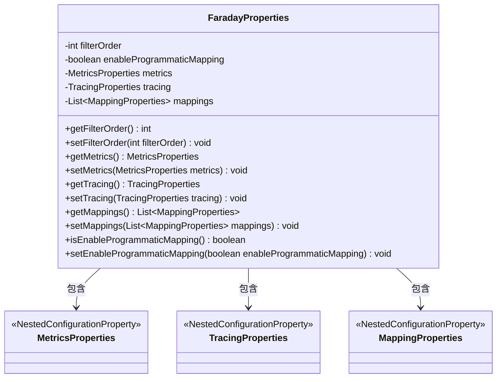

# 基础信息

|      |      |
|------|------|
| 名称 | FaradayProperties |
| 编码语言 | .java |
| 代码路径 | staffjoy/faraday/src/main/java/xyz/staffjoy/faraday/config/FaradayProperties.java |
| 包名 | xyz.staffjoy.faraday.config |
| 依赖项 | ['org.springframework.boot.context.properties.ConfigurationProperties', 'org.springframework.boot.context.properties.NestedConfigurationProperty', 'java.util.ArrayList', 'java.util.List', 'org.springframework.core.Ordered.HIGHEST_PRECEDENCE'] |
| 概述说明 | Faraday配置类，含过滤器顺序、映射开关、指标、追踪和代理映射属性。 |

# 说明

FaradayProperties类是一个配置属性类，用于管理Faraday相关的设置。它包含多个属性：filterOrder定义过滤器执行顺序，默认值为最高优先级加100；enableProgrammaticMapping控制是否启用编程式映射，默认开启，开发环境除外；metrics和tracing分别用于配置HTTP请求转发时的指标收集和追踪功能；mappings存储代理映射列表。类中提供了各属性的getter和setter方法，支持灵活配置。

# 类列表 Class Summary

| 名称   | 类型  | 说明 |
|-------|------|-------------|
| FaradayProperties | class | Faraday配置类，含过滤器顺序、程序映射开关、指标、追踪和代理映射属性。 |

## 类 FaradayProperties

|      |      |
|------|------|
| 访问范围 | @ConfigurationProperties("faraday");public |
| 类型 | class |
| 名称 | FaradayProperties |
| 说明 | Faraday配置类，含过滤器顺序、程序映射开关、指标、追踪和代理映射属性。 |

### UML类图

这段代码展示了一个Spring Boot配置属性类`FaradayProperties`，用于管理HTTP请求代理的相关配置。该类包含过滤器顺序、编程映射开关、指标收集、请求追踪和代理映射列表等配置项，通过`@NestedConfigurationProperty`注解嵌套了三个子配置类（MetricsProperties、TracingProperties和MappingProperties）。类图清晰地展示了主配置类与嵌套配置类之间的包含关系，以及所有属性的访问器方法。

### 内部方法调用关系图

```mermaid
graph TD
    A["类FaradayProperties"]
    B["属性: int filterOrder = HIGHEST_PRECEDENCE + 100"]
    C["属性: boolean enableProgrammaticMapping = true"]
    D["属性: MetricsProperties metrics = new MetricsProperties()"]
    E["属性: TracingProperties tracing = new TracingProperties()"]
    F["属性: List<MappingProperties> mappings = new ArrayList<>()"]
    G["方法: getFilterOrder()"]
    H["方法: setFilterOrder(int filterOrder)"]
    I["方法: getMetrics()"]
    J["方法: setMetrics(MetricsProperties metrics)"]
    K["方法: getTracing()"]
    L["方法: setTracing(TracingProperties tracing)"]
    M["方法: getMappings()"]
    N["方法: setMappings(List<MappingProperties> mappings)"]
    O["方法: isEnableProgrammaticMapping()"]
    P["方法: setEnableProgrammaticMapping(boolean enableProgrammaticMapping)"]

    A --> B
    A --> C
    A --> D
    A --> E
    A --> F
    A --> G
    A --> H
    A --> I
    A --> J
    A --> K
    A --> L
    A --> M
    A --> N
    A --> O
    A --> P
```

这段代码定义了一个名为FaradayProperties的配置类，用于管理HTTP请求转发相关的配置属性。类中包含过滤器顺序、编程映射开关、指标收集配置、请求追踪配置以及代理映射列表等核心属性，并为每个属性提供了标准的getter和setter方法。通过@ConfigurationProperties注解绑定到"faraday"前缀的配置项，支持嵌套配置（MetricsProperties/TracingProperties/MappingProperties），适用于Spring Boot应用的配置管理场景。

### 字段列表 Field List

| 名称  | 类型  | 说明 |
|-------|-------|------|
| metrics = new MetricsProperties() | MetricsProperties | 嵌套配置属性：MetricsProperties实例metrics。 |
| tracing = new TracingProperties() | TracingProperties | 嵌套配置属性：TracingProperties实例化 |
| enableProgrammaticMapping = true | boolean | 启用程序化映射 |
| filterOrder = HIGHEST_PRECEDENCE + 100 | int | 过滤器优先级设置为最高级加100 |
| mappings = new ArrayList<>() | List<MappingProperties> | 嵌套配置属性，映射列表初始化为空数组。 |

### 方法列表 Method List

| 名称  | 类型  | 说明 |
|-------|-------|------|
| getMetrics | MetricsProperties | 获取metrics属性的方法。 |
| setFilterOrder | void | 设置过滤器顺序的方法。 |
| getFilterOrder | int | 获取过滤器顺序的整数值。 |
| getTracing | TracingProperties | 获取追踪属性对象。 |
| getMappings | List<MappingProperties> | 获取映射属性列表的方法。 |
| setMetrics | void | 设置metrics属性的方法。 |
| setMappings | void | 设置映射属性列表。 |
| setTracing | void | 设置追踪属性方法 |
| setEnableProgrammaticMapping | void | 设置程序化映射启用状态的方法。 |
| isEnableProgrammaticMapping | boolean | 检查是否启用程序化映射 |

