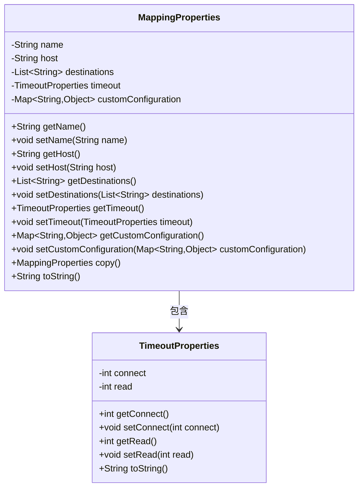

# 基础信息

|      |      |
|------|------|
| 名称 | MappingProperties |
| 编码语言 | .java |
| 代码路径 | staffjoy/faraday/src/main/java/xyz/staffjoy/faraday/config/MappingProperties.java |
| 包名 | xyz.staffjoy.faraday.config |
| 依赖项 | ['org.apache.commons.lang3.builder.ToStringBuilder', 'java.util.ArrayList', 'java.util.HashMap', 'java.util.List', 'java.util.Map', 'org.apache.commons.lang3.builder.ToStringStyle.NO_CLASS_NAME_STYLE'] |
| 概述说明 | HTTP请求映射配置类，含名称、主机路径、目标列表、超时及自定义属性。 |

# 说明

该内容描述了一个名为MappingProperties的Java类，用于配置HTTP请求映射属性。类包含以下字段：name（映射名称）、host（请求URI路径）、destinations（目标主机列表）、timeout（超时属性，含connect和read两个子属性）以及customConfiguration（自定义配置）。类提供了各字段的getter和setter方法，并实现了copy方法用于创建副本，以及toString方法用于格式化输出。TimeoutProperties作为嵌套类，定义了连接和读取超时时间。

# 类列表 Class Summary

| 名称   | 类型  | 说明 |
|-------|------|-------------|
| MappingProperties | class | HTTP请求映射配置类，含名称、主机路径、目标列表、超时设置及自定义属性。 |

## 类 MappingProperties

|      |      |
|------|------|
| 访问范围 | public |
| 类型 | class |
| 名称 | MappingProperties |
| 说明 | HTTP请求映射配置类，含名称、主机路径、目标列表、超时设置及自定义属性。 |

### UML类图

类图描述：该图展示了MappingProperties类及其嵌套类TimeoutProperties的结构。MappingProperties用于配置HTTP请求映射，包含名称、主机路径、目标地址列表、超时设置和自定义配置等属性，其中超时设置由TimeoutProperties类专门管理。TimeoutProperties定义了连接和读取超时参数。两个类都提供了标准的getter/setter方法和toString()实现，MappingProperties还包含一个深拷贝方法copy()。

### 内部方法调用关系图

```mermaid
graph TD
    A["类MappingProperties"]
    B["属性: String name"]
    C["属性: String host = ''"]
    D["属性: List<String> destinations = new ArrayList<>()"]
    E["属性: TimeoutProperties timeout = new TimeoutProperties()"]
    F["属性: Map<String, Object> customConfiguration = new HashMap<>()"]
    G["方法: getName()"]
    H["方法: setName(String name)"]
    I["方法: getHost()"]
    J["方法: setHost(String host)"]
    K["方法: getDestinations()"]
    L["方法: setDestinations(List<String> destinations)"]
    M["方法: getTimeout()"]
    N["方法: setTimeout(TimeoutProperties timeout)"]
    O["方法: getCustomConfiguration()"]
    P["方法: setCustomConfiguration(Map<String, Object> customConfiguration)"]
    Q["方法: copy()"]
    R["方法: toString()"]
    S["静态内部类TimeoutProperties"]
    T["属性: int connect = 2000"]
    U["属性: int read = 20000"]
    V["方法: getConnect()"]
    W["方法: setConnect(int connect)"]
    X["方法: getRead()"]
    Y["方法: setRead(int read)"]
    Z["方法: toString()"]

    A --> B
    A --> C
    A --> D
    A --> E
    A --> F
    A --> G
    A --> H
    A --> I
    A --> J
    A --> K
    A --> L
    A --> M
    A --> N
    A --> O
    A --> P
    A --> Q
    A --> R
    A --> S
    S --> T
    S --> U
    S --> V
    S --> W
    S --> X
    S --> Y
    S --> Z
```

这段代码定义了一个`MappingProperties`类，用于配置HTTP请求映射的相关属性，包括名称、主机路径、目标地址列表、超时设置和自定义配置。类中包含多个getter和setter方法用于属性访问，以及`copy()`方法用于创建对象副本。内部静态类`TimeoutProperties`专门处理连接和读取超时设置。流程图清晰地展示了类与内部类的结构关系，以及所有属性和方法的层级调用路径。

### 字段列表 Field List

| 名称  | 类型  | 说明 |
|-------|-------|------|
| destinations = new ArrayList<>() | List<String> | 声明一个私有字符串列表变量destinations并初始化为空列表。 |
| timeout = new TimeoutProperties() | TimeoutProperties | 初始化超时属性对象timeout。 |
| name | String | 私有字符串变量name |
| host = "" | String | 私有字符串变量host初始化为空。 |
| customConfiguration = new HashMap<>() | Map<String, Object> | 自定义配置映射表 |

### 方法列表 Method List

| 名称  | 类型  | 说明 |
|-------|-------|------|
| setDestinations | void | 设置目的地列表。 |
| setHost | void | 设置主机地址的方法。 |
| getName | String | 获取name属性的字符串值。 |
| getCustomConfiguration | Map<String, Object> | 获取自定义配置的公共方法，返回键值对映射。 |
| getHost | String | 获取host字符串的方法。 |
| setName | void | 设置对象名称的方法。 |
| getTimeout | TimeoutProperties | 获取超时属性的方法。 |
| setTimeout | void | 设置超时属性方法。 |
| setCustomConfiguration | void | 设置自定义配置的Map类型参数方法。 |
| getDestinations | List<String> | 获取目的地列表的方法。 |
| copy | MappingProperties | 复制MappingProperties对象，包含名称、主机、目标、超时和自定义配置。 |
| toString | String | 重写toString方法，输出name、host等字段信息。 |

