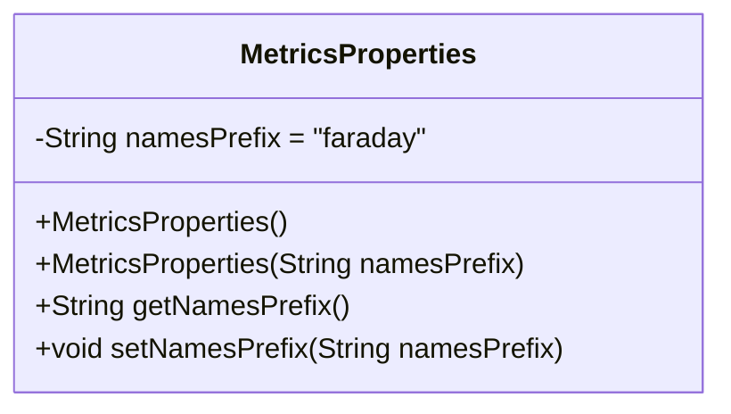
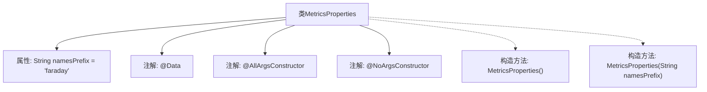

# 基础信息

|      |      |
|------|------|
| 名称 | MetricsProperties |
| 编码语言 | .java |
| 代码路径 | staffjoy/faraday/src/main/java/xyz/staffjoy/faraday/config/MetricsProperties.java |
| 包名 | xyz.staffjoy.faraday.config |
| 依赖项 | ['lombok.AllArgsConstructor', 'lombok.Data', 'lombok.NoArgsConstructor'] |
| 概述说明 | MetricsProperties类，含全参和无参构造，默认前缀为faraday。 |

# 说明

该内容定义了一个名为MetricsProperties的Java类，用于配置指标相关属性。类中包含一个私有字符串字段namesPrefix，默认值为"faraday"，用于设置全局指标名称的前缀。类通过Lombok库的注解自动生成全参数构造函数和无参数构造函数。该设计允许灵活配置指标前缀，同时简化了构造函数的样板代码。

# 类列表 Class Summary

| 名称   | 类型  | 说明 |
|-------|------|-------------|
| MetricsProperties | class | MetricsProperties类定义全局指标名前缀，默认值faraday。 |

## 类 MetricsProperties

|      |      |
|------|------|
| 访问范围 | @Data;@AllArgsConstructor;@NoArgsConstructor;public |
| 类型 | class |
| 名称 | MetricsProperties |
| 说明 | MetricsProperties类定义全局指标名前缀，默认值faraday。 |

### UML类图

这段代码展示了一个名为MetricsProperties的配置类，使用Lombok注解自动生成构造器、getter和setter方法。类中包含一个私有字段namesPrefix，默认值为"faraday"，用于存储全局指标名称前缀。通过@AllArgsConstructor和@NoArgsConstructor注解，该类提供了全参数和无参数构造器。@Data注解则自动生成了所有字段的访问器和修改器方法，简化了POJO类的样板代码。这个类通常用于指标监控系统的配置管理。

### 内部方法调用关系图

这段代码定义了一个名为MetricsProperties的类，使用Lombok注解自动生成getter/setter、全参构造和无参构造方法。类包含一个默认值为"faraday"的namesPrefix字符串属性，用于存储全局指标名称前缀。注解驱动的设计简化了代码，避免了手动编写样板代码，同时保持了类的核心功能——封装可配置的指标前缀属性。

### 字段列表 Field List

| 名称  | 类型  | 说明 |
|-------|-------|------|
| namesPrefix = "faraday" | String | 私有字符串变量namesPrefix初始化为"faraday"。 |

### 方法列表 Method List

| 名称  | 类型  | 说明 |
|-------|-------|------|

