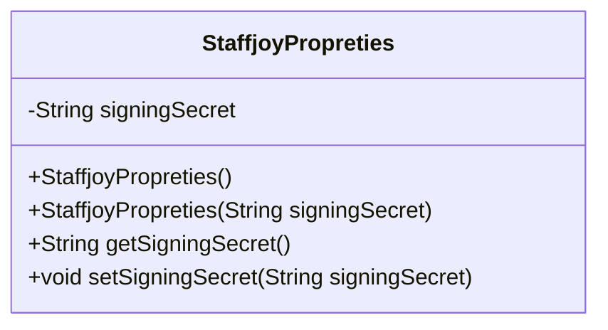
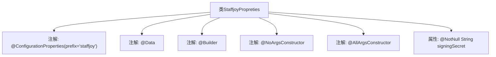

# 基础信息

|      |      |
|------|------|
| 名称 | StaffjoyPropreties |
| 编码语言 | .java |
| 代码路径 | staffjoy/faraday/src/main/java/xyz/staffjoy/faraday/config/StaffjoyPropreties.java |
| 包名 | xyz.staffjoy.faraday.config |
| 依赖项 | ['lombok.AllArgsConstructor', 'lombok.Builder', 'lombok.Data', 'lombok.NoArgsConstructor', 'org.springframework.boot.context.properties.ConfigurationProperties', 'javax.validation.constraints.NotNull'] |
| 概述说明 | Java配置类，定义签名密钥属性。 |

# 说明

这段内容描述了一个名为StaffjoyPropreties的Java类，使用了多个注解进行配置。类上标注了@ConfigurationProperties注解，前缀设置为staffjoy，表明这是一个配置属性类。同时使用了@Data、@Builder、@NoArgsConstructor和@AllArgsConstructor注解，分别用于自动生成getter/setter方法、构建器模式、无参构造器和全参构造器。类中包含一个非空的私有字符串属性signingSecret，用于存储签名密钥。整个类主要用于封装以staffjoy为前缀的配置属性。

# 类列表 Class Summary

| 名称   | 类型  | 说明 |
|-------|------|-------------|
| StaffjoyPropreties | class | Java配置类StaffjoyPropreties，含签名密钥字段。 |

## 类 StaffjoyPropreties

|      |      |
|------|------|
| 访问范围 | @ConfigurationProperties(prefix="staffjoy");@Data;@Builder;@NoArgsConstructor;@AllArgsConstructor;public |
| 类型 | class |
| 名称 | StaffjoyPropreties |
| 说明 | Java配置类StaffjoyPropreties，含签名密钥字段。 |

### UML类图

这段类图展示了一个名为StaffjoyPropreties的配置属性类，该类使用Lombok注解自动生成构造函数、getter/setter方法和builder模式。核心属性signingSecret被@NotNull注解标记，表示该字段不能为空。类通过@ConfigurationProperties绑定配置文件前缀为"staffjoy"的属性，适合在Spring Boot应用中作为集中式配置管理使用。类结构体现了Java配置类的典型设计模式，通过注解简化了样板代码的编写。

### 内部方法调用关系图

该流程图展示了StaffjoyPropreties类的结构，这是一个配置属性类，使用了Lombok的@Data、@Builder、@NoArgsConstructor和@AllArgsConstructor注解来自动生成getter/setter、构建器模式和无参/全参构造函数。类上标注了@ConfigurationProperties注解，表示它绑定到以"staffjoy"为前缀的配置属性，并包含一个非空的signingSecret字符串属性。整个设计用于简化外部配置的注入和管理。

### 字段列表 Field List

| 名称  | 类型  | 说明 |
|-------|-------|------|
| signingSecret | String | 非空字符串签名密钥 |

### 方法列表 Method List

| 名称  | 类型  | 说明 |
|-------|-------|------|

