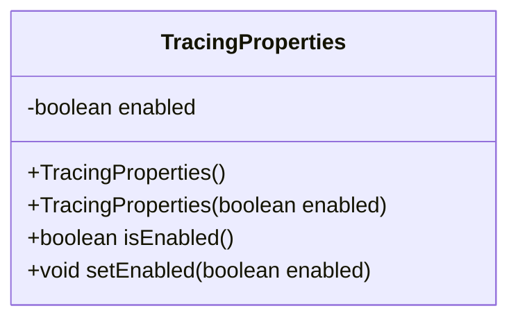
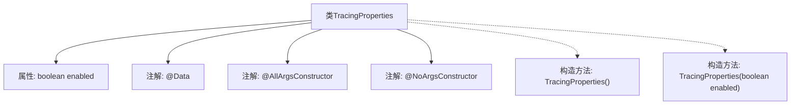

# 基础信息

|      |      |
|------|------|
| 名称 | TracingProperties |
| 编码语言 | .java |
| 代码路径 | staffjoy/faraday/src/main/java/xyz/staffjoy/faraday/config/TracingProperties.java |
| 包名 | xyz.staffjoy.faraday.config |
| 依赖项 | ['lombok.AllArgsConstructor', 'lombok.Data', 'lombok.NoArgsConstructor'] |
| 概述说明 | 追踪配置类，含启用标志和构造方法。 |

# 说明

这是一个名为TracingProperties的Java类，使用Lombok注解自动生成全参和无参构造函数。类中包含一个布尔类型字段enabled，用于控制是否启用追踪HTTP请求代理过程的开关功能。该字段通过注释说明其用途是启用或禁用追踪功能。整个类结构简洁，专注于配置请求追踪的开关状态。

# 类列表 Class Summary

| 名称   | 类型  | 说明 |
|-------|------|-------------|
| TracingProperties | class | 追踪配置类，含启用标志，有无参构造。 |

## 类 TracingProperties

|      |      |
|------|------|
| 访问范围 | @Data;@AllArgsConstructor;@NoArgsConstructor;public |
| 类型 | class |
| 名称 | TracingProperties |
| 说明 | 追踪配置类，含启用标志，有无参构造。 |

### UML类图

这段代码展示了一个使用Lombok注解的配置类TracingProperties，它通过@Data自动生成getter/setter方法，@AllArgsConstructor和@NoArgsConstructor分别生成全参和无参构造函数。该类核心功能是控制HTTP请求跟踪代理的开关状态，通过布尔字段enabled来标识是否启用跟踪功能。类图清晰地呈现了其私有字段、构造函数以及自动生成的访问方法，体现了简洁的配置类设计模式。

### 内部方法调用关系图

这段代码展示了一个使用Lombok注解的Java类TracingProperties，主要用于控制HTTP请求跟踪功能的开关状态。通过@Data注解自动生成getter/setter方法，@AllArgsConstructor和@NoArgsConstructor分别生成全参数和无参构造方法。核心属性enabled作为布尔标志位，决定是否启用请求跟踪功能。流程图清晰呈现了类结构、属性与注解的关联关系，以及Lombok自动生成的构造方法。

### 字段列表 Field List

| 名称  | 类型  | 说明 |
|-------|-------|------|
| enabled | boolean | 私有布尔变量enabled |

### 方法列表 Method List

| 名称  | 类型  | 说明 |
|-------|-------|------|

