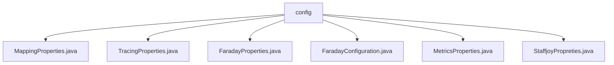

# 基础信息

|      |      |
|------|------|
| 名称 | config |
| 编码语言 | .java |
| 代码路径 | staffjoy/faraday/src/main/java/xyz/staffjoy/faraday/config |
| 包名 | staffjoy.docs.faraday.src.main.java.xyz.staffjoy.faraday.config |
| 概述说明 | Faraday配置类集合：MappingProperties定义HTTP映射属性；TracingProperties控制追踪开关；FaradayProperties管理代理设置；FaradayConfiguration注册组件；MetricsProperties配置指标前缀；StaffjoyProperties封装签名密钥。 |

# 说明

## 概述  
该代码模块是一个基于Spring的HTTP反向代理服务（Faraday），主要用于请求转发、负载均衡和追踪等功能。模块通过配置属性类（如`FaradayProperties`、`MappingProperties`等）和Spring组件（如过滤器、拦截器等）实现灵活的代理规则和功能扩展。核心功能包括动态请求映射、超时控制、指标收集、请求追踪以及安全校验等。

## 主要业务场景  
1. **HTTP请求代理与负载均衡**  
   - 通过`MappingProperties`配置请求路径（`host`）与目标主机列表（`destinations`），支持超时设置（`connect`/`read`）和自定义配置。  
   - `LoadBalancer`和`RequestForwarder`实现请求的分发与转发。  

2. **动态配置与验证**  
   - `FaradayProperties`集中管理代理全局配置，如过滤器顺序（`filterOrder`）、编程式映射开关（`enableProgrammaticMapping`）等。  
   - `MappingsValidator`确保映射配置的有效性。  

3. **监控与追踪**  
   - `MetricsProperties`设置指标前缀（如`faraday`），用于收集代理性能数据。  
   - `TracingProperties`控制是否启用请求代理过程的追踪（`enabled`开关）。  

4. **安全与过滤**  
   - 注册多种过滤器（如`SecurityFilter`、`NakedDomainFilter`）处理域名校验、健康检查等。  
   - `StaffjoyProperties`提供签名密钥（`signingSecret`）等安全配置。  

5. **扩展与拦截**  
   - 通过拦截器（如`PreForwardRequestInterceptor`、`TraceInterceptor`）在请求转发前后插入自定义逻辑。  
   - `HttpClientProvider`等组件支持HTTP客户端的灵活配置。  

模块设计注重可配置性和扩展性，适用于微服务架构中的请求路由、API网关等场景。

### 包内部结构视图

该流程图展示了Staffjoy Faraday项目中config目录下的文件结构关系。config作为根节点，包含6个配置文件：MappingProperties、TracingProperties、FaradayProperties、FaradayConfiguration、MetricsProperties和StaffjoyProperties。这些文件都属于Faraday项目的配置类文件，用于定义不同功能的配置属性。

# 文件列表 File List

| 名称   | 类型  | 说明 |
|-------|------|-------------|
| [TracingProperties.java](TracingProperties.md) | file | 追踪配置类，含启用标志和构造方法。 |
| [MappingProperties.java](MappingProperties.md) | file | HTTP请求映射配置类，含名称、主机路径、目标列表、超时及自定义属性。 |
| [MetricsProperties.java](MetricsProperties.md) | file | MetricsProperties类，含全参和无参构造，默认前缀为faraday。 |
| [FaradayConfiguration.java](FaradayConfiguration.md) | file | Faraday配置类，注册多个过滤器及反向代理相关组件，包含属性注入和条件化Bean创建。 |
| [FaradayProperties.java](FaradayProperties.md) | file | Faraday配置类，含过滤器顺序、映射开关、指标、追踪和代理映射属性。 |
| [StaffjoyPropreties.java](StaffjoyPropreties.md) | file | Java配置类，定义签名密钥属性。 |

