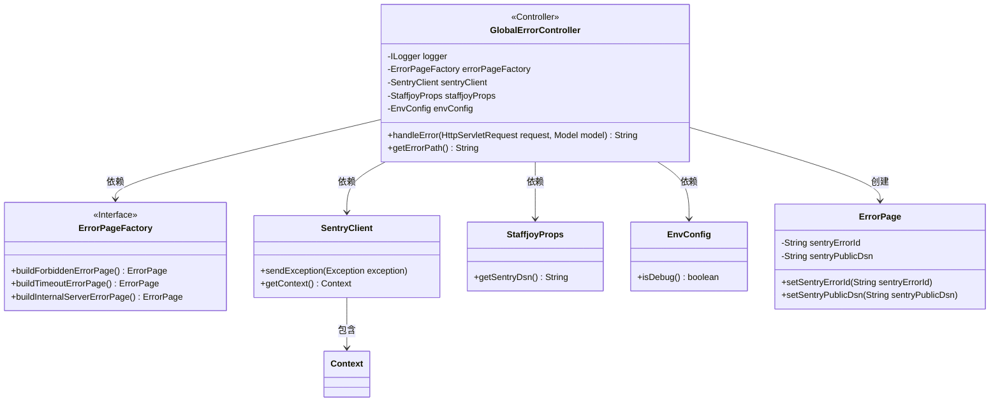
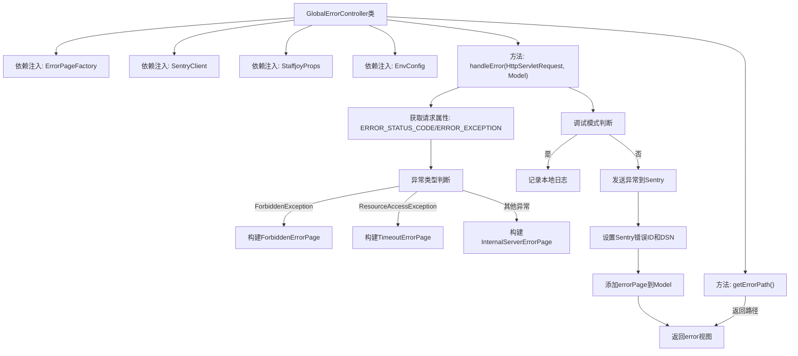

# 基础信息

|      |      |
|------|------|
| 名称 | GlobalErrorController |
| 编码语言 | .java |
| 代码路径 | staffjoy/faraday/src/main/java/xyz/staffjoy/faraday/controller/GlobalErrorController.java |
| 包名 | xyz.staffjoy.faraday.controller |
| 依赖项 | ['com.github.structlog4j.ILogger', 'com.github.structlog4j.SLoggerFactory', 'io.sentry.SentryClient', 'org.springframework.beans.factory.annotation.Autowired', 'org.springframework.boot.web.servlet.error.ErrorController', 'org.springframework.stereotype.Controller', 'org.springframework.ui.Model', 'org.springframework.web.bind.annotation.RequestMapping', 'org.springframework.web.client.ResourceAccessException', 'xyz.staffjoy.common.config.StaffjoyProps', 'xyz.staffjoy.common.env.EnvConfig', 'xyz.staffjoy.faraday.exceptions.ForbiddenException', 'xyz.staffjoy.faraday.view.ErrorPage', 'xyz.staffjoy.faraday.view.ErrorPageFactory', 'javax.servlet.RequestDispatcher', 'javax.servlet.http.HttpServletRequest', 'java.net.SocketTimeoutException', 'java.util.UUID'] |
| 概述说明 | 全局错误控制器，处理异常并生成错误页面，集成Sentry上报。 |

# 说明

GlobalErrorController是一个实现ErrorController接口的Spring控制器类，用于全局错误处理。它通过@Autowired注入了ErrorPageFactory、SentryClient、StaffjoyProps和EnvConfig等依赖组件。主要方法handleError处理/error路径的请求，根据请求中的异常类型（如ForbiddenException或ResourceAccessException）生成相应的错误页面。在非调试模式下，会将异常信息发送到Sentry服务并记录相关ID和DSN信息。最后将错误页面信息添加到Model中并返回error视图。getErrorPath方法返回错误处理路径/error。

# 类列表 Class Summary

| 名称   | 类型  | 说明 |
|-------|------|-------------|
| GlobalErrorController | class | 全局错误控制器，处理异常并生成错误页面，支持Sentry上报。 |

## 类 GlobalErrorController

|      |      |
|------|------|
| 访问范围 | @Controller;@SuppressWarnings(value = "Duplicates");public |
| 类型 | class |
| 名称 | GlobalErrorController |
| 说明 | 全局错误控制器，处理异常并生成错误页面，支持Sentry上报。 |

### UML类图

这段代码展示了一个Spring MVC的全局错误控制器`GlobalErrorController`，它实现了`ErrorController`接口，用于处理应用程序中的异常情况。控制器通过依赖注入获取了错误页面工厂、Sentry客户端、应用配置和环境配置等组件，根据不同类型的异常生成相应的错误页面，并在生产环境下将异常信息上报至Sentry错误监控系统。类图清晰地展示了控制器与各组件之间的依赖关系，以及错误页面的构建过程。

### 内部方法调用关系图

这段代码是Spring MVC的错误控制器实现，主要处理全局异常。流程图展示了从请求处理到错误页面构建的完整流程：首先获取请求中的错误状态和异常信息，根据异常类型构建不同的错误页面(403禁止/超时/500错误)，在非调试模式下会将异常发送到Sentry监控系统并记录相关ID，最后将错误页面数据添加到模型并返回错误视图。控制器还实现了获取错误路径的标准接口方法。

### 字段列表 Field List

| 名称  | 类型  | 说明 |
|-------|-------|------|
| sentryClient | SentryClient | 自动注入SentryClient实例。 |
| envConfig | EnvConfig | 自动注入EnvConfig配置实例 |
| errorPageFactory | ErrorPageFactory | 自动注入错误页面工厂实例。 |
| logger = SLoggerFactory.getLogger(GlobalErrorController.class) | ILogger | 静态日志记录器初始化，用于GlobalErrorController类。 |
| staffjoyProps | StaffjoyProps | 自动注入StaffjoyProps配置属性 |

### 方法列表 Method List

| 名称  | 类型  | 说明 |
|-------|-------|------|
| handleError | String | 处理错误请求，根据异常类型生成对应错误页，调试模式记录日志，否则上报Sentry并设置错误ID。 |
| getErrorPath | String | 重写getErrorPath方法，返回错误路径"/error"。 |

