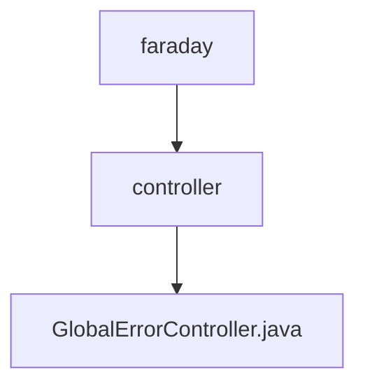

# 基础信息

|      |      |
|------|------|
| 名称 | controller |
| 编码语言 | .java |
| 代码路径 | staffjoy/faraday/src/main/java/xyz/staffjoy/faraday/controller |
| 包名 | staffjoy.docs.faraday.src.main.java.xyz.staffjoy.faraday.controller |
| 概述说明 | 全局错误控制器，处理异常并生成错误页面，集成Sentry上报。 |

# 说明

GlobalErrorController是一个实现ErrorController接口的Spring控制器类，用于全局错误处理。它通过@Autowired注入了ErrorPageFactory、SentryClient、StaffjoyProps和EnvConfig等依赖组件。主要方法handleError处理/error路径的请求，根据请求中的异常类型（如ForbiddenException或ResourceAccessException）生成相应的错误页面。在非调试模式下，会将异常信息发送到Sentry服务并记录相关ID和DSN信息。最后将错误页面信息添加到Model中并返回error视图。getErrorPath方法返回错误处理路径/error。

### 包内部结构视图

该流程图展示了Staffjoy项目中Faraday模块的控制器层级结构。顶层节点faraday下包含controller子目录，该子目录中包含一个具体的控制器文件GlobalErrorController.java。这是一个典型的三级目录结构，清晰地反映了Java项目中控制器层的组织方式，符合MVC架构模式的设计规范。

# 文件列表 File List

| 名称   | 类型  | 说明 |
|-------|------|-------------|
| [GlobalErrorController.java](GlobalErrorController.md) | file | 全局错误控制器，处理异常并生成错误页面，集成Sentry上报。 |

