# 基础信息

|      |      |
|------|------|
| 名称 | core |
| 编码语言 | .java |
| 代码路径 | staffjoy/faraday/src/main/java/xyz/staffjoy/faraday/core |
| 包名 | staffjoy.docs.faraday.src.main.java.xyz.staffjoy.faraday.core |
| 概述说明 | Java反向代理核心组件，含请求转发、客户端管理、拦截器、负载均衡、URI处理、安全过滤和请求追踪功能。 |

# 说明

## 概述  
该代码模块是一个基于Java实现的反向代理服务核心组件，采用分层架构设计，提供HTTP请求转发、负载均衡、安全控制及全链路监控等完整功能。模块由多个子模块组成，包括请求处理核心、拦截器框架、工具类、过滤器集合、追踪系统和配置管理系统，支持高可配置性和扩展性。主要特点包括：  

1. **分层设计**：核心功能（转发、负载均衡）与辅助功能（拦截、过滤）分离，通过接口抽象支持灵活扩展。  
2. **安全合规**：强制HTTPS、CORS支持、安全头注入等机制保障服务安全性。  
3. **全链路追踪**：从请求接收到响应返回的全过程监控，支持调试和问题排查。  
4. **动态配置**：支持程序化和静态两种方式管理路由映射，提供线程安全的配置更新。  

---

## 主要业务场景  

### 1. **HTTP请求代理与转发**  
- **反向代理**：通过`ReverseProxyFilter`和`RequestForwarder`实现请求拦截、目标地址解析及转发，处理X-Forwarded头部和负载均衡（随机算法）。  
- **客户端管理**：`HttpClientProvider`集中管理不同后端服务的HTTP客户端实例，支持动态配置更新和超时控制。  
- **数据封装**：`RequestData`/`ResponseData`标准化传输数据格式，支持不可变版本（`UnmodifiableRequestData`）和多种数据转换。  

### 2. **请求预处理与后处理**  
- **拦截器框架**：  
  - **认证与授权**：通过`PreForwardRequestInterceptor`实现身份验证、权限检查（如匿名用户重定向）。  
  - **缓存控制**：`PostForwardResponseInterceptor`强制`text/html`响应禁用缓存。  
- **过滤器链**：  
  - **安全防护**：`SecurityFilter`强制HTTPS、设置安全头；`NakedDomainFilter`规范化域名。  
  - **性能优化**：`FaviconFilter`和`HealthCheckFilter`快速处理静态资源与健康检查请求。  

### 3. **工具与辅助功能**  
- **URI处理**：`UriCorrector`标准化路径格式（如斜杠修正），确保路由匹配准确性。  
- **编码转换**：`BodyConverter`实现请求体在字节数组与字符串间的UTF-8编码转换，用于日志记录和调试。  

### 4. **全链路监控与调试**  
- **请求追踪**：`TraceInterceptor`记录请求/响应详细信息（方法、URI、状态码等），支持自定义日志实现。  
- **错误处理**：转发失败时记录错误上下文，便于问题定位。  

### 5. **动态配置管理**  
- **映射验证**：`MappingsValidator`检查配置合法性（如重复名称、目标主机格式）。  
- **多源配置**：  
  - **程序化配置**：`ProgrammaticMappingsProvider`从服务目录动态构建子域名映射。  
  - **静态配置**：`ConfigurationMappingsProvider`从预定义文件加载路由规则。  
- **线程安全更新**：通过`synchronized`保证配置原子性更新，同步刷新关联HTTP客户端。  

### 6. **负载均衡**  
- **随机算法**：`RandomLoadBalancer`在多个目标地址间随机分配请求，支持单地址直通和多地址选择。  

---  
**模块定位**：作为微服务架构中的API网关核心组件，适用于请求路由、安全防护、流量控制及服务监控等场景，兼顾功能完备性与性能优化。

### 包内部结构视图

```mermaid
graph TD
    core --> http
    core --> interceptor
    core --> utils
    core --> filter
    core --> trace
    core --> balancer
    core --> mappings
    http --> ReverseProxyFilter.java
    http --> HttpClientProvider.java
    http --> UnmodifiableRequestData.java
    http --> ResponseData.java
    http --> RequestData.java
    http --> RequestForwarder.java
    http --> ForwardDestination.java
    http --> RequestDataExtractor.java
    interceptor --> PreForwardRequestInterceptor.java
    interceptor --> NoOpPreForwardRequestInterceptor.java
    interceptor --> CacheResponseInterceptor.java
    interceptor --> PostForwardResponseInterceptor.java
    interceptor --> AuthRequestInterceptor.java
    interceptor --> NoOpPostForwardResponseInterceptor.java
    utils --> UriCorrector.java
    utils --> BodyConverter.java
    filter --> SecurityFilter.java
    filter --> FaviconFilter.java
    filter --> HealthCheckFilter.java
    filter --> NakedDomainFilter.java
    trace --> IncomingRequest.java
    trace --> LoggingTraceInterceptor.java
    trace --> ForwardRequest.java
    trace --> HttpEntity.java
    trace --> ReceivedResponse.java
    trace --> ProxyingTraceInterceptor.java
    trace --> TraceInterceptor.java
    balancer --> RandomLoadBalancer.java
    balancer --> LoadBalancer.java
    mappings --> MappingsValidator.java
    mappings --> MappingsProvider.java
    mappings --> ProgrammaticMappingsProvider.java
    mappings --> ConfigurationMappingsProvider.java
```

该流程图展示了Staffjoy Faraday项目的核心模块结构，包含7个主要子模块：http、interceptor、utils、filter、trace、balancer和mappings。每个子模块下包含多个具体实现类，例如http模块有8个代理相关类，interceptor模块包含6个请求/响应拦截器，filter模块实现4种过滤器功能。整体结构清晰展现了反向代理服务的核心组件及其层级关系，符合微服务架构中请求处理流程的典型设计模式。

# 文件列表 File List

| 名称   | 类型  | 说明 |
|-------|------|-------------|
| [mappings](mappings/_module.md) | package | MappingsValidator验证映射合法性。MappingsProvider管理映射配置，子类ProgrammaticMappingsProvider和ConfigurationMappingsProvider分别处理程序化和配置映射。 |
| [balancer](balancer/_module.md) | package | 随机负载均衡器实现类，随机选择目标地址。 |
| [trace](trace/_module.md) | package | HTTP请求处理类集合：IncomingRequest封装请求信息，LoggingTraceInterceptor记录日志，ForwardRequest处理转发，HttpEntity管理头信息，ReceivedResponse处理响应，ProxyingTraceInterceptor协调追踪，TraceInterceptor定义生命周期接口。 |
| [filter](filter/_module.md) | package | 安全过滤器强制HTTPS并设置安全头；图标过滤器处理网站图标请求；健康检查过滤器快速响应/health；裸域名过滤器重定向至www子域名。 |
| [utils](utils/_module.md) | package | UriCorrector类修正URI格式，BodyConverter类处理字节与字符串转换。 |
| [interceptor](interceptor/_module.md) | package | 请求转发前后拦截器接口及实现，包括空操作和认证处理。 |
| [http](http/_module.md) | package | 反向代理过滤器类管理HTTP客户端，处理请求转发与响应，封装请求响应数据。 |

