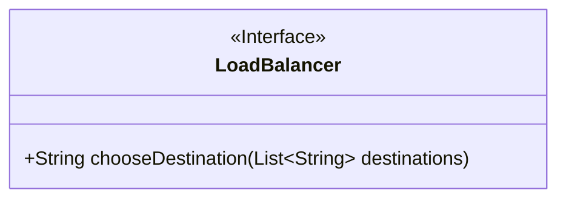
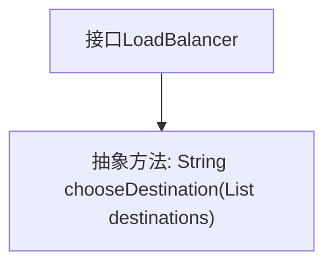

# 基础信息

|      |      |
|------|------|
| 名称 | LoadBalancer |
| 编码语言 | .java |
| 代码路径 | staffjoy/faraday/src/main/java/xyz/staffjoy/faraday/core/balancer/LoadBalancer.java |
| 包名 | xyz.staffjoy.faraday.core.balancer |
| 依赖项 | ['java.util.List'] |
| 概述说明 | 负载均衡器接口，选择目标地址方法。 |

# 说明

这是一个公开接口LoadBalancer，定义了一个方法chooseDestination，用于从目标地址列表destnations中选择一个目的地并返回其字符串表示。接口不包含具体实现，仅规定了负载均衡器的基本行为契约。

# 类列表 Class Summary

| 名称   | 类型  | 说明 |
|-------|------|-------------|
| LoadBalancer | interface | 负载均衡器接口，选择目标地址方法。 |

## 类 LoadBalancer

|      |      |
|------|------|
| 访问范围 | public |
| 类型 | interface |
| 名称 | LoadBalancer |
| 说明 | 负载均衡器接口，选择目标地址方法。 |

### UML类图

这段代码定义了一个负载均衡器接口`LoadBalancer`，其中包含一个抽象方法`chooseDestination`，该方法接收一个字符串列表参数`destinations`并返回选中的目标地址字符串。该接口作为抽象规范，用于实现不同负载均衡算法（如轮询、随机、加权等）的具体策略类。接口设计简洁明确，通过泛型List~String~确保类型安全，体现了策略模式的核心思想，为系统提供了可扩展的负载均衡能力。

### 内部方法调用关系图

这段流程图描述了`LoadBalancer`接口的结构，该接口定义了一个名为`chooseDestination`的抽象方法，用于从目标地址列表中选择一个地址。接口作为抽象类型，仅声明方法签名而不提供实现，具体实现将由实现该接口的类完成。图中清晰展示了接口与方法之间的从属关系，符合面向对象设计中接口的定义规范。

### 字段列表 Field List

| 名称  | 类型  | 说明 |
|-------|-------|------|

### 方法列表 Method List

| 名称  | 类型  | 说明 |
|-------|-------|------|
| chooseDestination | String | 方法：选择目的地，参数为目的地列表，返回字符串。 |

