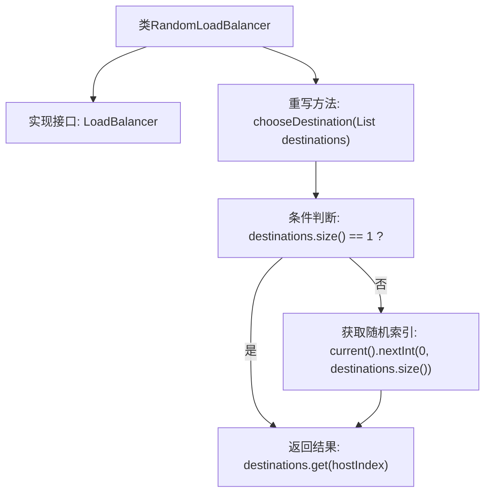

# 基础信息

|      |      |
|------|------|
| 名称 | RandomLoadBalancer |
| 编码语言 | .java |
| 代码路径 | staffjoy/faraday/src/main/java/xyz/staffjoy/faraday/core/balancer/RandomLoadBalancer.java |
| 包名 | xyz.staffjoy.faraday.core.balancer |
| 依赖项 | ['java.util.List', 'java.util.concurrent.ThreadLocalRandom.current'] |
| 概述说明 | 随机负载均衡器，从目标列表随机选择主机。 |

# 说明

该内容描述了一个名为RandomLoadBalancer的负载均衡器实现类，它实现了LoadBalancer接口。核心功能是通过chooseDestination方法从目标地址列表中随机选择一个地址。当列表仅含一个地址时直接返回该地址，否则使用随机数生成器在有效索引范围内选取。方法返回选中的目标地址字符串。

# 类列表 Class Summary

| 名称   | 类型  | 说明 |
|-------|------|-------------|
| RandomLoadBalancer | class | 随机负载均衡器，从目标列表中随机选择主机。 |


## 类 RandomLoadBalancer

|      |      |
|------|------|
| 访问范围 | public |
| 类型 | class |
| 名称 | RandomLoadBalancer |
| 说明 | 随机负载均衡器，从目标列表中随机选择主机。 |


### UML类图

```mermaid
classDiagram
    <<Interface>> LoadBalancer
    LoadBalancer : +chooseDestination(List~String~ destnations) String
    
    class RandomLoadBalancer {
        +chooseDestination(List~String~ destnations) String
    }
    
    RandomLoadBalancer ..|> LoadBalancer : 实现
```

这段代码展示了一个随机负载均衡器(RandomLoadBalancer)的实现，它实现了LoadBalancer接口。类图清晰地表示了这种实现关系，其中LoadBalancer是接口，用<<Interface>>标记，包含一个chooseDestination方法。RandomLoadBalancer类实现了该接口，提供了具体的随机选择逻辑。当目标列表只有一个元素时直接返回，否则使用随机数生成器选择。这种设计模式符合开闭原则，便于扩展不同的负载均衡策略。


### 内部方法调用关系图



这段代码展示了一个随机负载均衡器的实现，通过继承LoadBalancer接口并重写chooseDestination方法。当目标地址列表只有一个时直接选择该地址，否则通过随机数生成器选择索引。流程图清晰呈现了条件分支和随机选择逻辑，体现了负载均衡的核心决策过程，适用于多目标场景下的动态路由选择。

### 字段列表 Field List

| 名称  | 类型  | 说明 |
|-------|-------|------|

### 方法列表 Method List

| 名称  | 类型  | 说明 |
|-------|-------|------|
| chooseDestination | String | 重写方法，随机或唯一选择目标地址。 |


