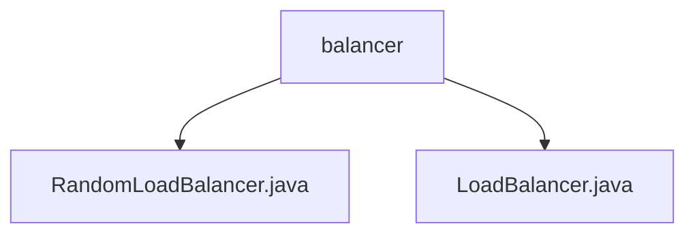

# 基础信息

|      |      |
|------|------|
| 名称 | balancer |
| 编码语言 | .java |
| 代码路径 | staffjoy/faraday/src/main/java/xyz/staffjoy/faraday/core/balancer |
| 包名 | staffjoy.docs.faraday.src.main.java.xyz.staffjoy.faraday.core.balancer |
| 概述说明 | 随机负载均衡器实现类，随机选择目标地址。 |

# 说明

## 概述
该代码模块实现了一个基于随机算法的负载均衡器，主要包含两个核心文件：
1. `RandomLoadBalancer.java` - 具体实现了`LoadBalancer`接口，提供随机选择目标地址的功能
2. `LoadBalancer.java` - 定义了负载均衡器的基本接口规范

模块通过抽象接口与具体实现分离的方式，提供了可扩展的负载均衡能力，当前实现了最简单的随机选择策略。

## 主要业务场景
该模块主要用于以下业务场景：
1. 当存在多个目标地址时，需要随机分配请求以实现负载均衡
2. 在微服务调用或API网关等场景中，对后端服务实例进行流量分发
3. 需要快速简单的负载均衡策略时（相比轮询、权重等复杂算法）

核心业务逻辑：
- 当目标地址列表只有一个地址时直接返回该地址
- 当存在多个地址时，通过随机数生成器在有效索引范围内选取
- 返回选中的目标地址字符串表示

### 包内部结构视图

该流程图展示了faraday项目中负载均衡器模块的核心结构。balancer作为父目录，包含两个实现文件：RandomLoadBalancer.java实现随机负载均衡算法，LoadBalancer.java则是负载均衡器的基类接口。这种层级关系清晰地体现了Java项目中典型的核心组件与具体实现之间的继承关系。

# 文件列表 File List

| 名称   | 类型  | 说明 |
|-------|------|-------------|
| [LoadBalancer.java](LoadBalancer.md) | file | 负载均衡器接口，选择目标地址方法。 |
| [RandomLoadBalancer.java](RandomLoadBalancer.md) | file | 随机负载均衡器，从目标列表随机选择主机。 |

