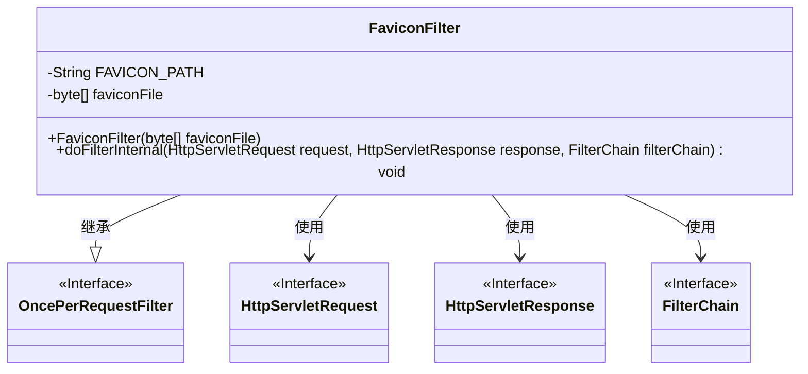
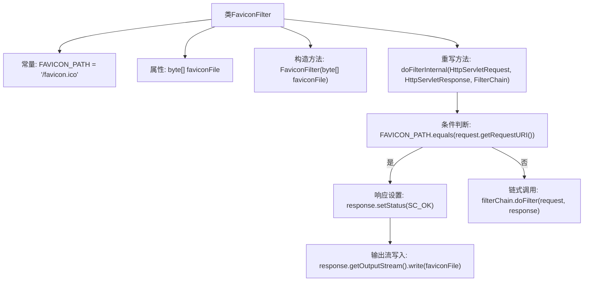

# 基础信息

|      |      |
|------|------|
| 名称 | FaviconFilter |
| 编码语言 | .java |
| 代码路径 | staffjoy/faraday/src/main/java/xyz/staffjoy/faraday/core/filter/FaviconFilter.java |
| 包名 | xyz.staffjoy.faraday.core.filter |
| 依赖项 | ['org.springframework.web.filter.OncePerRequestFilter', 'javax.servlet.FilterChain', 'javax.servlet.ServletException', 'javax.servlet.http.HttpServletRequest', 'javax.servlet.http.HttpServletResponse', 'java.io.IOException'] |
| 概述说明 | FaviconFilter拦截/favicon.ico请求并返回预设图标文件。 |

# 说明

这是一个名为FaviconFilter的Java类，继承自OncePerRequestFilter。它用于处理网站图标请求，包含一个静态常量FAVICON_PATH定义图标路径。类通过构造函数接收图标文件字节数组，重写doFilterInternal方法检查请求URI是否匹配图标路径。若匹配则返回图标数据并设置200状态码，否则继续过滤器链。

# 类列表 Class Summary

| 名称   | 类型  | 说明 |
|-------|------|-------------|
| FaviconFilter | class | 自定义过滤器处理favicon请求，匹配路径返回图标数据，否则继续过滤链。 |

## 类 FaviconFilter

|      |      |
|------|------|
| 访问范围 | public |
| 类型 | class |
| 名称 | FaviconFilter |
| 说明 | 自定义过滤器处理favicon请求，匹配路径返回图标数据，否则继续过滤链。 |

### UML类图

这段代码展示了一个处理网站favicon.ico请求的过滤器FaviconFilter，它继承自OncePerRequestFilter接口。当请求路径匹配FAVICON_PATH时，直接返回预设的favicon文件字节数组；否则继续执行过滤器链。类图中清晰体现了继承关系和依赖的外部接口，包括处理HTTP请求/响应的标准Servlet接口。该设计专注于高效处理favicon请求，避免不必要的过滤器链调用。

### 内部方法调用关系图

该流程图展示了FaviconFilter类的核心逻辑。作为OncePerRequestFilter的子类，它通过常量FAVICON_PATH匹配/favicon.ico请求，当请求匹配时返回预设的favicon图标字节数据（HTTP 200状态），否则继续执行过滤器链。关键路径包括请求URI判断、响应状态设置和输出流操作，体现了典型的Servlet过滤器处理流程。

### 字段列表 Field List

| 名称  | 类型  | 说明 |
|-------|-------|------|
| FAVICON_PATH = "/favicon.ico" | String | 定义静态常量FAVICON_PATH，值为/favicon.ico |
| faviconFile | byte[] | 私有字节数组faviconFile |

### 方法列表 Method List

| 名称  | 类型  | 说明 |
|-------|-------|------|
| doFilterInternal | void | 过滤请求，处理favicon或转发链。 |

