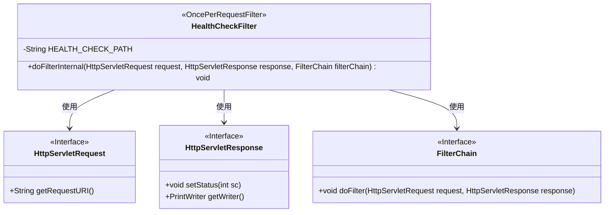
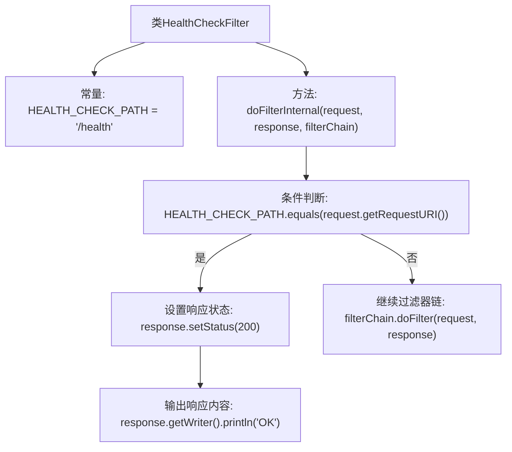

# 基础信息

|      |      |
|------|------|
| 名称 | HealthCheckFilter |
| 编码语言 | .java |
| 代码路径 | staffjoy/faraday/src/main/java/xyz/staffjoy/faraday/core/filter/HealthCheckFilter.java |
| 包名 | xyz.staffjoy.faraday.core.filter |
| 依赖项 | ['org.springframework.web.filter.OncePerRequestFilter', 'javax.servlet.FilterChain', 'javax.servlet.ServletException', 'javax.servlet.http.HttpServletRequest', 'javax.servlet.http.HttpServletResponse', 'java.io.IOException'] |
| 概述说明 | 健康检查过滤器，拦截/health请求返回OK，其他请求正常处理。 |

# 说明

这是一个名为HealthCheckFilter的Java类，继承自OncePerRequestFilter。它定义了一个静态常量HEALTH_CHECK_PATH，值为"/health"，表示应用程序的标准健康检查路径。该类重写了doFilterInternal方法，用于处理HTTP请求。当请求的URI匹配健康检查路径时，直接返回200状态码和"OK"响应内容；否则将请求传递给过滤器链继续处理。这个过滤器专门用于处理健康检查请求，确保快速响应而无需经过完整过滤器链。

# 类列表 Class Summary

| 名称   | 类型  | 说明 |
|-------|------|-------------|
| HealthCheckFilter | class | 健康检查过滤器，拦截/health请求返回OK，其他请求正常处理。 |

## 类 HealthCheckFilter

|      |      |
|------|------|
| 访问范围 | public |
| 类型 | class |
| 名称 | HealthCheckFilter |
| 说明 | 健康检查过滤器，拦截/health请求返回OK，其他请求正常处理。 |

### UML类图

这段代码定义了一个`HealthCheckFilter`类，继承自`OncePerRequestFilter`，用于处理HTTP请求的健康检查。当请求路径为"/health"时，直接返回200状态码和"OK"响应；否则将请求传递给过滤器链继续处理。类图中展示了与`HttpServletRequest`、`HttpServletResponse`和`FilterChain`三个接口的依赖关系，体现了该过滤器对Servlet API核心接口的使用。

### 内部方法调用关系图

这段代码定义了一个HealthCheckFilter类，继承自OncePerRequestFilter，用于处理HTTP请求的健康检查。当请求路径匹配"/health"时，直接返回200状态码和"OK"响应；否则将请求传递给过滤器链继续处理。流程图清晰展示了从请求判断到不同处理路径的逻辑分支，包括健康检查的特殊处理和常规请求的链式传递过程。

### 字段列表 Field List

| 名称  | 类型  | 说明 |
|-------|-------|------|
| HEALTH_CHECK_PATH = "/health" | String | 健康检查路径常量设为/health。 |

### 方法列表 Method List

| 名称  | 类型  | 说明 |
|-------|-------|------|
| doFilterInternal | void | 过滤器中检查请求路径，若为健康检查则返回OK，否则继续处理。 |

