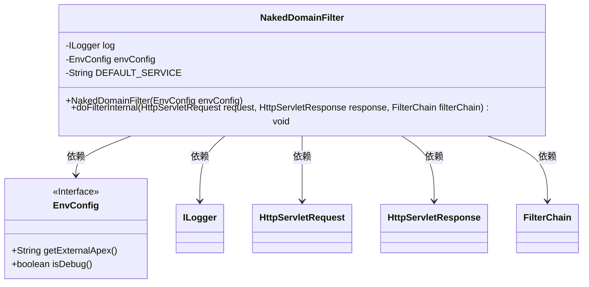
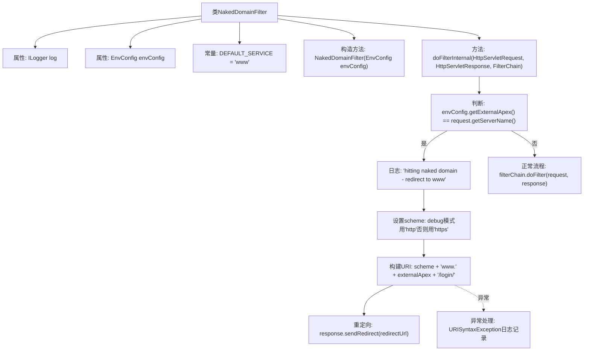

# 基础信息

|      |      |
|------|------|
| 名称 | NakedDomainFilter |
| 编码语言 | .java |
| 代码路径 | staffjoy/faraday/src/main/java/xyz/staffjoy/faraday/core/filter/NakedDomainFilter.java |
| 包名 | xyz.staffjoy.faraday.core.filter |
| 依赖项 | ['com.github.structlog4j.ILogger', 'com.github.structlog4j.SLoggerFactory', 'org.springframework.web.filter.OncePerRequestFilter', 'xyz.staffjoy.common.env.EnvConfig', 'javax.servlet.FilterChain', 'javax.servlet.ServletException', 'javax.servlet.http.HttpServletRequest', 'javax.servlet.http.HttpServletResponse', 'java.io.IOException', 'java.net.URI', 'java.net.URISyntaxException'] |
| 概述说明 | NakedDomainFilter将裸域名请求重定向至www子域名。 |

# 说明

NakedDomainFilter是一个继承自OncePerRequestFilter的Java类，用于处理HTTP请求。其主要功能是检测是否访问了裸域名（如staffjoy.xyz），如果是，则重定向到带www的子域名（如www.staffjoy.xyz）。该类依赖EnvConfig获取外部域名配置，默认使用https协议（调试模式下使用http）。重定向目标URL包含原始请求的端口和路径，若构建URL失败会记录错误日志。非裸域名请求则直接放行至后续过滤器链。

# 类列表 Class Summary

| 名称   | 类型  | 说明 |
|-------|------|-------------|
| NakedDomainFilter | class | NakedDomainFilter将裸域名请求重定向至www子域名。 |

## 类 NakedDomainFilter

|      |      |
|------|------|
| 访问范围 | public |
| 类型 | class |
| 名称 | NakedDomainFilter |
| 说明 | NakedDomainFilter将裸域名请求重定向至www子域名。 |

### UML类图

该代码实现了一个名为NakedDomainFilter的过滤器，用于处理裸域名的请求重定向。当检测到请求的服务器名称与配置的外部根域名匹配时，会将请求重定向到带有www子域名的地址。类图中展示了NakedDomainFilter与EnvConfig接口的依赖关系，以及与其他Servlet相关类的交互。过滤器核心逻辑在doFilterInternal方法中实现，包含重定向URL构建和异常处理。

### 内部方法调用关系图

该流程图展示了NakedDomainFilter的核心逻辑，主要处理裸域名访问的重定向功能。当检测到请求为裸域名时，会构造带www前缀的HTTPS(生产环境)或HTTP(调试环境)登录页URL进行301重定向；若非裸域名则直接放行请求。流程包含异常处理机制，当URI构建失败时会记录错误日志，确保系统健壮性。整个设计符合Servlet过滤器的标准模式，实现了请求的预处理和链式传递。

### 字段列表 Field List

| 名称  | 类型  | 说明 |
|-------|-------|------|
| envConfig | EnvConfig | 私有环境配置对象 |
| log = SLoggerFactory.getLogger(NakedDomainFilter.class) | ILogger | 私有日志记录器，用于NakedDomainFilter类。 |
| DEFAULT_SERVICE = "www" | String | 默认服务设为"www"。 |

### 方法列表 Method List

| 名称  | 类型  | 说明 |
|-------|-------|------|
| doFilterInternal | void | 重定向裸域名到www子域名，否则继续过滤器链。 |

