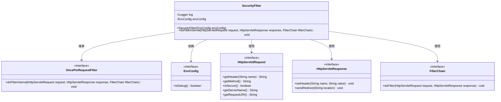
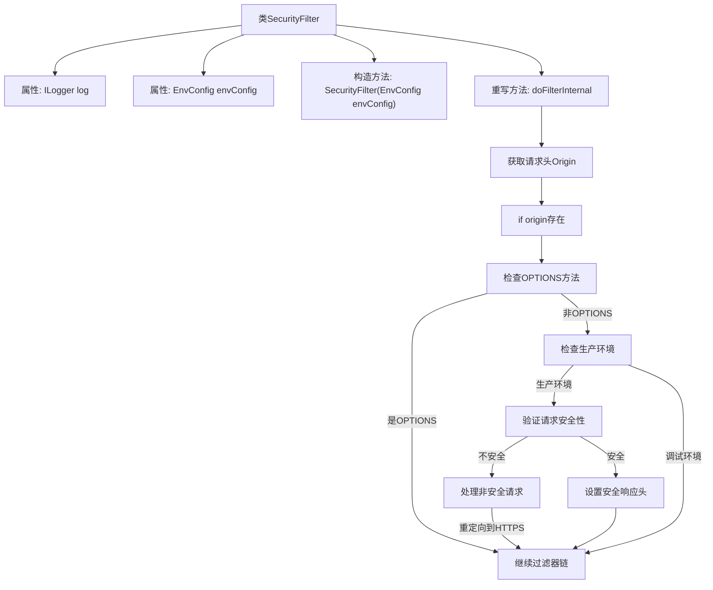

# 基础信息

|      |      |
|------|------|
| 名称 | SecurityFilter |
| 编码语言 | .java |
| 代码路径 | staffjoy/faraday/src/main/java/xyz/staffjoy/faraday/core/filter/SecurityFilter.java |
| 包名 | xyz.staffjoy.faraday.core.filter |
| 依赖项 | ['com.github.structlog4j.ILogger', 'com.github.structlog4j.SLoggerFactory', 'org.springframework.http.HttpHeaders', 'org.springframework.web.filter.OncePerRequestFilter', 'xyz.staffjoy.common.env.EnvConfig', 'javax.servlet.FilterChain', 'javax.servlet.ServletException', 'javax.servlet.http.HttpServletRequest', 'javax.servlet.http.HttpServletResponse', 'java.io.IOException', 'java.net.URI', 'java.net.URISyntaxException', 'org.apache.commons.lang3.StringUtils.isEmpty'] |
| 概述说明 | 安全过滤器类，处理CORS、HTTPS重定向及安全头设置。 |

# 说明

SecurityFilter是一个继承自OncePerRequestFilter的安全过滤器类，用于处理HTTP请求的安全控制。它通过EnvConfig获取环境配置，在非调试环境下强制HTTPS连接，检查请求头中的X-Forwarded-Proto判断是否安全，不安全则重定向到HTTPS。同时设置CORS相关响应头允许跨域请求，处理预检OPTIONS请求。还添加了HSTS、X-Frame-Options和X-XSS-Protection等安全头增强防护。最后将请求传递给过滤器链继续处理。

# 类列表 Class Summary

| 名称   | 类型  | 说明 |
|-------|------|-------------|
| SecurityFilter | class | 安全过滤器类，处理CORS、HTTPS重定向及安全头设置。 |

## 类 SecurityFilter

|      |      |
|------|------|
| 访问范围 | public |
| 类型 | class |
| 名称 | SecurityFilter |
| 说明 | 安全过滤器类，处理CORS、HTTPS重定向及安全头设置。 |

### UML类图

这段代码展示了一个安全过滤器`SecurityFilter`的实现，它继承自`OncePerRequestFilter`接口。该过滤器主要处理HTTP请求的安全相关功能，包括CORS头设置、HTTPS强制重定向、HSTS头设置以及XSS防护等。它依赖于`EnvConfig`来获取环境配置信息，并通过`HttpServletRequest`和`HttpServletResponse`与HTTP协议交互，最后通过`FilterChain`将请求传递给下一个过滤器。该设计体现了责任链模式，适用于Web应用的安全防护场景。

### 内部方法调用关系图

这段代码实现了一个安全过滤器，主要功能包括：处理跨域请求(CORS)、检查请求方法(特别是OPTIONS预检请求)、在生产环境下强制HTTPS安全连接、设置多种安全相关的HTTP响应头。流程图展示了从请求进入过滤器开始，经过各个安全检查步骤，最终决定是否继续过滤器链或中断请求的完整处理流程。关键决策点包括Origin检查、请求方法判断、环境配置检查和安全性验证等环节。

### 字段列表 Field List

| 名称  | 类型  | 说明 |
|-------|-------|------|
| envConfig | EnvConfig | 私有环境配置对象envConfig |
| log = SLoggerFactory.getLogger(SecurityFilter.class) | ILogger | 私有日志记录器实例，用于SecurityFilter类。 |

### 方法列表 Method List

| 名称  | 类型  | 说明 |
|-------|-------|------|
| doFilterInternal | void | 处理跨域请求和安全配置，包括SSL重定向、HSTS和XSS防护。 |

