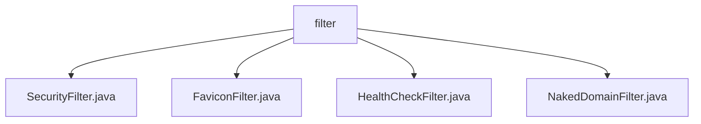

# 基础信息

|      |      |
|------|------|
| 名称 | filter |
| 编码语言 | .java |
| 代码路径 | staffjoy/faraday/src/main/java/xyz/staffjoy/faraday/core/filter |
| 包名 | staffjoy.docs.faraday.src.main.java.xyz.staffjoy.faraday.core.filter |
| 概述说明 | 安全过滤器强制HTTPS并设置安全头；图标过滤器处理网站图标请求；健康检查过滤器快速响应/health；裸域名过滤器重定向至www子域名。 |

# 说明

## 概述  
该代码模块是一个基于Java的HTTP请求过滤器集合，主要用于处理Web应用的安全控制、资源请求和域名规范化等场景。所有过滤器均继承自`OncePerRequestFilter`，确保每个请求只被处理一次。模块包含以下核心组件：  

1. **SecurityFilter**：负责强制HTTPS连接、设置安全响应头（如HSTS、CORS等）以及处理预检请求。  
2. **FaviconFilter**：专门处理网站图标（favicon.ico）请求，直接返回预定义的图标数据。  
3. **HealthCheckFilter**：快速响应健康检查路径（`/health`），避免完整过滤器链的开销。  
4. **NakedDomainFilter**：将裸域名请求（如`staffjoy.xyz`）重定向到带`www`的子域名，确保域名规范化。  

## 主要业务场景  
1. **安全防护**  
   - 强制非调试环境使用HTTPS，通过检查`X-Forwarded-Proto`头防止不安全连接。  
   - 设置CORS头允许跨域请求，并添加HSTS、X-Frame-Options等安全头防御常见攻击。  
   - 拦截并处理预检（OPTIONS）请求，优化跨域资源访问。  

2. **资源请求处理**  
   - 直接响应`favicon.ico`请求，减少不必要的过滤器链调用。  
   - 快速返回健康检查（`/health`）的`200 OK`状态，便于监控系统探测服务可用性。  

3. **域名规范化**  
   - 自动将裸域名重定向到带`www`的子域名（如`staffjoy.xyz` → `www.staffjoy.xyz`），统一入口并避免SEO重复内容问题。  
   - 支持调试模式（HTTP）和生产环境（HTTPS）的协议动态适配。  

4. **请求流程优化**  
   - 各过滤器按需拦截特定请求（如健康检查、图标请求），避免冗余处理，提升性能。  
   - 未匹配的请求均放行至后续过滤器链，确保业务逻辑正常执行。

### 包内部结构视图

该流程图展示了Staffjoy Faraday项目中核心过滤器模块的层级结构。根节点"filter"下包含四个具体的过滤器实现类：SecurityFilter负责安全验证，FaviconFilter处理网站图标请求，HealthCheckFilter用于健康检查，NakedDomainFilter处理裸域名访问。所有过滤器都位于faraday项目的核心过滤模块中，形成清晰的树状结构。

# 文件列表 File List

| 名称   | 类型  | 说明 |
|-------|------|-------------|
| [NakedDomainFilter.java](NakedDomainFilter.md) | file | NakedDomainFilter将裸域名请求重定向至www子域名。 |
| [HealthCheckFilter.java](HealthCheckFilter.md) | file | 健康检查过滤器，拦截/health请求返回OK，其他请求正常处理。 |
| [FaviconFilter.java](FaviconFilter.md) | file | FaviconFilter拦截/favicon.ico请求并返回预设图标文件。 |
| [SecurityFilter.java](SecurityFilter.md) | file | 安全过滤器类，处理CORS、HTTPS重定向及安全头设置。 |

