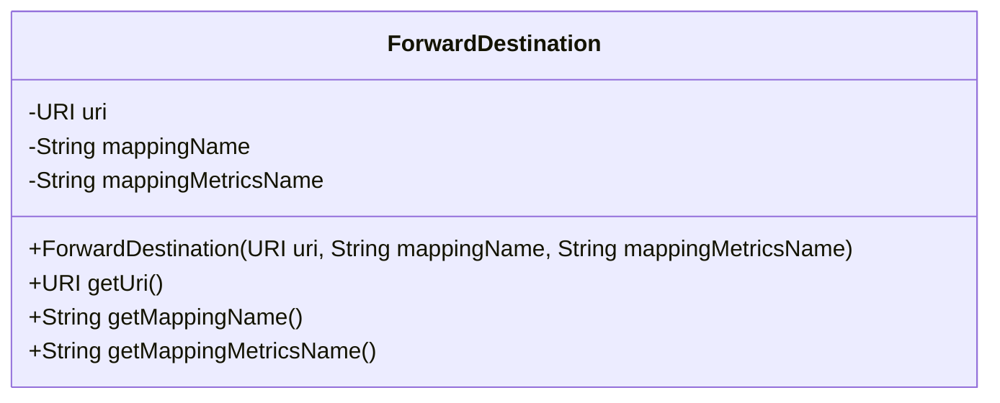
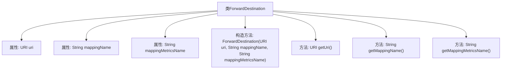

# 基础信息

|      |      |
|------|------|
| 名称 | ForwardDestination |
| 编码语言 | .java |
| 代码路径 | staffjoy/faraday/src/main/java/xyz/staffjoy/faraday/core/http/ForwardDestination.java |
| 包名 | xyz.staffjoy.faraday.core.http |
| 依赖项 | ['java.net.URI'] |
| 概述说明 | 转发目标类，含URI、映射名和指标名属性及对应get方法。 |

# 说明

ForwardDestination类是一个用于封装转发目标信息的类，包含三个主要属性：uri表示目标地址，mappingName表示映射名称，mappingMetricsName表示映射指标名称。该类提供了构造函数初始化这三个属性，并分别提供了对应的getter方法获取属性值。所有属性均为protected final修饰，确保线程安全且不可变。

# 类列表 Class Summary

| 名称   | 类型  | 说明 |
|-------|------|-------------|
| ForwardDestination | class | 转发目标类，含URI、映射名和指标名属性及对应get方法。 |

## 类 ForwardDestination

|      |      |
|------|------|
| 访问范围 | public |
| 类型 | class |
| 名称 | ForwardDestination |
| 说明 | 转发目标类，含URI、映射名和指标名属性及对应get方法。 |

### UML类图

这段类图描述了ForwardDestination类的结构，它是一个包含URI和两个字符串属性的数据传输对象。类中包含三个私有成员变量：uri表示目标URI地址，mappingName存储映射名称，mappingMetricsName记录用于监控的指标名称。通过公有构造函数初始化这些属性，并提供了三个对应的getter方法来获取属性值。这个类主要用于封装转发目标的相关信息，适合在需要传递转发配置信息的场景中使用。

### 内部方法调用关系图

这段代码定义了一个名为ForwardDestination的类，包含三个私有属性：URI类型的uri、String类型的mappingName和mappingMetricsName。类中提供了一个构造方法用于初始化这些属性，并提供了三个对应的getter方法用于获取属性值。流程图清晰地展示了类的结构，包括属性、构造方法和各个getter方法之间的层级关系。

### 字段列表 Field List

| 名称  | 类型  | 说明 |
|-------|-------|------|
| mappingMetricsName | String | 保护性字符串映射指标名 |
| mappingName | String | 受保护的最终字符串映射名称 |
| uri | URI | 受保护的最终URI变量。 |

### 方法列表 Method List

| 名称  | 类型  | 说明 |
|-------|-------|------|
| getMappingName | String | 获取映射名称的方法。 |
| getMappingMetricsName | String | 获取映射指标名称的方法。 |
| getUri | URI | 获取URI的方法。 |

