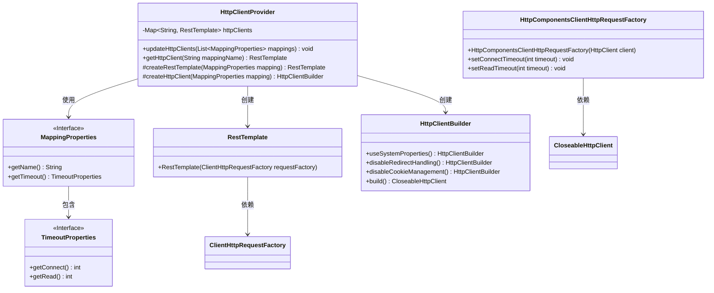
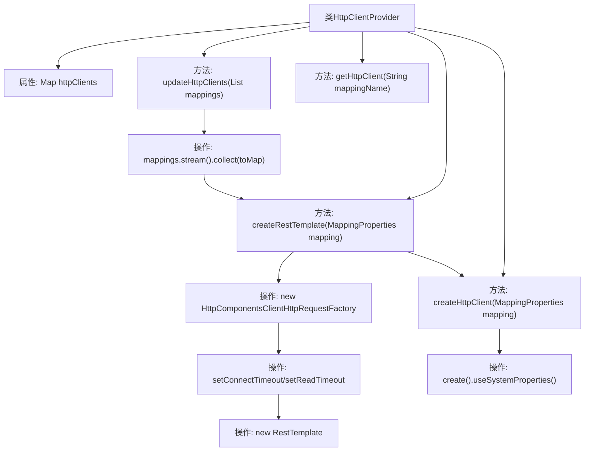

# 基础信息

|      |      |
|------|------|
| 名称 | HttpClientProvider |
| 编码语言 | .java |
| 代码路径 | staffjoy/faraday/src/main/java/xyz/staffjoy/faraday/core/http/HttpClientProvider.java |
| 包名 | xyz.staffjoy.faraday.core.http |
| 依赖项 | ['org.apache.http.impl.client.CloseableHttpClient', 'org.apache.http.impl.client.HttpClientBuilder', 'org.springframework.http.client.HttpComponentsClientHttpRequestFactory', 'org.springframework.web.client.RestTemplate', 'xyz.staffjoy.faraday.config.MappingProperties', 'java.util.HashMap', 'java.util.List', 'java.util.Map', 'java.util.stream.Collectors.toMap', 'org.apache.http.impl.client.HttpClientBuilder.create'] |
| 概述说明 | HttpClientProvider管理RestTemplate实例，支持动态更新和按名称获取，自定义超时和HTTP客户端配置。 |

# 说明

该代码描述了一个HttpClientProvider类，用于管理和提供HTTP客户端实例。该类维护一个映射表httpClients，存储不同名称对应的RestTemplate实例。主要功能包括：通过updateHttpClients方法更新客户端映射表，根据MappingProperties列表创建对应的RestTemplate；通过getHttpClient方法获取指定名称的客户端实例。创建RestTemplate时，会配置连接超时和读取超时参数，并使用自定义的HttpClientBuilder来构建基础HTTP客户端，该构建器禁用了重定向处理和Cookie管理功能。整个类封装了HTTP客户端的创建和管理逻辑。

# 类列表 Class Summary

| 名称   | 类型  | 说明 |
|-------|------|-------------|
| HttpClientProvider | class | HttpClientProvider类管理RestTemplate实例，支持动态更新和获取，自定义超时和HTTP客户端配置。 |

## 类 HttpClientProvider

|      |      |
|------|------|
| 访问范围 | public |
| 类型 | class |
| 名称 | HttpClientProvider |
| 说明 | HttpClientProvider类管理RestTemplate实例，支持动态更新和获取，自定义超时和HTTP客户端配置。 |

### UML类图

这段代码描述了一个HTTP客户端提供者(HttpClientProvider)的实现，它管理多个RestTemplate实例，每个实例对应不同的映射配置(MappingProperties)。该类提供了更新客户端列表、获取指定客户端的方法，并通过工厂方法创建配置了超时设置的RestTemplate。核心功能包括基于MappingProperties创建具有特定超时设置的HTTP客户端，并通过Builder模式配置客户端行为。类图中展示了与RestTemplate、HttpClientBuilder等组件的交互关系，以及配置属性的层级结构。

### 内部方法调用关系图

这段代码展示了一个HTTP客户端提供器的实现，核心是通过MappingProperties动态创建和管理RestTemplate实例。流程图清晰呈现了类结构和方法调用链：updateHttpClients方法通过流处理将映射列表转换为RestTemplate映射表，createRestTemplate方法负责构建带有超时设置的请求工厂，而底层createHttpClient方法使用系统属性配置HTTP客户端构建器。整个过程体现了从配置到具体HTTP客户端实例的完整创建流程。

### 字段列表 Field List

| 名称  | 类型  | 说明 |
|-------|-------|------|
| httpClients = new HashMap<>() | Map<String, RestTemplate> | 保护型Map存储RestTemplate客户端。 |

### 方法列表 Method List

| 名称  | 类型  | 说明 |
|-------|-------|------|
| createRestTemplate | RestTemplate | 创建RestTemplate，设置连接和读取超时。 |
| updateHttpClients | void | 更新HTTP客户端映射列表，将名称映射到对应RestTemplate实例。 |
| getHttpClient | RestTemplate | 获取指定名称的HTTP客户端实例。 |
| createHttpClient | HttpClientBuilder | 创建HttpClientBuilder，禁用重定向和Cookie管理。 |

