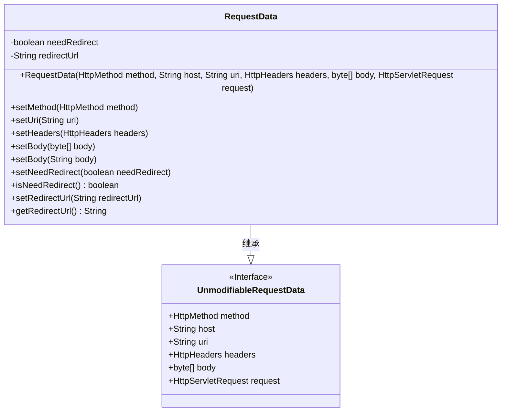
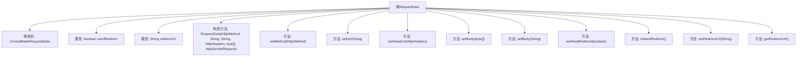

# 基础信息

|      |      |
|------|------|
| 名称 | RequestData |
| 编码语言 | .java |
| 代码路径 | staffjoy/faraday/src/main/java/xyz/staffjoy/faraday/core/http/RequestData.java |
| 包名 | xyz.staffjoy.faraday.core.http |
| 依赖项 | ['org.springframework.http.HttpHeaders', 'org.springframework.http.HttpMethod', 'javax.servlet.http.HttpServletRequest', 'xyz.staffjoy.faraday.core.utils.BodyConverter.convertStringToBody'] |
| 概述说明 | 可修改的请求数据类，支持重定向设置。 |

# 说明

该代码定义了一个名为RequestData的可变请求数据类，继承自不可变的UnmodifiableRequestData基类。它包含两个主要属性：needRedirect布尔标志和redirectUrl字符串，分别表示是否需要重定向及目标URL。类提供了设置HTTP方法、URI、请求头、请求体的方法，支持字节数组和字符串两种形式的请求体。同时提供了对重定向相关属性的存取方法，允许动态修改请求参数和重定向配置。

# 类列表 Class Summary

| 名称   | 类型  | 说明 |
|-------|------|-------------|
| RequestData | class | 可修改的请求数据类，支持重定向和属性设置。 |

## 类 RequestData

|      |      |
|------|------|
| 访问范围 | public |
| 类型 | class |
| 名称 | RequestData |
| 说明 | 可修改的请求数据类，支持重定向和属性设置。 |

### UML类图

这段类图展示了RequestData类继承自UnmodifiableRequestData接口的结构。RequestData是可修改的请求数据类，包含重定向相关属性和方法，能够设置请求方法、URI、头信息、正文内容等。它扩展了基础接口的功能，添加了needRedirect和redirectUrl两个私有字段，以及相应的getter/setter方法，实现了对HTTP请求数据的全面控制。

### 内部方法调用关系图

这段代码展示了一个RequestData类，它继承自UnmodifiableRequestData，主要用于处理HTTP请求数据。类中包含两个私有属性needRedirect和redirectUrl，分别表示是否需要重定向和重定向URL。提供了构造方法用于初始化请求数据，以及多个setter和getter方法用于修改和获取请求方法、URI、请求头、请求体等属性。特别提供了两种setBody方法，支持直接设置字节数组或字符串形式的请求体。所有方法都围绕HTTP请求数据的操作展开，形成了一个完整的请求数据处理单元。

### 字段列表 Field List

| 名称  | 类型  | 说明 |
|-------|-------|------|
| redirectUrl | String | 私有字符串变量redirectUrl。 |
| needRedirect | boolean | 私有布尔变量needRedirect |

### 方法列表 Method List

| 名称  | 类型  | 说明 |
|-------|-------|------|
| isNeedRedirect | boolean | 方法返回是否需要重定向的布尔值。 |
| setRedirectUrl | void | 设置重定向URL的方法。 |
| getRedirectUrl | String | 获取重定向URL的方法。 |
| setNeedRedirect | void | 设置重定向标志的方法。 |
| setBody | void | 设置字节数组类型的body属性值。 |
| setMethod | void | 设置HTTP请求方法。 |
| setBody | void | 设置body属性，并调用convertStringToBody方法转换输入字符串。 |
| setHeaders | void | 设置HTTP头方法，将输入headers赋值给类成员headers。 |
| setUri | void | 设置URI字符串参数的方法。 |

