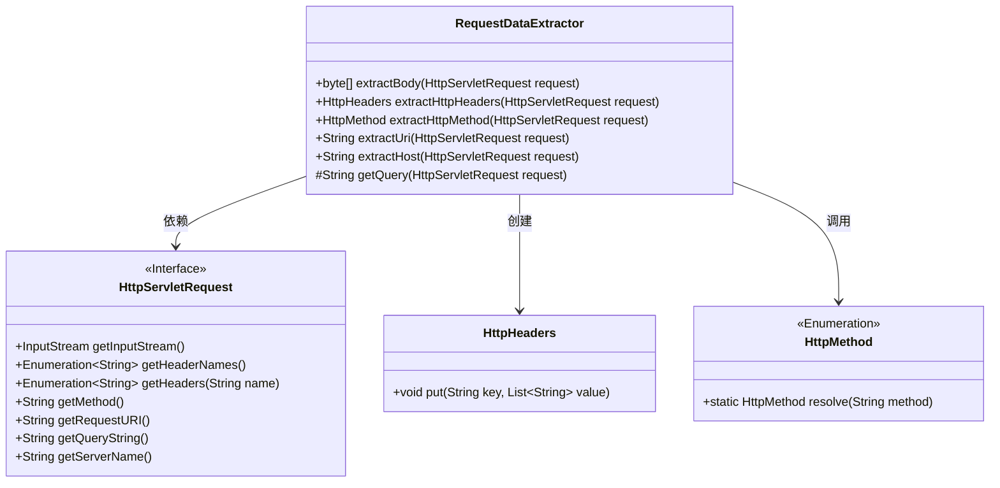
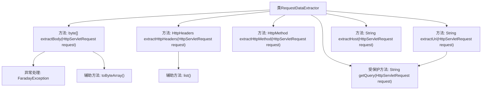

# 基础信息

|      |      |
|------|------|
| 名称 | RequestDataExtractor |
| 编码语言 | .java |
| 代码路径 | staffjoy/faraday/src/main/java/xyz/staffjoy/faraday/core/http/RequestDataExtractor.java |
| 包名 | xyz.staffjoy.faraday.core.http |
| 依赖项 | ['org.springframework.http.HttpHeaders', 'org.springframework.http.HttpMethod', 'xyz.staffjoy.faraday.exceptions.FaradayException', 'javax.servlet.http.HttpServletRequest', 'java.io.IOException', 'java.util.Enumeration', 'java.util.List', 'java.util.Collections.list', 'org.apache.commons.io.IOUtils.toByteArray', 'org.apache.commons.lang3.StringUtils.EMPTY'] |
| 概述说明 | 提取HTTP请求数据：正文、头、方法、URI和主机。 |

# 说明

该代码定义了一个名为RequestDataExtractor的类，用于从HttpServletRequest对象中提取HTTP请求的关键数据。主要功能包括：提取请求体内容并转换为字节数组，若出错则抛出异常；提取所有HTTP头信息并存入HttpHeaders对象；解析请求方法类型；获取完整请求URI（包含查询参数）；提取服务器主机名；以及一个辅助方法用于处理查询字符串的拼接。所有方法均围绕HttpServletRequest对象进行操作，实现了对HTTP请求基础信息的全面提取功能。

# 类列表 Class Summary

| 名称   | 类型  | 说明 |
|-------|------|-------------|
| RequestDataExtractor | class | 提取HTTP请求数据：正文、头、方法、URI和主机。 |

## 类 RequestDataExtractor

|      |      |
|------|------|
| 访问范围 | public |
| 类型 | class |
| 名称 | RequestDataExtractor |
| 说明 | 提取HTTP请求数据：正文、头、方法、URI和主机。 |

### UML类图

该类图展示了RequestDataExtractor工具类，它提供了从HttpServletRequest对象中提取HTTP请求数据的各种方法。该类主要处理请求体提取(extractBody)、请求头提取(extractHttpHeaders)、HTTP方法解析(extractHttpMethod)、URI构建(extractUri)和主机名获取(extractHost)等功能。它依赖于标准的HttpServletRequest接口来获取原始请求数据，并创建HttpHeaders对象来存储处理后的请求头信息。该类还使用了HttpMethod枚举来解析HTTP方法类型，体现了对HTTP协议各要素的完整处理能力。

### 内部方法调用关系图

这段代码展示了一个HTTP请求数据提取工具类，主要功能包括：提取请求体字节流、转换HTTP头信息、解析请求方法、构建完整URI和获取主机名。其中extractBody方法通过输入流转换字节数组并处理IO异常，extractHttpHeaders方法将请求头枚举转换为Map结构，extractUri方法拼接URI和查询参数。所有方法都围绕HttpServletRequest对象进行操作，体现了对HTTP请求数据的全面处理能力。

### 字段列表 Field List

| 名称  | 类型  | 说明 |
|-------|-------|------|

### 方法列表 Method List

| 名称  | 类型  | 说明 |
|-------|-------|------|
| extractBody | byte[] | 从HTTP请求提取字节流，异常时抛出错误及URI。 |
| extractUri | String | 提取请求URI和查询参数合并返回。 |
| extractHttpMethod | HttpMethod | 提取HTTP请求方法并返回对应枚举值。 |
| extractHost | String | 提取HTTP请求的服务器名 |
| extractHttpHeaders | HttpHeaders | 从HttpServletRequest提取所有HTTP头信息并转为HttpHeaders对象。 |
| getQuery | String | 从HTTP请求获取查询字符串，空则返回空值，非空加问号前缀。 |

