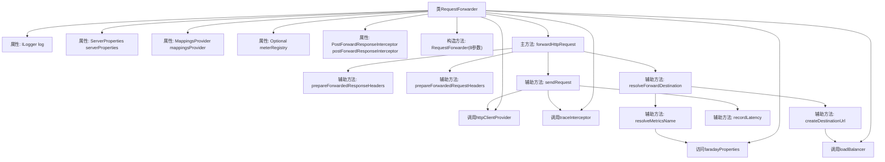

# 基础信息

|      |      |
|------|------|
| 名称 | RequestForwarder |
| 编码语言 | .java |
| 代码路径 | staffjoy/faraday/src/main/java/xyz/staffjoy/faraday/core/http/RequestForwarder.java |
| 包名 | xyz.staffjoy.faraday.core.http |
| 依赖项 | ['com.github.structlog4j.ILogger', 'com.github.structlog4j.SLoggerFactory', 'io.micrometer.core.instrument.MeterRegistry', 'org.springframework.boot.autoconfigure.web.ServerProperties', 'org.springframework.http.HttpHeaders', 'org.springframework.http.RequestEntity', 'org.springframework.http.ResponseEntity', 'org.springframework.web.client.HttpStatusCodeException', 'xyz.staffjoy.faraday.config.FaradayProperties', 'xyz.staffjoy.faraday.config.MappingProperties', 'xyz.staffjoy.faraday.core.balancer.LoadBalancer', 'xyz.staffjoy.faraday.core.interceptor.PostForwardResponseInterceptor', 'xyz.staffjoy.faraday.core.mappings.MappingsProvider', 'xyz.staffjoy.faraday.core.trace.ProxyingTraceInterceptor', 'xyz.staffjoy.faraday.exceptions.FaradayException', 'java.net.URI', 'java.net.URISyntaxException', 'java.util.Optional', 'java.lang.System.nanoTime', 'java.time.Duration.ofNanos', 'org.springframework.http.HttpHeaders', 'org.springframework.http.ResponseEntity.status'] |
| 概述说明 | 请求转发器类，包含属性配置、HTTP请求处理和响应拦截功能。 |

# 说明

该代码描述了一个请求转发器类RequestForwarder，用于处理HTTP请求的转发。它包含多个依赖组件如服务器属性、HTTP客户端提供者、负载均衡器等。主要功能包括解析转发目标地址、准备请求头、发送请求并记录延迟、处理响应头和异常。转发过程中会记录跟踪信息，并支持指标监控。代码还包含请求和响应头的清理逻辑，移除不适用于新请求或响应的协议级头信息。整体实现了完整的HTTP请求转发流程，包括目标地址解析、请求发送、响应处理和监控记录。

# 类列表 Class Summary

| 名称   | 类型  | 说明 |
|-------|------|-------------|
| RequestForwarder | class | RequestForwarder类处理HTTP请求转发，包含负载均衡、跟踪拦截和响应处理功能。 |


## 类 RequestForwarder

|      |      |
|------|------|
| 访问范围 | public |
| 类型 | class |
| 名称 | RequestForwarder |
| 说明 | RequestForwarder类处理HTTP请求转发，包含负载均衡、跟踪拦截和响应处理功能。 |


### UML类图

```mermaid
classDiagram
    class RequestForwarder {
        -ILogger log
        -ServerProperties serverProperties
        -FaradayProperties faradayProperties
        -HttpClientProvider httpClientProvider
        -MappingsProvider mappingsProvider
        -LoadBalancer loadBalancer
        -Optional~MeterRegistry~ meterRegistry
        -ProxyingTraceInterceptor traceInterceptor
        -PostForwardResponseInterceptor postForwardResponseInterceptor
        +RequestForwarder(ServerProperties, FaradayProperties, HttpClientProvider, MappingsProvider, LoadBalancer, Optional~MeterRegistry~, ProxyingTraceInterceptor, PostForwardResponseInterceptor)
        +forwardHttpRequest(RequestData data, String traceId, MappingProperties mapping) ResponseEntity~byte[]~
        #prepareForwardedResponseHeaders(ResponseData response)
        #prepareForwardedRequestHeaders(RequestData request, ForwardDestination destination)
        #resolveForwardDestination(String originUri, MappingProperties mapping) ForwardDestination
        #createDestinationUrl(String uri, MappingProperties mapping) URI
        #sendRequest(String traceId, RequestEntity~byte[]~ request, MappingProperties mapping, String mappingMetricsName, RequestData requestData) ResponseData
        #recordLatency(String metricName, long startingTime)
        #resolveMetricsName(MappingProperties mapping) String
    }

    class ForwardDestination {
        +String uri
        +String mappingName
        +String mappingMetricsName
        +ForwardDestination(String uri, String mappingName, String mappingMetricsName)
        +String getUri()
        +String getMappingName()
        +String getMappingMetricsName()
    }

    class ResponseData {
        +HttpStatus status
        +HttpHeaders headers
        +byte[] body
        +RequestData requestData
        +ResponseData(HttpStatus status, HttpHeaders headers, byte[] body, RequestData requestData)
        +HttpStatus getStatus()
        +HttpHeaders getHeaders()
        +byte[] getBody()
    }

    class RequestData {
        +String method
        +String host
        +String uri
        +HttpHeaders headers
        +byte[] body
        +String getMethod()
        +String getHost()
        +String getUri()
        +HttpHeaders getHeaders()
        +byte[] getBody()
    }

    class UnmodifiableRequestData {
        +RequestData requestData
        +UnmodifiableRequestData(RequestData requestData)
    }

    class MappingProperties {
        +String name
        +List~String~ destinations
        +String getName()
        +List~String~ getDestinations()
    }

    interface <<Interface>> ILogger {
        +debug(String message)
    }

    interface <<Interface>> HttpClientProvider {
        +getHttpClient(String name) HttpClient
    }

    interface <<Interface>> MappingsProvider {
        +getMappings() List~MappingProperties~
    }

    interface <<Interface>> LoadBalancer {
        +chooseDestination(List~String~ destinations) String
    }

    interface <<Interface>> ProxyingTraceInterceptor {
        +onForwardStart(String traceId, String mappingName, String method, String host, String uri, byte[] body, HttpHeaders headers)
        +onForwardComplete(String traceId, HttpStatus status, byte[] body, HttpHeaders headers)
        +onForwardFailed(String traceId, Exception e)
    }

    interface <<Interface>> PostForwardResponseInterceptor {
        +intercept(ResponseData response, MappingProperties mapping)
    }

    RequestForwarder --> ForwardDestination : 创建
    RequestForwarder --> ResponseData : 返回
    RequestForwarder --> RequestData : 处理
    RequestForwarder --> UnmodifiableRequestData : 封装
    RequestForwarder --> MappingProperties : 使用
    RequestForwarder ..|> ILogger : 依赖
    RequestForwarder --> HttpClientProvider : 使用
    RequestForwarder --> MappingsProvider : 使用
    RequestForwarder --> LoadBalancer : 使用
    RequestForwarder --> ProxyingTraceInterceptor : 调用
    RequestForwarder --> PostForwardResponseInterceptor : 调用
    ResponseData --> RequestData : 包含
    UnmodifiableRequestData --> RequestData : 封装
```

这段类图描述了RequestForwarder类的核心结构和相关依赖关系。RequestForwarder是一个HTTP请求转发器，通过构造函数注入多个配置和组件依赖，包括服务器属性、HTTP客户端提供者、映射提供者、负载均衡器等。它主要提供forwardHttpRequest方法处理请求转发流程，涉及目标地址解析、请求/响应头处理、请求发送和监控记录等功能。类图中清晰地展示了与ForwardDestination、ResponseData等值对象的关系，以及通过接口依赖的各种服务提供者，体现了职责分离的设计原则。


### 内部方法调用关系图



这段代码实现了一个HTTP请求转发器，主要功能包括：通过构造方法注入各种配置和组件依赖；forwardHttpRequest作为核心方法，完整处理请求转发流程；包含多个辅助方法处理URL解析、请求/响应头处理、监控指标记录等。类结构清晰，通过责任分离实现了请求转发的完整生命周期管理，包括预处理、转发执行、后处理等阶段，同时集成了日志、监控和链路追踪能力。

### 字段列表 Field List

| 名称  | 类型  | 说明 |
|-------|-------|------|
| meterRegistry | Optional<MeterRegistry> | 受保护的最终可选计量注册表。 |
| log = SLoggerFactory.getLogger(RequestForwarder.class) | ILogger | 私有日志记录器，用于RequestForwarder类。 |
| serverProperties | ServerProperties | 受保护的ServerProperties实例变量。 |
| faradayProperties | FaradayProperties | 受保护的最终Faraday属性配置对象。 |
| postForwardResponseInterceptor | PostForwardResponseInterceptor | 受保护的最终响应拦截器postForwardResponseInterceptor。 |
| loadBalancer | LoadBalancer | 保护性负载均衡器实例 |
| httpClientProvider | HttpClientProvider | 受保护的最终HttpClientProvider实例。 |
| mappingsProvider | MappingsProvider | 受保护的最终映射提供者变量。 |
| traceInterceptor | ProxyingTraceInterceptor | 受保护的最终代理跟踪拦截器实例。 |

### 方法列表 Method List

| 名称  | 类型  | 说明 |
|-------|-------|------|
| prepareForwardedResponseHeaders | void | 移除响应头中的特定字段 |
| prepareForwardedRequestHeaders | void | 移除请求头中的TE字段，保留其他信息。 |
| resolveForwardDestination | ForwardDestination | 解析转发目标：生成目标URL、名称和指标名。 |
| createDestinationUrl | URI | 方法根据映射选择目标主机并拼接URI，异常时抛出错误。 |
| forwardHttpRequest | ResponseEntity<byte[]> | 转发HTTP请求，处理请求头、日志、拦截器和响应头，返回响应状态和内容。 |
| sendRequest | ResponseData | 发送HTTP请求并记录延迟，处理异常后返回响应数据。 |
| recordLatency | void | 记录方法执行耗时并存入监控系统。 |
| resolveMetricsName | String | 解析指标名：前缀+映射名 |


