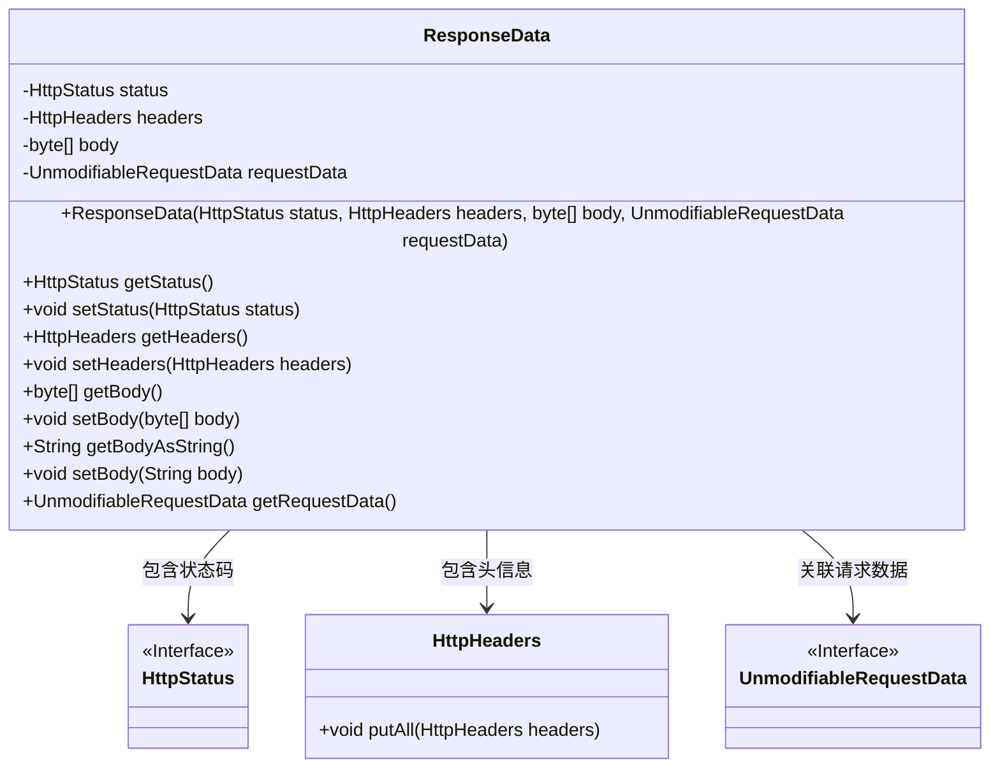
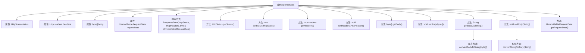

# 基础信息

|      |      |
|------|------|
| 名称 | ResponseData |
| 编码语言 | .java |
| 代码路径 | staffjoy/faraday/src/main/java/xyz/staffjoy/faraday/core/http/ResponseData.java |
| 包名 | xyz.staffjoy.faraday.core.http |
| 依赖项 | ['org.springframework.http.HttpHeaders', 'org.springframework.http.HttpStatus', 'xyz.staffjoy.faraday.core.utils.BodyConverter.convertBodyToString', 'xyz.staffjoy.faraday.core.utils.BodyConverter.convertStringToBody'] |
| 概述说明 | HTTP响应数据类，包含状态码、头信息、请求体和请求数据。 |

# 说明

ResponseData类封装HTTP响应数据，包含状态码status、响应头headers、字节数组body及不可变请求数据requestData。构造函数初始化各字段，headers通过深拷贝确保独立性。提供status、headers、body的getter/setter方法，支持body与字符串互转。requestData仅提供getter方法，确保不可变性。

# 类列表 Class Summary

| 名称   | 类型  | 说明 |
|-------|------|-------------|
| ResponseData | class | HTTP响应数据类，包含状态、头、体和请求数据。 |

## 类 ResponseData

|      |      |
|------|------|
| 访问范围 | public |
| 类型 | class |
| 名称 | ResponseData |
| 说明 | HTTP响应数据类，包含状态、头、体和请求数据。 |

### UML类图

这段类图展示了ResponseData类的结构及其与外部组件的关系。ResponseData是一个封装HTTP响应数据的实体类，包含状态码(status)、头信息(headers)、响应体(body)和关联的不可变请求数据(requestData)。它通过聚合方式引用了HttpStatus接口、HttpHeaders类和UnmodifiableRequestData接口，提供了完整的响应数据封装能力，支持二进制和字符串形式的响应体转换。类中所有字段均为protected可见性，通过公有getter/setter方法进行访问控制。

### 内部方法调用关系图

该流程图展示了ResponseData类的完整结构，包含4个核心属性(status/headers/body/requestData)和10个主要方法。构造方法初始化所有属性并深度复制headers，getter/setter提供基础属性访问，其中getBodyAsString()和setBody(String)通过私有转换方法实现字节数组与字符串的互转。类设计重点体现在对HTTP响应数据的封装和类型转换功能，通过UnmodifiableRequestData保证请求数据的不可变性。

### 字段列表 Field List

| 名称  | 类型  | 说明 |
|-------|-------|------|
| headers | HttpHeaders | 声明受保护的HttpHeaders变量headers。 |
| body | byte[] | 保护字节数组body |
| requestData | UnmodifiableRequestData | 不可修改的请求数据保护变量 |
| status | HttpStatus | 声明受保护的HttpStatus状态变量。 |

### 方法列表 Method List

| 名称  | 类型  | 说明 |
|-------|-------|------|
| getBody | byte[] | 获取字节数组body的方法。 |
| setHeaders | void | 设置HTTP头信息的方法。 |
| getHeaders | HttpHeaders | 获取HTTP头信息的方法。 |
| setStatus | void | 设置HTTP状态码的方法。 |
| getStatus | HttpStatus | 获取HTTP状态码的方法。 |
| setBody | void | 设置字节数组类型的body值。 |
| getBodyAsString | String | 获取请求体字符串的方法，调用convertBodyToString转换body后返回。 |
| setBody | void | 设置body属性，并转换输入字符串为body格式。 |
| getRequestData | UnmodifiableRequestData | 获取不可修改的请求数据对象。 |

