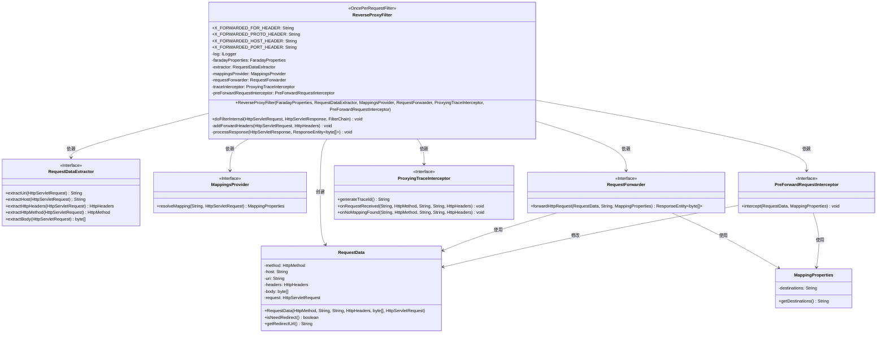
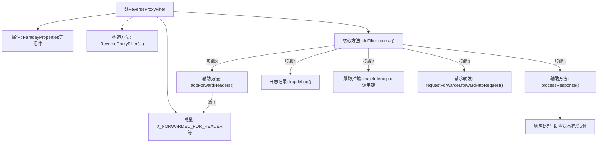

# 基础信息

|      |      |
|------|------|
| 名称 | ReverseProxyFilter |
| 编码语言 | .java |
| 代码路径 | staffjoy/faraday/src/main/java/xyz/staffjoy/faraday/core/http/ReverseProxyFilter.java |
| 包名 | xyz.staffjoy.faraday.core.http |
| 依赖项 | ['com.github.structlog4j.ILogger', 'com.github.structlog4j.SLoggerFactory', 'org.springframework.http.HttpHeaders', 'org.springframework.http.HttpMethod', 'org.springframework.http.ResponseEntity', 'org.springframework.web.filter.OncePerRequestFilter', 'xyz.staffjoy.faraday.config.FaradayProperties', 'xyz.staffjoy.faraday.config.MappingProperties', 'xyz.staffjoy.faraday.core.interceptor.PreForwardRequestInterceptor', 'xyz.staffjoy.faraday.core.mappings.MappingsProvider', 'xyz.staffjoy.faraday.core.trace.ProxyingTraceInterceptor', 'xyz.staffjoy.faraday.exceptions.FaradayException', 'javax.servlet.FilterChain', 'javax.servlet.ServletException', 'javax.servlet.http.HttpServletRequest', 'javax.servlet.http.HttpServletResponse', 'java.io.IOException', 'java.util.ArrayList', 'java.util.List', 'java.lang.String.valueOf', 'org.apache.commons.lang3.StringUtils.isBlank', 'org.springframework.util.CollectionUtils.isEmpty'] |
| 概述说明 | 反向代理过滤器类，处理请求转发、映射和响应处理。 |

# 说明

ReverseProxyFilter是一个继承自OncePerRequestFilter的Java类，用于实现反向代理功能。它定义了多个X-Forwarded相关头部常量，并包含多个核心组件如属性配置、请求数据提取器、映射提供器、请求转发器等。主要逻辑在doFilterInternal方法中：提取请求信息，生成跟踪ID，解析目标映射，处理重定向或转发请求，并添加转发头部。若找不到映射则返回400错误。最后处理响应状态码、头部和内容体。整个过程包含详细的日志记录和跟踪拦截器调用。

# 类列表 Class Summary

| 名称   | 类型  | 说明 |
|-------|------|-------------|
| ReverseProxyFilter | class | 反向代理过滤器类，处理请求转发、映射和响应处理。 |

## 类 ReverseProxyFilter

|      |      |
|------|------|
| 访问范围 | public |
| 类型 | class |
| 名称 | ReverseProxyFilter |
| 说明 | 反向代理过滤器类，处理请求转发、映射和响应处理。 |

### UML类图

这段代码实现了一个反向代理过滤器，继承自OncePerRequestFilter，主要功能是拦截HTTP请求并根据配置的映射规则转发到目标服务。类图展示了核心组件：ReverseProxyFilter作为主控制器，依赖RequestDataExtractor提取请求数据、MappingsProvider解析映射规则、RequestForwarder执行转发、ProxyingTraceInterceptor处理跟踪日志、PreForwardRequestInterceptor进行转发前拦截。RequestData封装请求数据，MappingProperties存储目标服务信息。整个设计遵循单一职责原则，通过接口隔离实现高度可扩展性。

### 内部方法调用关系图

该流程图展示了反向代理过滤器的核心处理流程。首先初始化各类代理组件，在请求处理阶段依次执行：请求信息提取与日志记录→生成跟踪ID并拦截→解析目标映射→添加转发头→预处理请求→执行请求转发→处理响应结果。整个过程涉及请求头处理、负载均衡路由、双向拦截器链等关键功能模块，最终完成HTTP请求的透明代理和响应回传。

### 字段列表 Field List

| 名称  | 类型  | 说明 |
|-------|-------|------|
| faradayProperties | FaradayProperties | 保护型Faraday属性实例 |
| traceInterceptor | ProxyingTraceInterceptor | 受保护的最终代理跟踪拦截器变量。 |
| mappingsProvider | MappingsProvider | 受保护的最终映射提供者变量。 |
| extractor | RequestDataExtractor | 保护型最终请求数据提取器 |
| X_FORWARDED_PROTO_HEADER = "X-Forwarded-Proto" | String | 保护静态常量X-Forwarded-Proto头字段 |
| X_FORWARDED_PORT_HEADER = "X-Forwarded-Port" | String | 定义常量X_FORWARDED_PORT_HEADER值为X-Forwarded-Port。 |
| X_FORWARDED_HOST_HEADER = "X-Forwarded-Host" | String | 定义常量X_FORWARDED_HOST_HEADER值为X-Forwarded-Host。 |
| X_FORWARDED_FOR_HEADER = "X-Forwarded-For" | String | 保护静态常量X-Forwarded-For头字段 |
| requestForwarder | RequestForwarder | 保护型请求转发器实例。 |
| log = SLoggerFactory.getLogger(ReverseProxyFilter.class) | ILogger | 私有静态日志记录器，用于ReverseProxyFilter类。 |
| preForwardRequestInterceptor | PreForwardRequestInterceptor | 受保护的最终预转发请求拦截器。 |

### 方法列表 Method List

| 名称  | 类型  | 说明 |
|-------|-------|------|
| doFilterInternal | void | 过滤请求，记录日志，检查映射，转发或重定向响应。 |
| addForwardHeaders | void | 方法添加转发头信息：更新X-Forwarded-For、Proto、Host和Port。 |
| processResponse | void | 处理HTTP响应：设置状态码、头信息并写入响应体，异常时抛出错误。 |

