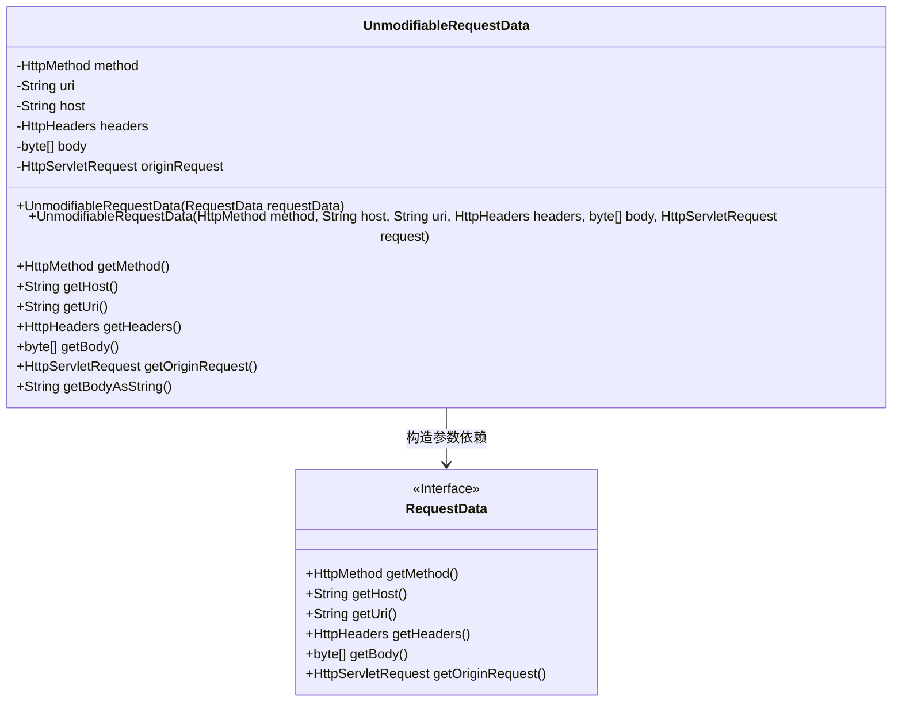
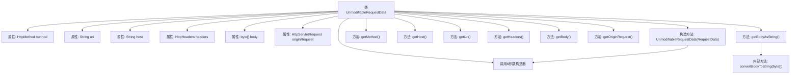

# 基础信息

|      |      |
|------|------|
| 名称 | UnmodifiableRequestData |
| 编码语言 | .java |
| 代码路径 | staffjoy/faraday/src/main/java/xyz/staffjoy/faraday/core/http/UnmodifiableRequestData.java |
| 包名 | xyz.staffjoy.faraday.core.http |
| 依赖项 | ['org.springframework.http.HttpHeaders', 'org.springframework.http.HttpMethod', 'javax.servlet.http.HttpServletRequest', 'xyz.staffjoy.faraday.core.utils.BodyConverter.convertBodyToString'] |
| 概述说明 | 不可修改请求数据类，包含方法、主机、URI、头、体和原始请求等属性及获取方法。 |

# 说明

该内容描述了一个名为UnmodifiableRequestData的Java类，用于封装不可修改的HTTP请求数据。类中包含HTTP方法、URI、主机名、请求头、请求体字节数组和原始请求对象等属性。提供了两个构造函数，一个接受RequestData对象，另一个直接接收各属性值。类中还包含多个getter方法，用于获取各属性值，包括将请求体字节数组转换为字符串的方法。该类主要用于存储和访问HTTP请求的不可变数据。

# 类列表 Class Summary

| 名称   | 类型  | 说明 |
|-------|------|-------------|
| UnmodifiableRequestData | class | 不可修改的请求数据类，包含方法、主机、URI、头、体和原始请求。 |

## 类 UnmodifiableRequestData

|      |      |
|------|------|
| 访问范围 | public |
| 类型 | class |
| 名称 | UnmodifiableRequestData |
| 说明 | 不可修改的请求数据类，包含方法、主机、URI、头、体和原始请求。 |

### UML类图

这段代码展示了一个不可修改的请求数据类`UnmodifiableRequestData`，它封装了HTTP请求的核心元素（方法、URI、主机头、请求头、请求体和原始请求对象）。该类通过两种构造方式初始化：一种是直接接收各字段参数，另一种是通过`RequestData`接口实例提取数据。所有字段均为私有且仅提供getter方法，确保实例的不可变性。类图中明确显示了与`RequestData`接口的依赖关系，体现了数据来源的灵活性。

### 内部方法调用关系图

该流程图展示了UnmodifiableRequestData类的完整结构，包含7个核心属性和8个关键方法。两个构造方法形成级联调用关系，其中单参数构造器会委托给六参数构造器完成初始化。特别值得注意的是getBodyAsString()方法依赖内部convertBodyToString()工具方法实现功能，体现了对字节数组到字符串转换的封装。所有getter方法均直接返回对应属性值，保持数据不可变性。该类设计主要用于封装HTTP请求数据，并提供只读访问接口。

### 字段列表 Field List

| 名称  | 类型  | 说明 |
|-------|-------|------|
| headers | HttpHeaders | 声明受保护的HttpHeaders变量headers。 |
| uri | String | 声明保护字符串变量uri |
| originRequest | HttpServletRequest | 受保护的HTTP请求原始对象 |
| body | byte[] | 字节数组类型保护字段body |
| method | HttpMethod | 声明受保护的HttpMethod类型变量method。 |
| host | String | 声明受保护的字符串变量host |

### 方法列表 Method List

| 名称  | 类型  | 说明 |
|-------|-------|------|
| getUri | String | 获取URI字符串的方法。 |
| getHost | String | 获取主机地址的方法。 |
| getHeaders | HttpHeaders | 获取HTTP头信息的方法。 |
| getBody | byte[] | 获取字节数组形式的body内容。 |
| getOriginRequest | HttpServletRequest | 获取原始HTTP请求对象。 |
| getBodyAsString | String | 方法返回字符串形式的body内容。 |
| getMethod | HttpMethod | 获取HTTP请求方法。 |

