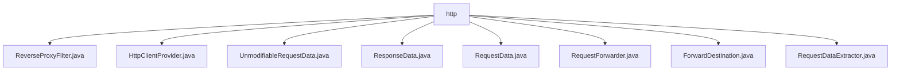

# 基础信息

|      |      |
|------|------|
| 名称 | http |
| 编码语言 | .java |
| 代码路径 | staffjoy/faraday/src/main/java/xyz/staffjoy/faraday/core/http |
| 包名 | staffjoy.docs.faraday.src.main.java.xyz.staffjoy.faraday.core.http |
| 概述说明 | 反向代理过滤器类管理HTTP客户端，处理请求转发与响应，封装请求响应数据。 |

# 说明

## 概述
该代码模块是一个基于Java实现的反向代理服务核心组件，主要提供HTTP请求的转发、重定向和代理功能。模块采用分层设计，包含请求/响应数据处理、客户端管理、请求转发等核心功能，支持可配置的映射规则和详细的日志监控。

## 主要业务场景
1. **反向代理请求处理**：通过`ReverseProxyFilter`拦截HTTP请求，解析目标地址并转发到后端服务，同时处理X-Forwarded相关头部信息。

2. **HTTP客户端管理**：通过`HttpClientProvider`集中管理不同目标服务的RestTemplate实例，支持动态更新客户端配置和连接超时控制。

3. **请求/响应数据封装**：使用`RequestData`/`ResponseData`及其不可变版本`UnmodifiableRequestData`统一封装传输数据，支持重定向配置和多种数据格式转换。

4. **请求转发执行**：`RequestForwarder`实现完整的转发流程，包括目标地址解析、负载均衡、请求头处理、响应监控和异常处理。

5. **请求数据提取**：`RequestDataExtractor`从HttpServletRequest中提取方法、URI、头信息和请求体等关键数据，为后续处理提供标准化输入。

### 包内部结构视图

该流程图展示了Staffjoy Faraday项目中HTTP核心模块的文件结构。所有文件都直接位于http目录下，包括反向代理过滤器、HTTP客户端提供者、请求/响应数据类、请求转发器以及相关辅助类。这些组件共同构成了HTTP请求处理的核心功能模块，用于实现请求转发和代理功能。

# 文件列表 File List

| 名称   | 类型  | 说明 |
|-------|------|-------------|
| [ReverseProxyFilter.java](ReverseProxyFilter.md) | file | 反向代理过滤器类，处理请求转发、映射和响应处理。 |
| [HttpClientProvider.java](HttpClientProvider.md) | file | HttpClientProvider管理RestTemplate实例，支持动态更新和按名称获取，自定义超时和HTTP客户端配置。 |
| [UnmodifiableRequestData.java](UnmodifiableRequestData.md) | file | 不可修改请求数据类，包含方法、主机、URI、头、体和原始请求等属性及获取方法。 |
| [RequestForwarder.java](RequestForwarder.md) | file | 请求转发器类，包含属性配置、HTTP请求处理和响应拦截功能。 |
| [RequestData.java](RequestData.md) | file | 可修改的请求数据类，支持重定向设置。 |
| [ForwardDestination.java](ForwardDestination.md) | file | 转发目标类，含URI、映射名和指标名属性及对应get方法。 |
| [RequestDataExtractor.java](RequestDataExtractor.md) | file | 提取HTTP请求数据：正文、头、方法、URI和主机。 |
| [ResponseData.java](ResponseData.md) | file | HTTP响应数据类，包含状态码、头信息、请求体和请求数据。 |

