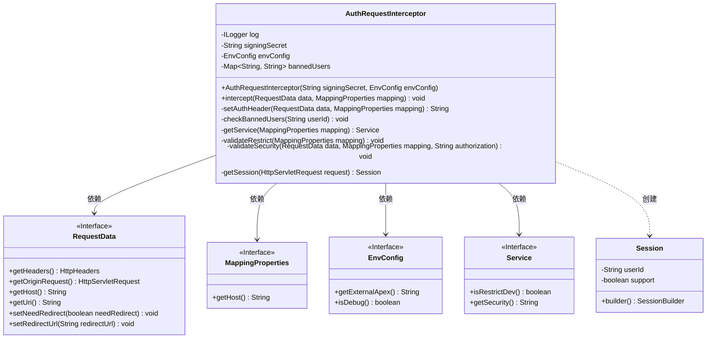
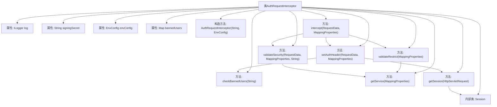

# 基础信息

|      |      |
|------|------|
| 名称 | AuthRequestInterceptor |
| 编码语言 | .java |
| 代码路径 | staffjoy/faraday/src/main/java/xyz/staffjoy/faraday/core/interceptor/AuthRequestInterceptor.java |
| 包名 | xyz.staffjoy.faraday.core.interceptor |
| 依赖项 | ['com.auth0.jwt.interfaces.DecodedJWT', 'com.github.structlog4j.ILogger', 'com.github.structlog4j.SLoggerFactory', 'lombok.AllArgsConstructor', 'lombok.Builder', 'lombok.Data', 'lombok.NoArgsConstructor', 'org.springframework.http.HttpHeaders', 'xyz.staffjoy.common.auth.AuthConstant', 'xyz.staffjoy.common.auth.Sessions', 'xyz.staffjoy.common.crypto.Sign', 'xyz.staffjoy.common.env.EnvConfig', 'xyz.staffjoy.common.services.SecurityConstant', 'xyz.staffjoy.common.services.Service', 'xyz.staffjoy.common.services.ServiceDirectory', 'xyz.staffjoy.faraday.config.MappingProperties', 'xyz.staffjoy.faraday.core.http.RequestData', 'xyz.staffjoy.faraday.exceptions.FaradayException', 'xyz.staffjoy.faraday.exceptions.ForbiddenException', 'javax.servlet.http.HttpServletRequest', 'java.net.URI', 'java.net.URISyntaxException', 'java.util.HashMap', 'java.util.Map'] |
| 概述说明 | 拦截请求验证权限，检查禁用用户，处理匿名访问及重定向。 |

# 说明

AuthRequestInterceptor是一个请求拦截器，用于处理认证和授权逻辑。它通过构造函数接收签名密钥和环境配置，维护一个禁止用户列表。主要功能包括设置请求头中的认证信息，检查用户是否被禁止访问，验证服务是否限制在开发环境，以及检查匿名用户访问安全服务的权限。若匿名用户尝试访问安全服务，会重定向到登录页面。拦截器还会解析会话令牌，验证用户身份，并根据用户类型设置不同的授权头。整个过程包含详细的错误处理和日志记录。

# 类列表 Class Summary

| 名称   | 类型  | 说明 |
|-------|------|-------------|
| AuthRequestInterceptor | class | AuthRequestInterceptor拦截请求，验证用户权限并检查封禁用户，处理重定向和会话管理。 |

## 类 AuthRequestInterceptor

|      |      |
|------|------|
| 访问范围 | public |
| 类型 | class |
| 名称 | AuthRequestInterceptor |
| 说明 | AuthRequestInterceptor拦截请求，验证用户权限并检查封禁用户，处理重定向和会话管理。 |

### UML类图

这段代码描述了一个认证请求拦截器（AuthRequestInterceptor），主要用于处理HTTP请求的认证和授权逻辑。它通过检查请求头中的会话信息来验证用户身份，并执行禁止用户检查、服务限制验证和安全验证等操作。拦截器依赖于RequestData、MappingProperties、EnvConfig和Service等接口，并内部使用Session类来封装用户会话信息。该设计实现了请求预处理、权限控制和重定向等核心功能，适用于需要严格安全控制的Web服务场景。

### 内部方法调用关系图

这段代码展示了一个请求拦截器AuthRequestInterceptor的实现，主要用于处理请求的身份验证和授权逻辑。流程图清晰地展示了类结构及其方法调用关系，包括构造方法、核心拦截方法intercept()以及多个辅助验证方法如setAuthHeader()、validateSecurity()等。内部类Session用于存储用户会话信息。整个流程涉及请求头处理、禁止用户检查、服务验证和安全验证等多个关键步骤，确保请求的安全性和合规性。

### 字段列表 Field List

| 名称  | 类型  | 说明 |
|-------|-------|------|
| signingSecret | String | 私有字符串签名密钥。 |
| bannedUsers = new HashMap<String, String>() {{        put("d7b9dbed-9719-4856-5f19-23da2d0e3dec", "hidden");    }} | Map<String, String> | 禁止用户映射表，含1条记录。 |
| envConfig | EnvConfig | 私有环境配置对象 |
| log = SLoggerFactory.getLogger(AuthRequestInterceptor.class) | ILogger | 私有静态日志记录器，用于AuthRequestInterceptor类。 |

### 方法列表 Method List

| 名称  | 类型  | 说明 |
|-------|-------|------|
| getService | Service | 从映射属性获取服务，检查子域名有效性，无效则抛出异常。 |
| setAuthHeader | String | 方法设置请求授权头，根据会话状态分配不同权限，检查封禁用户并更新头信息。 |
| validateRestrict | void | 验证服务环境限制：非调试环境访问受限服务时抛出异常。 |
| intercept | void | 拦截请求，设置授权头并验证安全性和限制条件。 |
| checkBannedUsers | void | 检查用户是否被封禁，若封禁则记录日志并抛出异常。 |
| validateSecurity | void | 匿名用户访问安全服务时重定向至登录页。 |
| getSession | Session | 从请求获取token并验证，成功返回用户会话，失败记录错误返回空。 |

