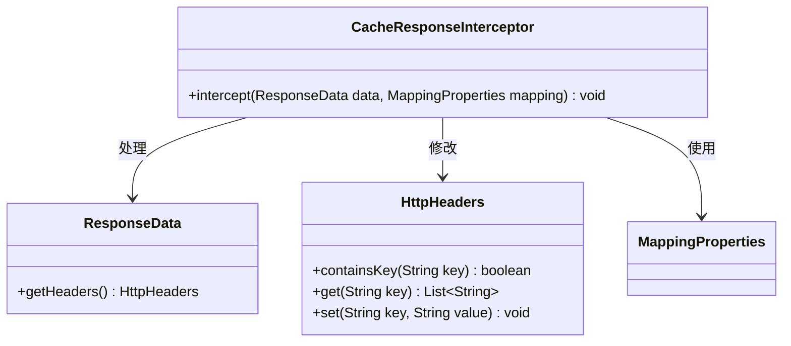
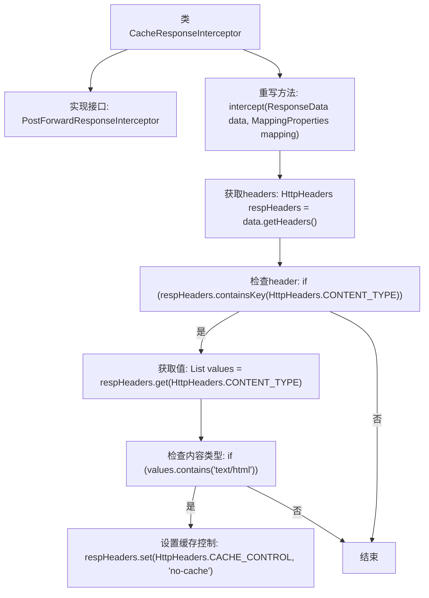

# 基础信息

|      |      |
|------|------|
| 名称 | CacheResponseInterceptor |
| 编码语言 | .java |
| 代码路径 | staffjoy/faraday/src/main/java/xyz/staffjoy/faraday/core/interceptor/CacheResponseInterceptor.java |
| 包名 | xyz.staffjoy.faraday.core.interceptor |
| 依赖项 | ['org.springframework.http.HttpHeaders', 'xyz.staffjoy.faraday.config.MappingProperties', 'xyz.staffjoy.faraday.core.http.ResponseData', 'java.util.List'] |
| 概述说明 | 拦截响应，若内容类型为HTML则禁止缓存。 |

# 说明

该内容描述了一个名为CacheResponseInterceptor的类，实现了PostForwardResponseInterceptor接口。该类的主要功能是拦截响应数据，检查响应头中的Content-Type是否为text/html。如果是，则在响应头中添加Cache-Control字段并设置为no-cache，以防止缓存HTML内容。整个过程不涉及任何代码实现细节，仅描述了类的功能和行为逻辑。

# 类列表 Class Summary

| 名称   | 类型  | 说明 |
|-------|------|-------------|
| CacheResponseInterceptor | class | 拦截响应，若内容类型为text/html则设置不缓存。 |

## 类 CacheResponseInterceptor

|      |      |
|------|------|
| 访问范围 | public |
| 类型 | class |
| 名称 | CacheResponseInterceptor |
| 说明 | 拦截响应，若内容类型为text/html则设置不缓存。 |

### UML类图

该代码展示了一个缓存响应拦截器实现，主要功能是检查响应头中的Content-Type，当发现text/html类型时自动添加no-cache控制头。类图中包含四个关键类：CacheResponseInterceptor实现核心拦截逻辑，依赖ResponseData获取响应头，操作HttpHeaders进行头信息修改，并使用MappingProperties配置参数。这种设计模式常见于HTTP请求处理链，用于在响应返回前动态修改响应头信息。

### 内部方法调用关系图

这段代码流程图展示了CacheResponseInterceptor类的工作流程。该类实现了PostForwardResponseInterceptor接口，主要功能是拦截响应数据并检查Content-Type头。当检测到text/html内容类型时，会自动添加no-cache的Cache-Control头以防止缓存。流程从获取响应头开始，经过多层条件判断，最终在满足条件时设置缓存控制头，否则直接结束处理。整个过程体现了对HTTP响应头的精细控制和缓存策略的安全处理。

### 字段列表 Field List

| 名称  | 类型  | 说明 |
|-------|-------|------|

### 方法列表 Method List

| 名称  | 类型  | 说明 |
|-------|-------|------|
| intercept | void | 拦截响应数据，检查内容类型为text/html时设置无缓存头。 |

