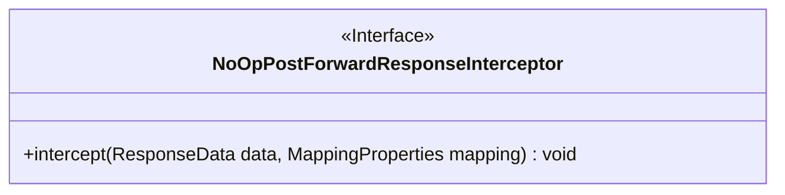
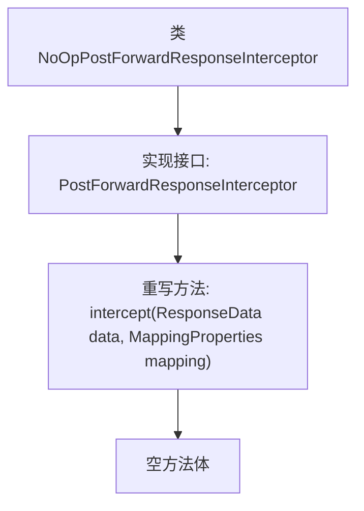

# 基础信息

|      |      |
|------|------|
| 名称 | NoOpPostForwardResponseInterceptor |
| 编码语言 | .java |
| 代码路径 | staffjoy/faraday/src/main/java/xyz/staffjoy/faraday/core/interceptor/NoOpPostForwardResponseInterceptor.java |
| 包名 | xyz.staffjoy.faraday.core.interceptor |
| 依赖项 | ['xyz.staffjoy.faraday.config.MappingProperties', 'xyz.staffjoy.faraday.core.http.ResponseData'] |
| 概述说明 | 无操作响应拦截器，空实现拦截方法。 |

# 说明

这是一个名为NoOpPostForwardResponseInterceptor的类，实现了PostForwardResponseInterceptor接口。该类定义了一个空的intercept方法，接收ResponseData和MappingProperties参数但不执行任何操作。这是一个典型的空实现拦截器，用于在不需要处理响应数据时提供默认行为。

# 类列表 Class Summary

| 名称   | 类型  | 说明 |
|-------|------|-------------|
| NoOpPostForwardResponseInterceptor | class | 无操作响应拦截器，空实现拦截方法。 |

## 类 NoOpPostForwardResponseInterceptor

|      |      |
|------|------|
| 访问范围 | public |
| 类型 | class |
| 名称 | NoOpPostForwardResponseInterceptor |
| 说明 | 无操作响应拦截器，空实现拦截方法。 |

### UML类图

这段类图描述了一个名为NoOpPostForwardResponseInterceptor的接口，该接口定义了一个名为intercept的方法，该方法接收ResponseData和MappingProperties两个参数且无返回值。该接口可能用于实现某种响应拦截机制，但当前实现为空操作（No-Operation），表明这是一个基础接口或占位接口，供具体实现类覆盖其行为。接口通过<<Interface>>标记明确标识其类型特征。

### 内部方法调用关系图

这段流程图描述了NoOpPostForwardResponseInterceptor类的结构，该类实现了PostForwardResponseInterceptor接口并重写了intercept方法。intercept方法接收ResponseData和MappingProperties两个参数，但方法体为空，表明这是一个不执行任何操作的空实现拦截器。该设计模式常用于需要提供默认实现或占位符的场景，允许其他类在不修改基础结构的情况下扩展功能。

### 字段列表 Field List

| 名称  | 类型  | 说明 |
|-------|-------|------|

### 方法列表 Method List

| 名称  | 类型  | 说明 |
|-------|-------|------|
| intercept | void | 重写方法拦截响应数据与映射属性。 |

