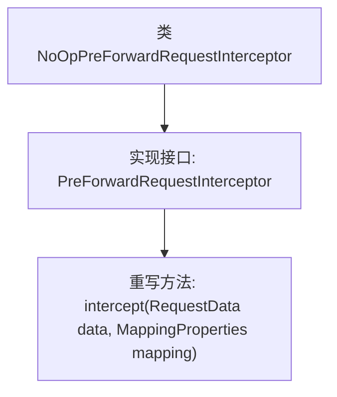

# 基础信息

|      |      |
|------|------|
| 名称 | NoOpPreForwardRequestInterceptor |
| 编码语言 | .java |
| 代码路径 | staffjoy/faraday/src/main/java/xyz/staffjoy/faraday/core/interceptor/NoOpPreForwardRequestInterceptor.java |
| 包名 | xyz.staffjoy.faraday.core.interceptor |
| 依赖项 | ['xyz.staffjoy.faraday.config.MappingProperties', 'xyz.staffjoy.faraday.core.http.RequestData'] |
| 概述说明 | 无操作请求拦截器，空实现拦截方法。 |

# 说明

这是一个名为NoOpPreForwardRequestInterceptor的Java类，实现了PreForwardRequestInterceptor接口。该类定义了一个空的intercept方法，接收RequestData和MappingProperties两个参数但不执行任何操作。这表明它是一个无操作的拦截器实现，可能用于默认或占位场景。类名中的"NoOp"暗示其不改变请求数据的特性。

# 类列表 Class Summary

| 名称   | 类型  | 说明 |
|-------|------|-------------|
| NoOpPreForwardRequestInterceptor | class | 空实现的前置转发请求拦截器，不执行任何操作。 |


## 类 NoOpPreForwardRequestInterceptor

|      |      |
|------|------|
| 访问范围 | public |
| 类型 | class |
| 名称 | NoOpPreForwardRequestInterceptor |
| 说明 | 空实现的前置转发请求拦截器，不执行任何操作。 |


### UML类图

```mermaid
classDiagram
    class NoOpPreForwardRequestInterceptor {
        +intercept(RequestData data, MappingProperties mapping) void
    }
    <<Interface>> PreForwardRequestInterceptor
    NoOpPreForwardRequestInterceptor ..|> PreForwardRequestInterceptor : 实现
```

这段代码展示了一个名为NoOpPreForwardRequestInterceptor的类，它实现了PreForwardRequestInterceptor接口。该类仅包含一个空的intercept方法，接收RequestData和MappingProperties参数，不执行任何操作。这种模式通常用于提供默认的空实现，允许调用方在不提供实际拦截逻辑时使用。类图清晰地显示了实现关系，其中接口用<<Interface>>标注，实现类通过空心三角箭头指向接口。


### 内部方法调用关系图



这段代码展示了一个名为NoOpPreForwardRequestInterceptor的类，它实现了PreForwardRequestInterceptor接口。该类仅重写了intercept方法，但方法体为空，表明这是一个无操作（No-Operation）的实现，通常用于提供默认的拦截行为或作为占位符。流程图清晰地反映了类与接口的继承关系以及方法的重写结构，突出了其简洁的设计意图。

### 字段列表 Field List

| 名称  | 类型  | 说明 |
|-------|-------|------|

### 方法列表 Method List

| 名称  | 类型  | 说明 |
|-------|-------|------|
| intercept | void | 重写方法拦截请求数据和映射属性 |


