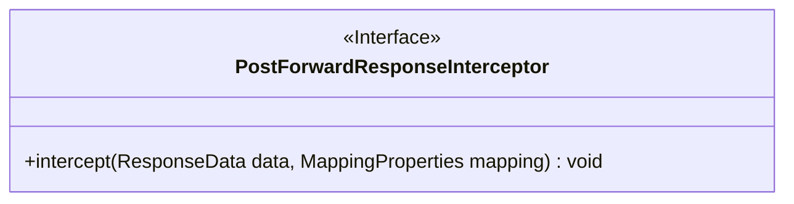
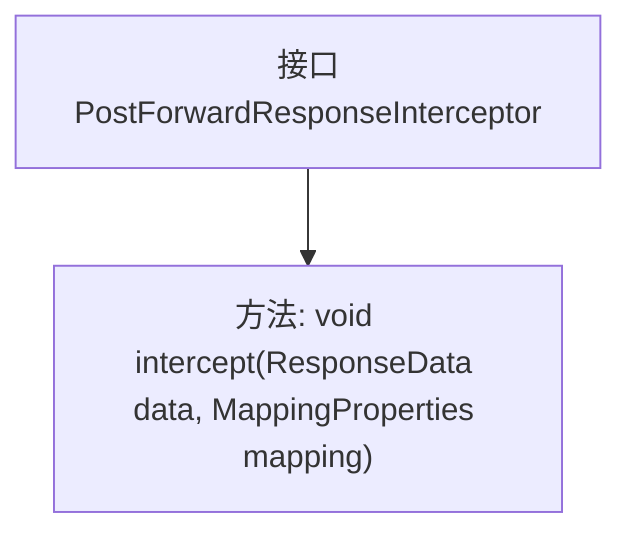

# 基础信息

|      |      |
|------|------|
| 名称 | PostForwardResponseInterceptor |
| 编码语言 | .java |
| 代码路径 | staffjoy/faraday/src/main/java/xyz/staffjoy/faraday/core/interceptor/PostForwardResponseInterceptor.java |
| 包名 | xyz.staffjoy.faraday.core.interceptor |
| 依赖项 | ['xyz.staffjoy.faraday.config.MappingProperties', 'xyz.staffjoy.faraday.core.http.ResponseData'] |
| 概述说明 | 接口定义响应拦截方法，处理响应数据和映射属性。 |

# 说明

这是一个公开接口PostForwardResponseInterceptor，定义了一个拦截方法intercept，用于处理响应数据和映射属性。该方法接收ResponseData类型的数据和MappingProperties类型的映射配置作为参数，无返回值。接口设计用于在响应转发过程中插入自定义处理逻辑。

# 类列表 Class Summary

| 名称   | 类型  | 说明 |
|-------|------|-------------|
| PostForwardResponseInterceptor | interface | 接口定义响应拦截器，处理响应数据和映射属性。 |

## 类 PostForwardResponseInterceptor

|      |      |
|------|------|
| 访问范围 | public |
| 类型 | interface |
| 名称 | PostForwardResponseInterceptor |
| 说明 | 接口定义响应拦截器，处理响应数据和映射属性。 |

### UML类图

这段类图描述了一个名为PostForwardResponseInterceptor的接口，该接口定义了一个拦截器模式的核心方法。接口中包含一个公有方法intercept，该方法接收ResponseData和MappingProperties两个参数，用于在响应转发过程中进行拦截处理。这种设计常用于实现AOP(面向切面编程)或责任链模式，允许在不修改核心逻辑的情况下插入额外处理逻辑。接口标记为<<Interface>>，表明这是一个纯抽象定义，需要由具体类实现其功能。

### 内部方法调用关系图

这段流程图展示了`PostForwardResponseInterceptor`接口的结构，该接口定义了一个名为`intercept`的方法，接收`ResponseData`和`MappingProperties`两个参数。图中清晰地呈现了接口与方法之间的层级关系，符合Mermaid语法规范，便于理解接口的核心功能设计。

### 字段列表 Field List

| 名称  | 类型  | 说明 |
|-------|-------|------|

### 方法列表 Method List

| 名称  | 类型  | 说明 |
|-------|-------|------|
| intercept | void | 拦截响应数据并映射属性。 |

