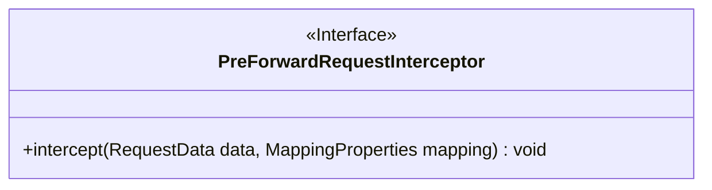
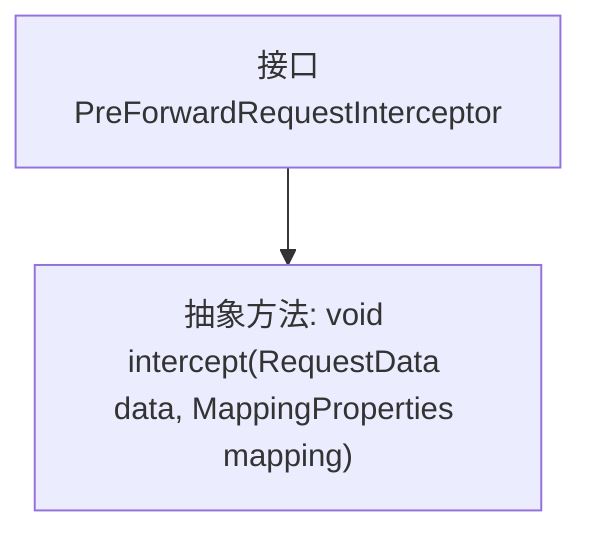

# 基础信息

|      |      |
|------|------|
| 名称 | PreForwardRequestInterceptor |
| 编码语言 | .java |
| 代码路径 | staffjoy/faraday/src/main/java/xyz/staffjoy/faraday/core/interceptor/PreForwardRequestInterceptor.java |
| 包名 | xyz.staffjoy.faraday.core.interceptor |
| 依赖项 | ['xyz.staffjoy.faraday.config.MappingProperties', 'xyz.staffjoy.faraday.core.http.RequestData'] |
| 概述说明 | 接口定义请求拦截器，处理请求数据和映射属性。 |

# 说明

这是一个名为PreForwardRequestInterceptor的公共接口，定义了一个拦截器模式。接口包含一个intercept方法，接收两个参数：RequestData类型的数据对象和MappingProperties类型的映射配置对象。该接口用于在请求转发前进行拦截处理，允许对请求数据和映射配置进行操作或检查，但不包含具体实现细节。

# 类列表 Class Summary

| 名称   | 类型  | 说明 |
|-------|------|-------------|
| PreForwardRequestInterceptor | interface | 接口定义请求拦截器，处理请求数据和映射属性。 |

## 类 PreForwardRequestInterceptor

|      |      |
|------|------|
| 访问范围 | public |
| 类型 | interface |
| 名称 | PreForwardRequestInterceptor |
| 说明 | 接口定义请求拦截器，处理请求数据和映射属性。 |

### UML类图

这段代码定义了一个名为PreForwardRequestInterceptor的接口，该接口包含一个intercept方法，用于在请求转发前进行拦截处理。接口方法接收RequestData和MappingProperties两个参数，分别表示请求数据和映射配置，无返回值。该接口可被具体拦截器类实现，用于实现请求转发前的自定义处理逻辑，如数据校验、日志记录或参数修改等操作。

### 内部方法调用关系图

这段mermaid流程图描述了PreForwardRequestInterceptor接口的结构。该接口定义了一个名为intercept的抽象方法，该方法接收RequestData和MappingProperties两个参数且无返回值。图中清晰地展示了接口与方法之间的层级关系，接口作为父节点，抽象方法作为子节点通过箭头连接。这种结构符合Java接口的定义规范，即只声明方法签名而不包含实现。

### 字段列表 Field List

| 名称  | 类型  | 说明 |
|-------|-------|------|

### 方法列表 Method List

| 名称  | 类型  | 说明 |
|-------|-------|------|
| intercept | void | 拦截请求数据并映射属性 |

