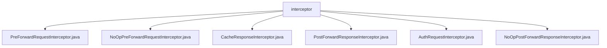

# 基础信息

|      |      |
|------|------|
| 名称 | interceptor |
| 编码语言 | .java |
| 代码路径 | staffjoy/faraday/src/main/java/xyz/staffjoy/faraday/core/interceptor |
| 包名 | staffjoy.docs.faraday.src.main.java.xyz.staffjoy.faraday.core.interceptor |
| 概述说明 | 请求转发前后拦截器接口及实现，包括空操作和认证处理。 |

# 说明

## 概述  
该代码模块实现了一个拦截器框架，主要用于在请求转发前后进行拦截处理。模块包含两类核心拦截器：`PreForwardRequestInterceptor`（请求转发前拦截）和`PostForwardResponseInterceptor`（响应转发后拦截），并提供了默认的空实现（`NoOp`）和具体功能实现（如认证、缓存控制等）。拦截器设计允许在请求/响应的处理流程中插入自定义逻辑，例如修改请求头、验证权限、控制缓存等。

## 主要业务场景  
1. **请求预处理**  
   - **认证与授权**：通过`AuthRequestInterceptor`实现，包括用户身份验证、权限检查（如禁止用户列表）、环境限制（如仅开发环境访问）以及匿名用户访问控制（重定向到登录页）。  
   - **默认空操作**：`NoOpPreForwardRequestInterceptor`提供无操作的默认实现，用于不需要请求处理的场景。  

2. **响应后处理**  
   - **缓存控制**：`CacheResponseInterceptor`针对`text/html`响应类型添加`Cache-Control: no-cache`头部，防止HTML内容被缓存。  
   - **默认空操作**：`NoOpPostForwardResponseInterceptor`为响应拦截提供占位实现。  

3. **扩展性设计**  
   - 通过接口（如`PreForwardRequestInterceptor`、`PostForwardResponseInterceptor`）定义标准拦截方法，支持灵活扩展自定义拦截逻辑。  
   - 空实现类（`NoOp`）简化了默认配置，避免强制实现无关逻辑。  

4. **安全与合规**  
   - 在认证拦截器中集成会话令牌解析、用户类型区分（如设置不同的授权头）和错误处理，确保服务访问的安全性。  
   - 通过响应拦截器强制关键内容（如HTML）的实时性，避免敏感数据缓存风险。

### 包内部结构视图

该流程图展示了faraday项目中拦截器模块的文件结构。根节点为interceptor文件夹，其下包含6个具体的拦截器实现类，包括请求前拦截器、响应后拦截器以及缓存相关的拦截器等。这些拦截器类共同构成了faraday核心功能中的拦截器链体系。

# 文件列表 File List

| 名称   | 类型  | 说明 |
|-------|------|-------------|
| [NoOpPostForwardResponseInterceptor.java](NoOpPostForwardResponseInterceptor.md) | file | 无操作响应拦截器，空实现拦截方法。 |
| [AuthRequestInterceptor.java](AuthRequestInterceptor.md) | file | 拦截请求验证权限，检查禁用用户，处理匿名访问及重定向。 |
| [PostForwardResponseInterceptor.java](PostForwardResponseInterceptor.md) | file | 接口定义响应拦截方法，处理响应数据和映射属性。 |
| [CacheResponseInterceptor.java](CacheResponseInterceptor.md) | file | 拦截响应，若内容类型为HTML则禁止缓存。 |
| [NoOpPreForwardRequestInterceptor.java](NoOpPreForwardRequestInterceptor.md) | file | 无操作请求拦截器，空实现拦截方法。 |
| [PreForwardRequestInterceptor.java](PreForwardRequestInterceptor.md) | file | 接口定义请求拦截器，处理请求数据和映射属性。 |

