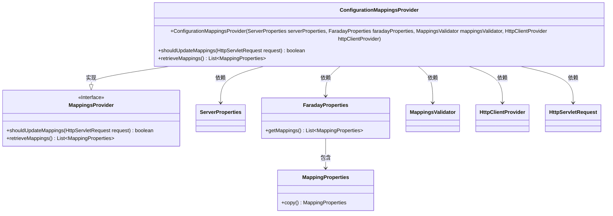
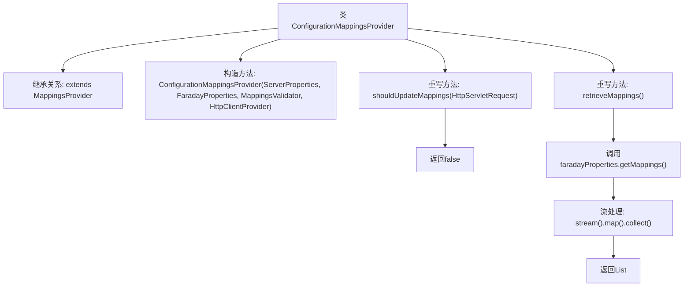

# 基础信息

|      |      |
|------|------|
| 名称 | ConfigurationMappingsProvider |
| 编码语言 | .java |
| 代码路径 | staffjoy/faraday/src/main/java/xyz/staffjoy/faraday/core/mappings/ConfigurationMappingsProvider.java |
| 包名 | xyz.staffjoy.faraday.core.mappings |
| 依赖项 | ['org.springframework.boot.autoconfigure.web.ServerProperties', 'xyz.staffjoy.faraday.config.FaradayProperties', 'xyz.staffjoy.faraday.config.MappingProperties', 'xyz.staffjoy.faraday.core.http.HttpClientProvider', 'javax.servlet.http.HttpServletRequest', 'java.util.List', 'java.util.stream.Collectors'] |
| 概述说明 | 配置映射提供类继承映射提供基类，重写方法返回属性映射列表。 |

# 说明

ConfigurationMappingsProvider类继承自MappingsProvider，用于处理配置映射。构造函数接收ServerProperties、FaradayProperties、MappingsValidator和HttpClientProvider参数，并传递给父类。重写shouldUpdateMappings方法始终返回false，表示不更新映射。retrieveMappings方法从faradayProperties获取映射列表，通过stream操作复制每个MappingProperties对象后返回新列表。

# 类列表 Class Summary

| 名称   | 类型  | 说明 |
|-------|------|-------------|
| ConfigurationMappingsProvider | class | 配置映射提供类，继承映射提供基类，重写获取映射方法，不更新映射。 |

## 类 ConfigurationMappingsProvider

|      |      |
|------|------|
| 访问范围 | public |
| 类型 | class |
| 名称 | ConfigurationMappingsProvider |
| 说明 | 配置映射提供类，继承映射提供基类，重写获取映射方法，不更新映射。 |

### UML类图

该类图展示了ConfigurationMappingsProvider继承自MappingsProvider接口，并依赖多个外部类来实现其功能。ConfigurationMappingsProvider通过构造函数注入ServerProperties、FaradayProperties等依赖项，重写了父接口的shouldUpdateMappings和retrieveMappings方法。其中retrieveMappings方法通过FaradayProperties获取映射配置并返回副本，而shouldUpdateMappings始终返回false表示不更新映射。类图清晰地呈现了类之间的继承和依赖关系。

### 内部方法调用关系图

该流程图展示了ConfigurationMappingsProvider类的结构，它继承自MappingsProvider类。主要包含构造方法和两个重写方法：shouldUpdateMappings直接返回false，而retrieveMappings通过流处理从faradayProperties获取映射配置并返回拷贝后的列表。箭头清晰地表示了类与方法的层级关系和方法间的调用流程。

### 字段列表 Field List

| 名称  | 类型  | 说明 |
|-------|-------|------|

### 方法列表 Method List

| 名称  | 类型  | 说明 |
|-------|-------|------|
| shouldUpdateMappings | boolean | 覆盖方法，始终返回false不更新映射。 |
| retrieveMappings | List<MappingProperties> | 重写方法，复制并返回映射属性列表。 |

