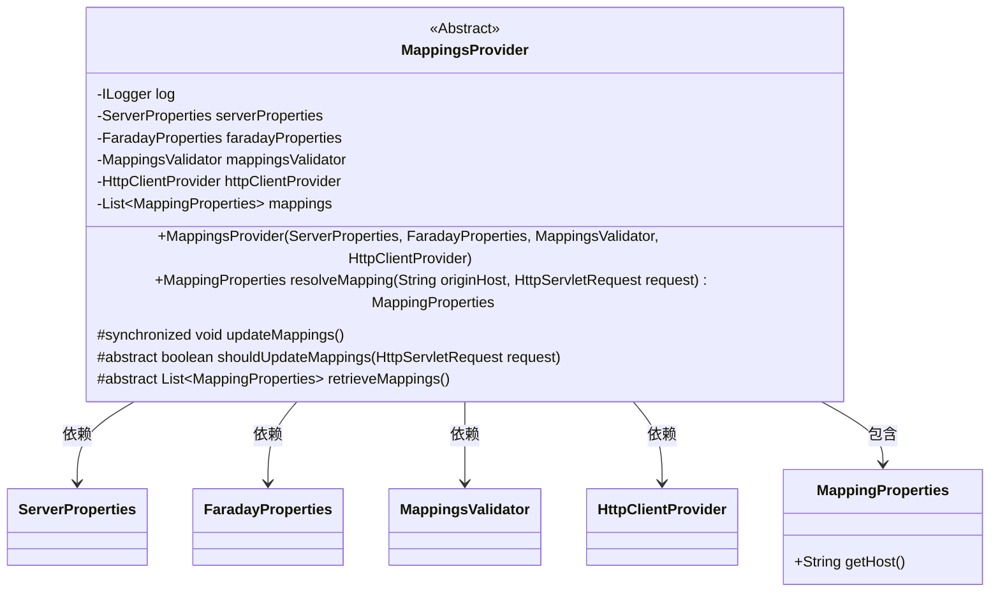
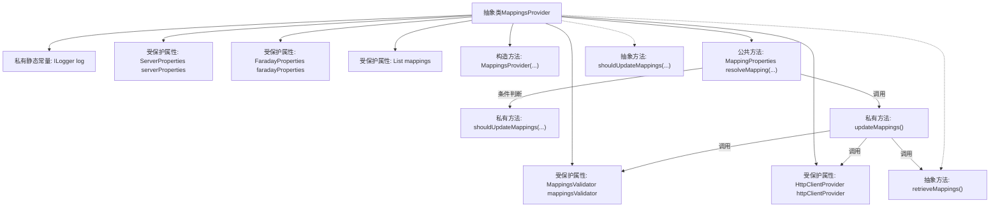

# 基础信息

|      |      |
|------|------|
| 名称 | MappingsProvider |
| 编码语言 | .java |
| 代码路径 | staffjoy/faraday/src/main/java/xyz/staffjoy/faraday/core/mappings/MappingsProvider.java |
| 包名 | xyz.staffjoy.faraday.core.mappings |
| 依赖项 | ['com.github.structlog4j.ILogger', 'com.github.structlog4j.SLoggerFactory', 'org.springframework.boot.autoconfigure.web.ServerProperties', 'xyz.staffjoy.faraday.config.FaradayProperties', 'xyz.staffjoy.faraday.config.MappingProperties', 'xyz.staffjoy.faraday.core.http.HttpClientProvider', 'javax.annotation.PostConstruct', 'javax.servlet.http.HttpServletRequest', 'java.util.List', 'java.util.stream.Collectors', 'org.springframework.util.CollectionUtils.isEmpty'] |
| 概述说明 | 抽象类MappingsProvider提供映射解析功能，包含属性配置、验证及更新逻辑。 |

# 说明

这是一个抽象类MappingsProvider，用于管理和提供映射配置。类中包含四个关键依赖：ServerProperties、FaradayProperties、MappingsValidator和HttpClientProvider。核心功能包括通过resolveMapping方法根据请求主机名解析对应映射配置，以及通过updateMappings方法同步更新所有映射配置。更新时会验证新配置并更新HTTP客户端。该类要求子类实现shouldUpdateMappings和retrieveMappings两个抽象方法，分别用于判断是否需要更新映射和获取新映射配置。整个类采用线程安全设计，使用synchronized保证映射更新的原子性。

# 类列表 Class Summary

| 名称   | 类型  | 说明 |
|-------|------|-------------|
| MappingsProvider | class | 抽象类MappingsProvider管理映射配置，包含解析、更新和验证功能。 |

## 类 MappingsProvider

|      |      |
|------|------|
| 访问范围 | public abstract |
| 类型 | class |
| 名称 | MappingsProvider |
| 说明 | 抽象类MappingsProvider管理映射配置，包含解析、更新和验证功能。 |

### UML类图

该抽象类图展示了MappingsProvider的核心结构及其依赖关系。作为映射配置提供者，它通过构造函数注入四个关键组件（服务器属性、Faraday属性、验证器和HTTP客户端提供者），并维护一个映射属性列表。类提供了解析映射、更新映射的同步方法，并定义了两个抽象方法供子类实现。通过组合模式管理MappingProperties对象，实现了主机名到目标映射的动态解析和验证机制。

### 内部方法调用关系图

这段代码展示了一个抽象类MappingsProvider的结构和主要方法调用关系。该类负责管理映射配置，包含属性初始化、映射解析和更新机制。核心流程包括：通过resolveMapping方法解析主机映射，在需要时触发updateMappings更新操作，后者会调用抽象方法retrieveMappings获取新映射并验证。类中使用了依赖注入的属性对象和日志记录功能，通过抽象方法将部分逻辑交由子类实现，体现了模板方法设计模式。

### 字段列表 Field List

| 名称  | 类型  | 说明 |
|-------|-------|------|
| serverProperties | ServerProperties | 保护型ServerProperties实例变量。 |
| faradayProperties | FaradayProperties | 保护型FaradayProperties属性 |
| mappingsValidator | MappingsValidator | 受保护的最终映射验证器 |
| httpClientProvider | HttpClientProvider | 受保护的最终HttpClientProvider实例。 |
| mappings | List<MappingProperties> | 保护映射属性列表 |
| log = SLoggerFactory.getLogger(MappingsProvider.class) | ILogger | 私有日志记录器，用于MappingsProvider类。 |

### 方法列表 Method List

| 名称  | 类型  | 说明 |
|-------|-------|------|
| shouldUpdateMappings | boolean | 受保护抽象方法，判断是否需更新请求映射。 |
| updateMappings | void | 同步方法更新映射：获取验证新映射，更新HTTP客户端并记录日志。 |
| resolveMapping | MappingProperties | 解析映射：根据请求更新映射，匹配主机名返回首个结果，无匹配返回空。 |
| retrieveMappings | List<MappingProperties> | 抽象方法：获取映射属性列表。 |

