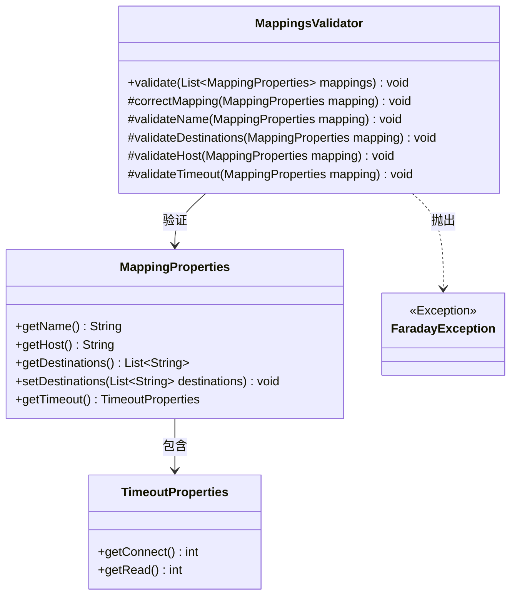
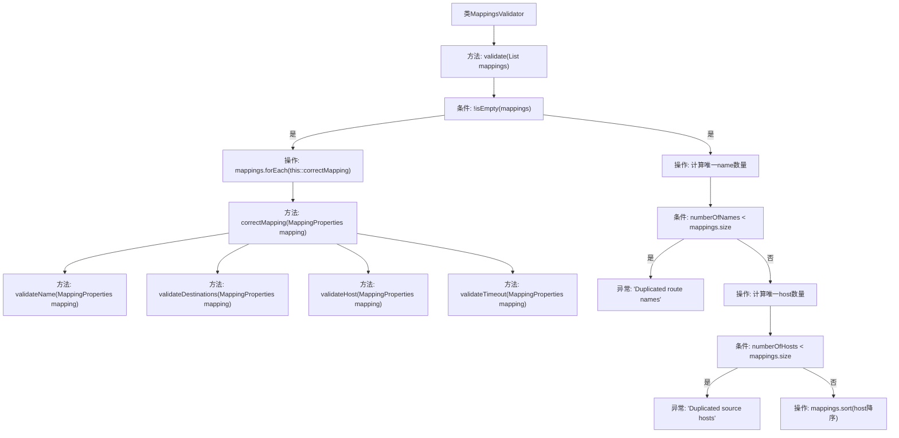

# 基础信息

|      |      |
|------|------|
| 名称 | MappingsValidator |
| 编码语言 | .java |
| 代码路径 | staffjoy/faraday/src/main/java/xyz/staffjoy/faraday/core/mappings/MappingsValidator.java |
| 包名 | xyz.staffjoy.faraday.core.mappings |
| 依赖项 | ['xyz.staffjoy.common.services.ServiceDirectory', 'xyz.staffjoy.faraday.config.MappingProperties', 'xyz.staffjoy.faraday.exceptions.FaradayException', 'java.util.ArrayList', 'java.util.List', 'java.util.stream.Collectors.toSet', 'org.apache.commons.lang3.StringUtils', 'org.springframework.util.CollectionUtils.isEmpty'] |
| 概述说明 | 验证映射配置，检查名称、主机、目标和超时，确保无重复和有效值。 |

# 说明

MappingsValidator类用于验证映射列表的合法性。主要功能包括检查映射名称和源主机是否重复，并按主机名排序。correctMapping方法验证单个映射的各个属性：名称不能为空，目标主机列表不能为空且需格式化为标准URL格式，源主机不能为空，连接和读取超时值必须非负。任何验证失败都会抛出FaradayException异常。

# 类列表 Class Summary

| 名称   | 类型  | 说明 |
|-------|------|-------------|
| MappingsValidator | class | 验证映射配置，检查名称、主机、目标和超时，确保无重复和有效值。 |

## 类 MappingsValidator

|      |      |
|------|------|
| 访问范围 | public |
| 类型 | class |
| 名称 | MappingsValidator |
| 说明 | 验证映射配置，检查名称、主机、目标和超时，确保无重复和有效值。 |

### UML类图

该代码展示了一个映射验证器类，用于检查路由映射配置的合法性。MappingsValidator通过5个核心方法验证MappingProperties对象的名称、目标地址、主机和超时设置，确保无重复路由名/主机、非空字段和有效超时值。类图中包含4个主要类，其中TimeoutProperties作为嵌套配置类，FaradayException用于处理验证失败场景。验证过程采用流式处理和异常机制保证数据一致性。

### 内部方法调用关系图

流程图描述：该流程图展示了MappingsValidator类的核心验证逻辑。首先检查mappings列表非空后，遍历执行correctMapping方法进行四项子验证（名称、目标地址、主机和超时）。随后检查路由名称和源主机的唯一性，出现重复时抛出异常。最后对mappings按主机名降序排序。整个流程包含5个主要验证步骤和2个唯一性检查，通过严格的参数校验确保映射配置的合法性。

### 字段列表 Field List

| 名称  | 类型  | 说明 |
|-------|-------|------|

### 方法列表 Method List

| 名称  | 类型  | 说明 |
|-------|-------|------|
| validate | void | 验证映射列表：检查名称和主机重复，排序主机。 |
| validateDestinations | void | 验证目标地址有效性，空则报错，自动补全协议并去除末尾斜杠。 |
| validateName | void | 验证映射名称非空，否则抛出异常。 |
| correctMapping | void | 保护方法correctMapping验证映射属性：名称、目标、主机和超时。 |
| validateHost | void | 验证主机映射，空值抛出异常。 |
| validateTimeout | void | 验证超时参数，若连接或读取超时值为负则抛出异常。 |

