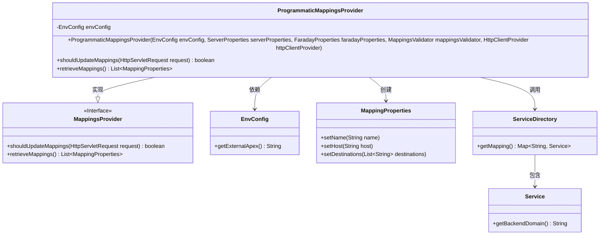
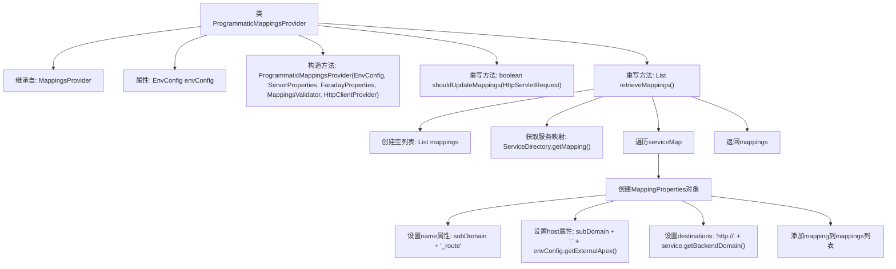

# 基础信息

|      |      |
|------|------|
| 名称 | ProgrammaticMappingsProvider |
| 编码语言 | .java |
| 代码路径 | staffjoy/faraday/src/main/java/xyz/staffjoy/faraday/core/mappings/ProgrammaticMappingsProvider.java |
| 包名 | xyz.staffjoy.faraday.core.mappings |
| 依赖项 | ['org.springframework.boot.autoconfigure.web.ServerProperties', 'xyz.staffjoy.common.env.EnvConfig', 'xyz.staffjoy.common.services.Service', 'xyz.staffjoy.common.services.ServiceDirectory', 'xyz.staffjoy.faraday.config.FaradayProperties', 'xyz.staffjoy.faraday.config.MappingProperties', 'xyz.staffjoy.faraday.core.http.HttpClientProvider', 'javax.servlet.http.HttpServletRequest', 'java.util.ArrayList', 'java.util.Arrays', 'java.util.List', 'java.util.Map'] |
| 概述说明 | 编程映射提供类，继承映射提供器，含环境配置，重写检索映射方法，生成子域名路由列表。 |

# 说明

ProgrammaticMappingsProvider是一个继承自MappingsProvider的类，用于处理程序化映射配置。它通过构造函数接收EnvConfig、ServerProperties、FaradayProperties、MappingsValidator和HttpClientProvider等参数，并初始化envConfig。该类重写了shouldUpdateMappings方法，始终返回false表示不更新映射。retrieveMappings方法从ServiceDirectory获取服务映射，为每个服务创建MappingProperties对象，设置名称、主机和目的地。主机由子域名和外部根域名拼接而成，目的地为服务的后端域名。最终返回包含所有映射的列表。

# 类列表 Class Summary

| 名称   | 类型  | 说明 |
|-------|------|-------------|
| ProgrammaticMappingsProvider | class | ProgrammaticMappingsProvider类继承MappingsProvider，通过ServiceDirectory生成映射列表。 |

## 类 ProgrammaticMappingsProvider

|      |      |
|------|------|
| 访问范围 | public |
| 类型 | class |
| 名称 | ProgrammaticMappingsProvider |
| 说明 | ProgrammaticMappingsProvider类继承MappingsProvider，通过ServiceDirectory生成映射列表。 |

### UML类图

这段代码展示了一个映射提供者实现类ProgrammaticMappingsProvider，它继承自MappingsProvider接口。主要功能是通过ServiceDirectory获取服务映射，并转换为MappingProperties对象列表。类图中清晰地显示了继承关系、依赖关系和关键方法调用，包括从环境配置获取域名、服务目录查询以及映射属性构建等核心逻辑。EnvConfig提供外部域名配置，ServiceDirectory维护服务映射表，最终生成包含主机名和目标地址的路由配置列表。

### 内部方法调用关系图

这段代码展示了一个`ProgrammaticMappingsProvider`类，它继承自`MappingsProvider`。主要功能是通过`retrieveMappings`方法动态生成路由映射配置。该方法从服务目录获取所有服务，为每个服务创建一个路由映射，设置名称、主机和目标地址等属性，最终返回映射列表。构造方法接收环境配置和其他依赖项，而`shouldUpdateMappings`方法被重写为始终返回false，表示不更新映射。整个流程清晰地展示了从获取服务到生成路由配置的完整过程。

### 字段列表 Field List

| 名称  | 类型  | 说明 |
|-------|-------|------|
| envConfig | EnvConfig | 受保护的最终环境配置变量。 |

### 方法列表 Method List

| 名称  | 类型  | 说明 |
|-------|-------|------|
| shouldUpdateMappings | boolean | 覆盖方法，固定返回false不更新映射。 |
| retrieveMappings | List<MappingProperties> | 重写方法获取服务映射，生成子域名路由配置并返回列表。 |

