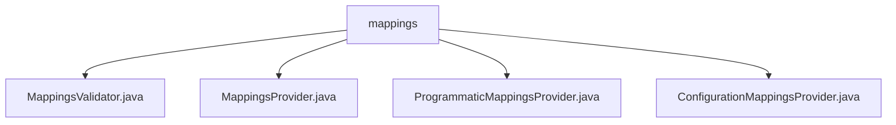

# 基础信息

|      |      |
|------|------|
| 名称 | mappings |
| 编码语言 | .java |
| 代码路径 | staffjoy/faraday/src/main/java/xyz/staffjoy/faraday/core/mappings |
| 包名 | staffjoy.docs.faraday.src.main.java.xyz.staffjoy.faraday.core.mappings |
| 概述说明 | MappingsValidator验证映射合法性。MappingsProvider管理映射配置，子类ProgrammaticMappingsProvider和ConfigurationMappingsProvider分别处理程序化和配置映射。 |

# 说明

## 概述

该代码模块是一个用于管理和验证HTTP请求映射配置的系统，主要功能包括映射配置的验证、解析和更新。模块采用分层设计，包含一个抽象基类和多个具体实现类，支持程序化配置和静态配置两种方式。核心功能围绕映射配置的合法性检查、动态更新和请求路由展开，采用线程安全设计保证操作原子性。

## 主要业务场景

1. **映射配置验证**：
   - 通过`MappingsValidator`类验证映射列表的合法性
   - 检查映射名称和源主机是否重复
   - 验证单个映射的各个属性（名称非空、目标主机列表格式正确、超时值非负等）
   - 验证失败时抛出`FaradayException`异常

2. **映射配置管理**：
   - 抽象基类`MappingsProvider`提供核心框架
   - 支持通过请求主机名解析对应映射配置
   - 支持同步更新所有映射配置（包含验证和HTTP客户端更新）
   - 要求子类实现配置更新判断和配置获取逻辑

3. **程序化配置支持**：
   - `ProgrammaticMappingsProvider`实现从服务目录动态获取映射
   - 自动构建服务子域名映射
   - 为每个服务创建标准化的映射配置对象

4. **静态配置支持**：
   - `ConfigurationMappingsProvider`实现从配置文件获取映射
   - 直接从配置属性中读取预定义的映射列表
   - 提供映射配置的复制功能保证安全性

5. **线程安全更新**：
   - 使用`synchronized`关键字保证映射更新的原子性
   - 防止多线程环境下的配置不一致问题
   - 在更新时同步更新关联的HTTP客户端

### 包内部结构视图

该流程图展示了staffjoy/faraday项目中core/mappings目录下的文件结构关系。mappings作为父节点，包含四个子文件：MappingsValidator.java、MappingsProvider.java、ProgrammaticMappingsProvider.java和ConfigurationMappingsProvider.java，这些文件都直接位于mappings目录下，没有更深层次的嵌套结构。

# 文件列表 File List

| 名称   | 类型  | 说明 |
|-------|------|-------------|
| [MappingsProvider.java](MappingsProvider.md) | file | 抽象类MappingsProvider提供映射解析功能，包含属性配置、验证及更新逻辑。 |
| [ConfigurationMappingsProvider.java](ConfigurationMappingsProvider.md) | file | 配置映射提供类继承映射提供基类，重写方法返回属性映射列表。 |
| [ProgrammaticMappingsProvider.java](ProgrammaticMappingsProvider.md) | file | 编程映射提供类，继承映射提供器，含环境配置，重写检索映射方法，生成子域名路由列表。 |
| [MappingsValidator.java](MappingsValidator.md) | file | 验证映射配置，检查名称、主机、目标和超时，确保无重复和有效值。 |

