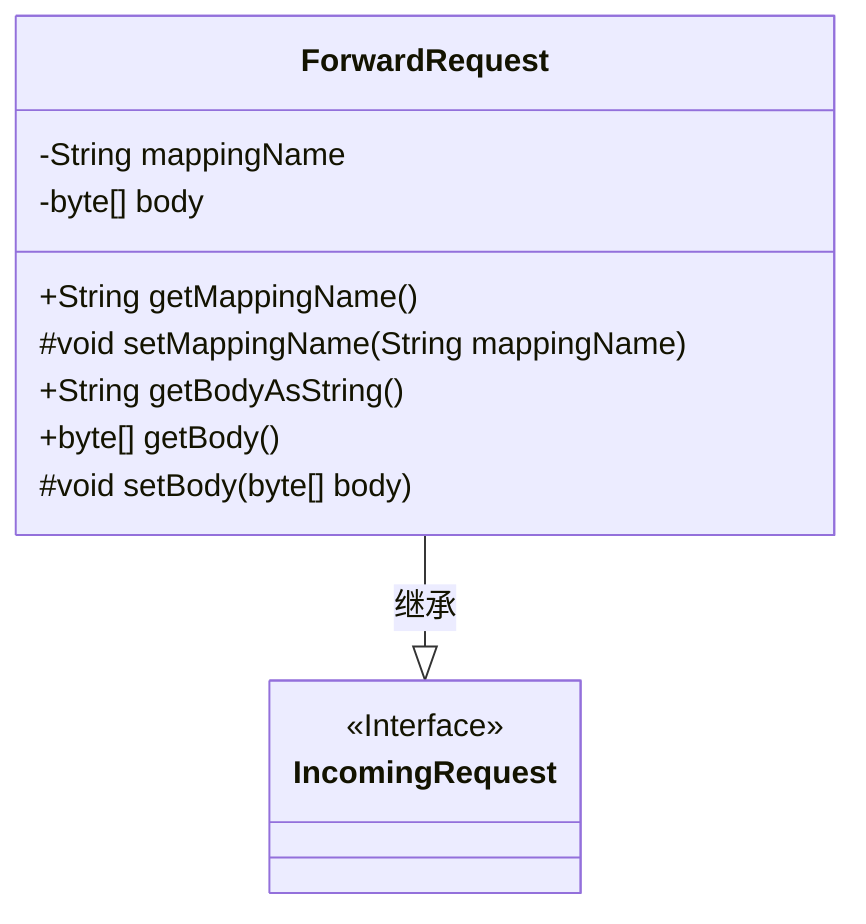
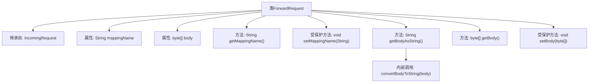

# 基础信息

|      |      |
|------|------|
| 名称 | ForwardRequest |
| 编码语言 | .java |
| 代码路径 | staffjoy/faraday/src/main/java/xyz/staffjoy/faraday/core/trace/ForwardRequest.java |
| 包名 | xyz.staffjoy.faraday.core.trace |
| 依赖项 | ['xyz.staffjoy.faraday.core.utils.BodyConverter.convertBodyToString'] |
| 概述说明 | ForwardRequest类继承IncomingRequest，含mappingName和body属性及对应方法。 |

# 说明

ForwardRequest类继承自IncomingRequest，包含两个主要属性：mappingName和body。mappingName是字符串类型，body是字节数组类型。类提供了获取和设置这两个属性的方法：getMappingName、setMappingName、getBodyAsString、getBody和setBody。getBodyAsString方法将body字节数组转换为字符串返回。所有set方法都是protected修饰，只能在类内部或子类中调用。

# 类列表 Class Summary

| 名称   | 类型  | 说明 |
|-------|------|-------------|
| ForwardRequest | class | ForwardRequest类继承IncomingRequest，含mappingName和body属性及对应方法。 |

## 类 ForwardRequest

|      |      |
|------|------|
| 访问范围 | public |
| 类型 | class |
| 名称 | ForwardRequest |
| 说明 | ForwardRequest类继承IncomingRequest，含mappingName和body属性及对应方法。 |

### UML类图

这段类图展示了ForwardRequest类继承自IncomingRequest接口的结构。ForwardRequest包含两个私有属性mappingName和body，提供了对应的公有getter方法和受保护的setter方法。其中getBodyAsString()方法将字节数组转换为字符串返回。类图中清晰体现了继承关系，并准确区分了公有和受保护的成员方法，符合面向对象设计原则。

### 内部方法调用关系图

这段代码展示了一个继承自IncomingRequest的ForwardRequest类，主要处理请求映射和消息体。类包含两个核心属性：mappingName用于存储映射名称，body以字节数组形式存储请求体。提供getter/setter方法访问这些属性，其中setMappingName和setBody为受保护方法。getBodyAsString方法通过内部convertBodyToString转换字节数组为字符串，体现了数据封装和转换逻辑。整体设计符合请求转发场景的需求。

### 字段列表 Field List

| 名称  | 类型  | 说明 |
|-------|-------|------|
| mappingName | String | 声明受保护的字符串变量mappingName。 |
| body | byte[] | 保护字节数组body |

### 方法列表 Method List

| 名称  | 类型  | 说明 |
|-------|-------|------|
| getMappingName | String | 获取映射名称的方法。 |
| getBody | byte[] | 获取字节数组body的方法。 |
| setBody | void | 设置字节数组类型的body属性值 |
| getBodyAsString | String | 将请求体转换为字符串并返回。 |
| setMappingName | void | 设置映射名称的方法。 |

