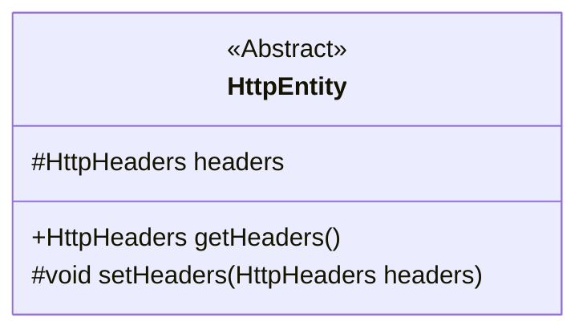
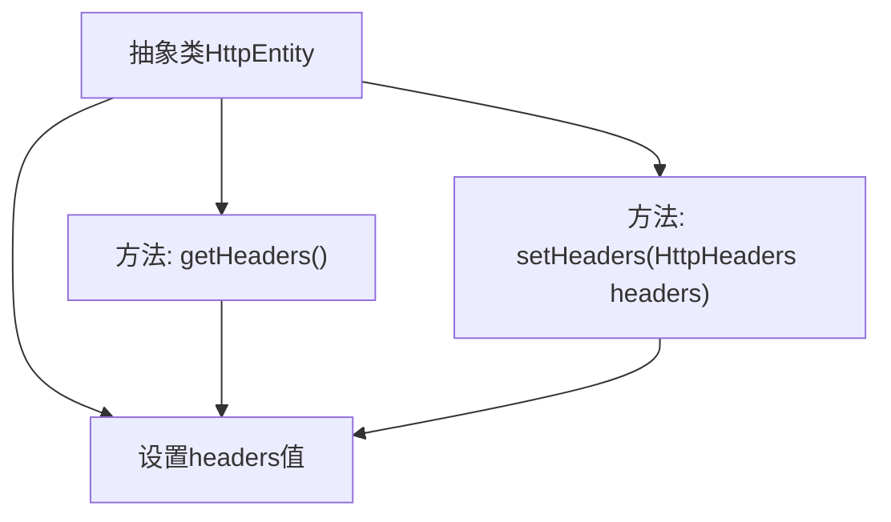

# 基础信息

|      |      |
|------|------|
| 名称 | HttpEntity |
| 编码语言 | .java |
| 代码路径 | staffjoy/faraday/src/main/java/xyz/staffjoy/faraday/core/trace/HttpEntity.java |
| 包名 | xyz.staffjoy.faraday.core.trace |
| 依赖项 | ['org.springframework.http.HttpHeaders'] |
| 概述说明 | 抽象类HttpEntity含headers属性，提供get/set方法。 |

# 说明

这是一个名为HttpEntity的抽象类，主要用于处理HTTP实体。该类包含一个受保护的HttpHeaders类型成员变量headers，用于存储HTTP头信息。提供了两个方法：getHeaders()用于获取headers，setHeaders(HttpHeaders headers)用于设置headers。setHeaders方法为受保护方法，只能在类内部或子类中调用。整个类结构简洁，专注于HTTP头信息的封装与管理。

# 类列表 Class Summary

| 名称   | 类型  | 说明 |
|-------|------|-------------|
| HttpEntity | class | 抽象类HttpEntity包含headers属性及其get/set方法。 |

## 类 HttpEntity

|      |      |
|------|------|
| 访问范围 | public abstract |
| 类型 | class |
| 名称 | HttpEntity |
| 说明 | 抽象类HttpEntity包含headers属性及其get/set方法。 |

### UML类图

这段代码展示了一个抽象类HttpEntity的结构，该类主要用于封装HTTP实体（请求/响应体）及其头部信息。类中包含一个受保护的headers字段，提供公共的getHeaders()方法用于获取头信息，以及受保护的setHeaders()方法用于设置头信息。作为抽象类，它需要被子类继承才能实例化，这种设计为处理HTTP消息提供了基础框架，允许子类实现具体的实体内容处理逻辑。

### 内部方法调用关系图

该流程图展示了抽象类HttpEntity的结构，包含一个受保护的headers属性和两个关键方法。getHeaders()用于获取当前headers对象，setHeaders()用于更新headers值。抽象类作为基类设计，允许子类继承并扩展HTTP实体相关的通用功能，同时通过受保护方法控制headers属性的访问权限，体现了封装性设计原则。

### 字段列表 Field List

| 名称  | 类型  | 说明 |
|-------|-------|------|
| headers | HttpHeaders | 声明受保护的HttpHeaders变量headers。 |

### 方法列表 Method List

| 名称  | 类型  | 说明 |
|-------|-------|------|
| getHeaders | HttpHeaders | 获取HTTP头信息的方法。 |
| setHeaders | void | 设置HTTP头信息。 |

