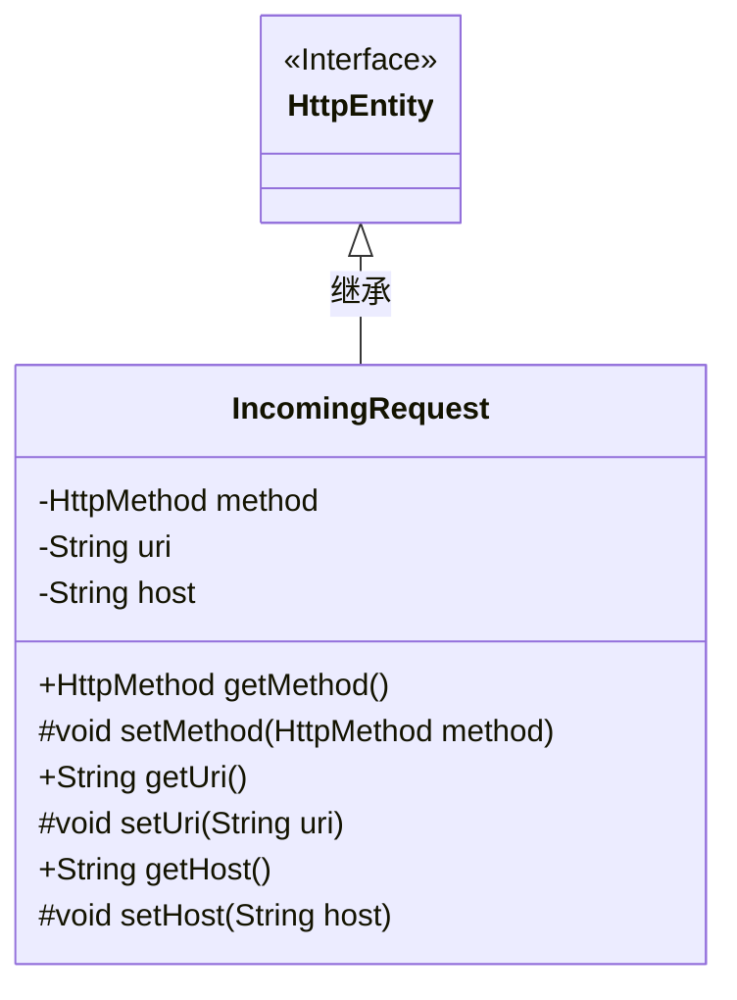
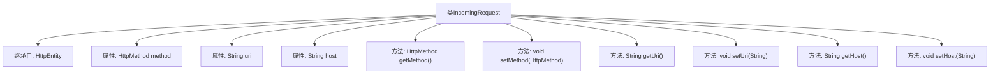

# 基础信息

|      |      |
|------|------|
| 名称 | IncomingRequest |
| 编码语言 | .java |
| 代码路径 | staffjoy/faraday/src/main/java/xyz/staffjoy/faraday/core/trace/IncomingRequest.java |
| 包名 | xyz.staffjoy.faraday.core.trace |
| 依赖项 | ['org.springframework.http.HttpMethod'] |
| 概述说明 | IncomingRequest类继承HttpEntity，包含method、uri、host属性和对应getter/setter方法。 |

# 说明

该代码定义了一个名为IncomingRequest的类，继承自HttpEntity。类中包含三个受保护的成员变量：method（HttpMethod类型）、uri（字符串类型）和host（字符串类型）。提供了三个公共的getter方法（getMethod、getUri、getHost）用于获取这些变量的值，以及三个受保护的setter方法（setMethod、setUri、setHost）用于设置这些变量的值。该类主要用于封装HTTP请求的相关信息。

# 类列表 Class Summary

| 名称   | 类型  | 说明 |
|-------|------|-------------|
| IncomingRequest | class | 继承HttpEntity的IncomingRequest类，含method、uri、host属性和对应get/set方法。 |

## 类 IncomingRequest

|      |      |
|------|------|
| 访问范围 | public |
| 类型 | class |
| 名称 | IncomingRequest |
| 说明 | 继承HttpEntity的IncomingRequest类，含method、uri、host属性和对应get/set方法。 |

### UML类图

这段类图展示了IncomingRequest类继承自HttpEntity接口的结构。IncomingRequest包含三个私有字段(method/uri/host)，每个字段都有对应的公有getter方法和受保护的setter方法。类图中明确体现了继承关系，并通过符号区分了方法的访问权限(公有+号/受保护#号)。该设计遵循了封装原则，对外提供只读访问，同时允许子类或同包类修改属性值。

### 内部方法调用关系图

这段流程图展示了IncomingRequest类的完整结构，该类继承自HttpEntity基类。图中清晰呈现了三个核心属性(method/uri/host)及其对应的getter/setter方法，其中setter方法被声明为protected访问级别。所有方法都采用标准驼峰命名法，属性使用小写命名，体现了良好的Java编码规范。类结构简单但完整，适合用于HTTP请求数据的封装和传递。

### 字段列表 Field List

| 名称  | 类型  | 说明 |
|-------|-------|------|
| host | String | 声明受保护的字符串变量host |
| method | HttpMethod | 声明受保护的HttpMethod类型变量method。 |
| uri | String | 声明受保护的字符串变量uri。 |

### 方法列表 Method List

| 名称  | 类型  | 说明 |
|-------|-------|------|
| getMethod | HttpMethod | 获取HTTP请求方法。 |
| getHost | String | 获取主机地址的方法。 |
| setHost | void | 设置主机地址的方法。 |
| setUri | void | 设置URI字符串的方法。 |
| setMethod | void | 设置HTTP请求方法。 |
| getUri | String | 获取URI字符串的方法。 |

