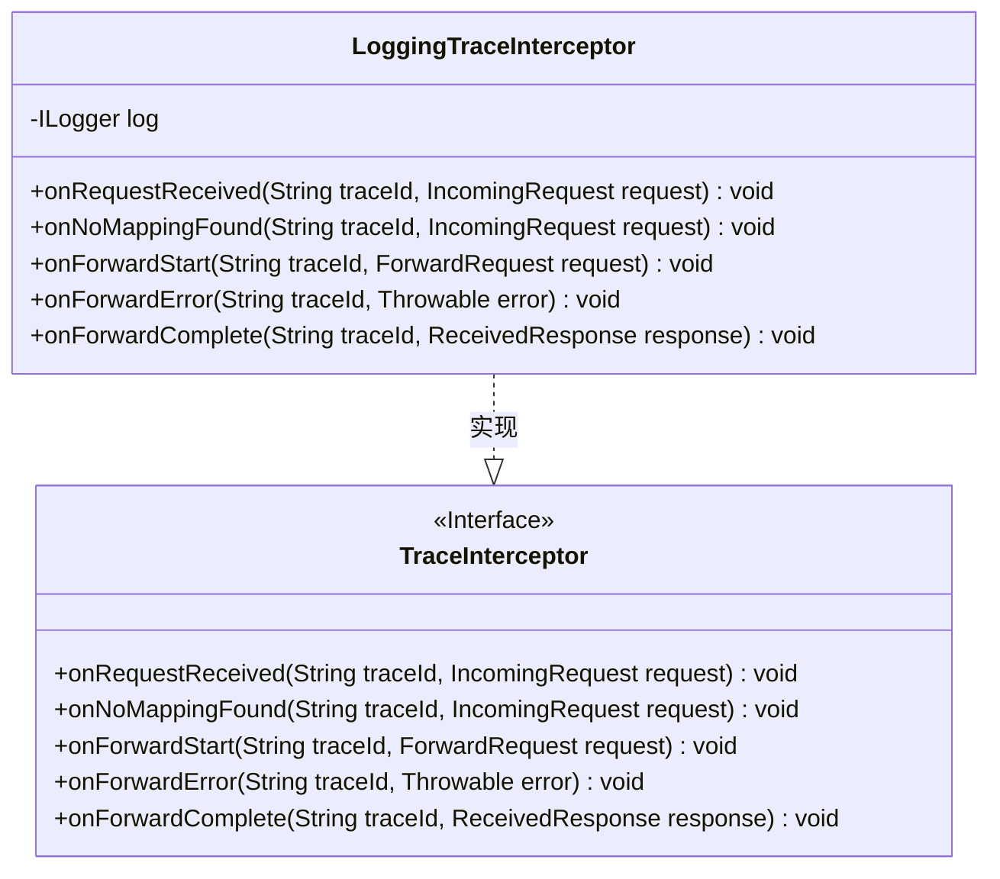
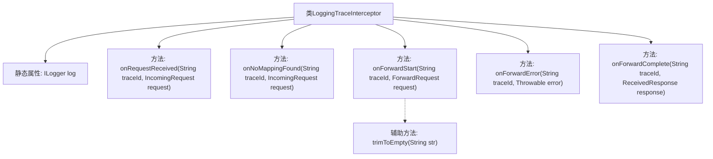

# 基础信息

|      |      |
|------|------|
| 名称 | LoggingTraceInterceptor |
| 编码语言 | .java |
| 代码路径 | staffjoy/faraday/src/main/java/xyz/staffjoy/faraday/core/trace/LoggingTraceInterceptor.java |
| 包名 | xyz.staffjoy.faraday.core.trace |
| 依赖项 | ['com.github.structlog4j.ILogger', 'com.github.structlog4j.SLoggerFactory', 'org.apache.commons.lang3.StringUtils.trimToEmpty'] |
| 概述说明 | 日志拦截器类，记录请求、转发及响应的关键信息。 |

# 说明

LoggingTraceInterceptor类实现了TraceInterceptor接口，用于记录HTTP请求和响应的跟踪信息。它包含五个方法：onRequestReceived记录接收到的请求信息，包括traceId、方法、主机、URI和头信息；onNoMappingFound记录未找到映射的请求信息；onForwardStart记录转发的请求开始信息，包括映射名称、方法、主机、URI、请求体和头信息；onForwardError记录转发失败的错误信息；onForwardComplete记录转发完成的响应信息，包括状态码、响应体和头信息。所有日志通过ILogger输出。

# 类列表 Class Summary

| 名称   | 类型  | 说明 |
|-------|------|-------------|
| LoggingTraceInterceptor | class | 日志拦截器类，记录请求接收、转发及响应信息。 |

## 类 LoggingTraceInterceptor

|      |      |
|------|------|
| 访问范围 | public |
| 类型 | class |
| 名称 | LoggingTraceInterceptor |
| 说明 | 日志拦截器类，记录请求接收、转发及响应信息。 |

### UML类图

这段代码展示了一个日志追踪拦截器(LoggingTraceInterceptor)的实现，它实现了TraceInterceptor接口，用于记录HTTP请求处理过程中的关键事件。该类通过日志系统(ILogger)记录五种事件：请求接收、无映射发现、转发开始、转发错误和转发完成。每个方法都接收traceId用于请求追踪，并记录相关请求/响应细节，包括方法、主机、URI、头部等信息，为分布式系统提供可观测性支持。

### 内部方法调用关系图

该流程图展示了LoggingTraceInterceptor类的核心结构和功能。该类是一个HTTP请求跟踪拦截器，通过5个主要方法记录请求处理全生命周期的关键事件：接收请求、无映射处理、转发开始、转发失败和转发完成。每个方法都会通过静态日志实例记录结构化信息，其中onForwardStart方法调用辅助函数trimToEmpty处理映射名称。所有方法均以traceId作为链路追踪标识，并记录请求/响应的关键属性如方法、主机、URI等，形成完整的可观测性日志。

### 字段列表 Field List

| 名称  | 类型  | 说明 |
|-------|-------|------|
| log = SLoggerFactory.getLogger(LoggingTraceInterceptor.class) | ILogger | 私有静态日志记录器，用于LoggingTraceInterceptor类。 |

### 方法列表 Method List

| 名称  | 类型  | 说明 |
|-------|-------|------|
| onForwardComplete | void | 重写方法记录转发HTTP响应，含traceId、状态、正文和头信息。 |
| onRequestReceived | void | 记录HTTP请求信息，包括traceId、方法、主机、URI和头部。 |
| onForwardStart | void | 转发HTTP请求开始：记录traceId、映射名、方法、主机、URI、体和头信息。 |
| onNoMappingFound | void | 未找到HTTP请求映射：traceId、方法、主机、URI、头信息已记录。 |
| onForwardError | void | 重写方法记录转发HTTP请求失败，含traceId和错误信息。 |

